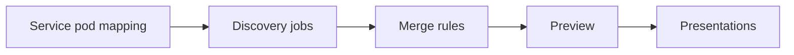

import LimitedAvail from '/snippets/_partials/limited-avail.mdx';

{/* -- dri: Garrett Guillotte -- */}

<LimitedAvail />

Chronosphere Lens provides a view into your applications based on
[services](/observe/services). If a service doesn't match the rules that you define,
you can edit the service configuration in Observability Platform to include or remove
services from your display. You can also modify services' visual presentations of
your data.

## Understand service configuration

The **Service Configuration** page lets you configure how to discover services that
exist in your environment, and what visualizations to present on your services pages,
based on their telemetry data.

All users can view service configurations and preview changes. Only users with
[SysAdmin permissions](/administer/accounts-teams/teams#add-a-role-to-a-team)
can save new or edit existing service configurations.

## View service configuration

In the navigation menu, click **<Icon icon="shield" /> Go to Admin**
and then select
**<Icon icon="wrench" /> Platform > Service Configuration**
to open the **Service Configuration** page.

### Review changes

If there are unsaved changes, the **Review & apply changes** button indicates the
number of unsaved changes. An <Icon icon="circle-exclamation" /> alert icon indicates
modified jobs that haven't yet been saved.

### Global mappings

Global mappings let services be discovered by jobs using metrics that have a Kubernetes
Pod or instance label but no obvious service labels.

Discovery jobs can be configured to join their
[Pod](https://kubernetes.io/docs/concepts/workloads/pods/) label with the pod label
from one of the global mapping configurations that has a label that's more likely to
map to a service name. For example, the `kube_pod_info` metric from
[kube-state-metrics (KSM)](https://github.com/kubernetes/kube-state-metrics) have a
`created_by_name` which is often a service name. Chronosphere uses
those labels to match the physical pods to a discovered service.

Users can't edit configurations in the **Global mapping** tab. These configurations
are commonly from standard KSM and OpenTelemetry libraries. Introducing new
potentially conflicting configurations here could cause services to be silently
ignored by discovery jobs.

- **Slug**: The slug name of the discovery rule defining the service pod mapping.
- **Name**: The rule name.
- **Service labels**: One or more labels that could be a candidate for the service
  name.
- **Pod label**: The pod label is usually the name of the pod or instance and is used
  as a key to map to the service name. These are created during
  [metrics discovery jobs](#use-discovery-jobs-to-identify-and-add-services).

Click the <Icon icon="ellipsis-vertical" /> three vertical dots icon and then
**Open in Metrics Explorer** to open the query for that service instance in
[Metrics Explorer](/investigate/querying/metrics/explorer).

### Configuration status

The **Configuration Status** tab title includes the number of changes since the last
run of a discovery job. If there are problems with discovery jobs, the tab includes
an orange dot in the corner.

Click the tab to review all messages. Use the search box to find specific messages.

Each message contains the following details:

- **Severity**: The severity of the alert.
- **Type**: The type of process causing the error. For example, type of `discovery
  job` means a [discovery job](#use-discovery-jobs-to-identify-and-add-services) has
  errors or conflicts that need correction.
- **Name**: The name of the item in the **Type** field.
- **Message**: Details about the error or conflict. Use these details to review your
  configuration and make changes.
- **Labels**: A list of labels and values that explain the conflicting rule:
  - `service_name`: The service with the conflict.
  - `first_service_name`: The first instance of a service with the label causing
    the conflict.
  - `rule_slug`: The immutable ID of the rule for this discovery job.
  - `source`: The label whose value causes the conflict.
  - `dimension_value`: The value of the conflicting label.

## Use discovery jobs to identify and add services

_Discovery jobs_ are templates that match metrics to a discovered service.
Chronosphere provides some common discovery jobs. Create your own jobs or copy and
customize existing jobs for your environment.

Use the **Search jobs** box to find a specific template.

- **Status**: Toggle the switch to enable or disable the job.
- **Managed by**: Jobs are manged by Chronosphere (non-editable), or by the user
  (editable).
- **Job name**: The user-readable discovery job name.
- **Type**: Users can create jobs to discover services based on metrics (`Metrics`)
  or change events (`Events`) types.
  `Traces` are managed by Chronosphere and not user creatable or editable. `Traces`
  is used by the **Trace Services Based on Service Attribute** job, and is
  available only to customers with a Tracing license. Users can enable or disable the
  discovery job.
- **Service label mapping**: Labels identifying the service name. Provided by the
  the service label or instance label + identifying label (**Service template label**)
  from the template form.
- **Services discovered**: The estimated maximum number of discovered services. This
  number can be significantly different (often higher) than the actual number of
  discovered services, depending on
  [merge rules](#use-merge-rules-to-correct-or-remove-services).

### Create a discovery job

To create a discovery job:

1. On the **Service Configuration** page, click **Create**.
1. From the menu, choose **Metrics discovery** or **Change events discovery**.
1. Add a **Job name**.
1. Select **Manual** or **From dashboard JSON**.

<Tabs>
<Tab title="Manual" id="metrics-discovery-manual">

1. Add **Job details**:

   <Tabs>
   <Tab title="Metrics" id="metrics-discovery-job">

    For a **Metrics discovery job**, add:

    - **Metric name**: Observability Platform queries this metric to find labels
      which contain candidate service names based on the discovery job configuration.
    - **Metric name prefix**: A prefix of metric names to used filter and scope
      metrics this job applies to. This field uses
      [glob syntax](/investigate/querying/glob-syntax) to match metric names.
      When a service is discovered by this discovery job, metrics with this prefix
      will receive a [derived
      label](/investigate/querying/metrics/derived-telemetry/derived-labels) called
      `lens_service` which is set to the discovered service name.

      <Warning>
      This prefix, along with optional target label names in this job, must not
            conflict with the prefix in another enabled discovery job.
      </Warning>
    - Optionally, click **Options** to add one or more **Target names** and **Target values**.
      These fields are respectively a label name and value
      [glob expression](/investigate/querying/glob-syntax) that further scope to
      which metrics Observability Platform applies the `lens_service` label. Use
      these fields to help scope the discovery job and avoid conflicts when you
      need to configure different discoveries on metrics with the same prefix.
    - **Service mapping**:

      Focus your template using one of the following groups:
      - **Service label**: A label containing the service name. This label must be
        found on the previously specified **Metric name**. This is the preferred
        option when you already have a good service name label on your metrics.
        Click the Click the <Icon icon="arrow-up-right-from-square" /> icon to draft a
        `cardinality_estimate by (<SERVICE LABEL>) ()` query in
        [Metrics Explorer](/investigate/querying/metrics/explorer).
      - **Pod mapping**: Pod mappings are an advanced option. Use if you don't have
        an obvious label to use as the service name, but you have a pod or instance
        label that could join with a global mapping that has a service name.
        - **Instance label**: The label containing the instance or pod name. Label
          values are used as keys to map to the service name. For example, GRPC
          metrics have an **instance label** of `instance` and an identifying label
          of `grpc_service`.
        - **Transform regex**: A [regular
          expression](/investigate/querying/regular-expressions) that modifies the
          value in the instance label to match a value in the service instance
          mappings. This is often used to remove a pod name's prefix. Can be `(+.)`
          if no trimming is required.
        - **Transform replacement**: The regular expression replacing the
          original label, allowing modification of the value in the instance label
          so that it matches a value in the service instance mappings. You can use
          symbols like `$1` to insert regular expression capture groups.
        - **Identifying label**: A label containing information that uniquely
          identifies which service the time series belongs to. The identifying label
          can't be the `instance label` or other ephemeral label. It must be static,
          finite, and uniquely identify the service. For example, an identifying
          label value of `X` that indicates it belongs to `service1` must always
          map to `service1`. The value `X` can't map to another service.

          <Warning>
          This mode of service discovery fails if this label is
                    [high cardinality](/control/shaping/reduce-cardinality).
          </Warning>

   </Tab>
   <Tab title="Events">

   For an **Events discovery job**, add a **Service label**, which is the label
   containing a the service name. Discovery jobs use this to find service name
   candidates.

   Use the **Preview events** graph to select a service and preview the events to show.

   For example, if you're sending an event to Observability Platform with the payload
   `"pipelineName": "PIPELINE_NAME"` as a label, you can search through the service
   labels to find and select that label. If the event doesn't have the `lens_service`
   label, you can create a [merge rule](#use-merge-rules-to-correct-or-remove-services)
   to map the existing label to the service. Events corresponding to that label
   display in charts on the applicable service's page.

   </Tab>
   </Tabs>

</Tab>

<Tab title="From a dashboard" id="metrics-discovery-from-dashboard">

You can create both a presentation and a metrics discovery job from a dashboard.

1. Click **Import JSON file** to import an Observability Platform standard dashboard
   from its JSON representation. This feature isn't compatible with classic dashboards.
   
   Optionally, click **Select dashboard** to automatically generate the JSON representation
   for an existing dashboard.

   If the JSON is valid, Observability Platform confirms this.
1. If the dashboard is confirmed to be valid, click the **Choose service variable**
   dropdown that appears and select an appropriate variable.

</Tab>
</Tabs>

To complete discovery job completion:

1. Click **Create**.
1. Click **Review & apply changes**.

### Edit or delete a discovery job

You can edit or disable existing user-created jobs to ensure your configurations
match your services when those services change.

1. Click the <Icon icon="ellipsis-vertical" /> three vertical dots and then select
   **Edit config** to change or **Delete** to remove the job.
1. Available edits to job details include:
   - Clear the **Enabled** checkbox to disable the job.
   - Update the **Service label**.
   - For metrics discovery, update the **Pod mapping** fields.
1. Click **Stage changes** to preview your updated configuration.
1. Review your changes.
1. Click **Review & apply changes** to save.

When editing a metrics discovery job, you can review the **Service discovery query**,
which is the query used to generate the discovery job. Click the
<Icon icon="arrow-up-right-from-square" /> icon to open the query in
[Metrics Explorer](/investigate/querying/metrics/explorer).

## Use merge rules to correct or remove services

When a service doesn't match expectations, create _merge rules_ to correct mismatches.
Merge rules define how to group or match service data when service names or
labels might not be the same across multiple instances.

Merge rules affect the number of displayed services in service pages. For example,
Trace Explorer might find a particular set of services, but a service page might have
a lower number of services based on the merge rules applied to those services.

Use the **Search rules** box to find a specific rule, or filter by **Rule type**.

The **Merge rules** table displays information that was set during rule creation.

Merge rules apply from the top to the bottom of the list, in **Order**. A service
matches the first rule that applies to it, and won't match additional rules. Use the
drag icon to move the rule up or down in the list to change the order that rules
apply.

Toggle the **Status** icon to disable a job.

### Preview and apply changes

This table is a list of changes that will take effect when you apply any staged
merge rule updates. To display only the staged changes, click the **Show diff only**
toggle. If **Review & apply updates** displays a **0** in the button, no user-created
changes are staged to apply. However, the preview pane can still display
staged changes. These changes are due to discovery jobs run by Observability Platform
that haven't yet been applied.

#### Add or modify services

To run discovery jobs:

1. Click **Review & apply changes** to open a larger **Review & apply changes**
   drawer. This drawer lets you review a more detailed preview, including any
   **Presentations** attached to services. Click the **Use freshest data** toggle to run the
   preview without a cache from previous discovery runs.
1. Click **Run service discovery**. You must have
   [SysAdmin](/administer/accounts-teams/teams#add-a-role-to-a-team) permissions to
   run service discovery.

In the **Review & apply changes** drawer, the number of unchanged, added, deactivated,
and modified services displays under the drawer title. Select **Skip service discovery**
to wait until the next schedules discovery run.

To discard changes, click **Reset changes**.

### Create a merge rule

<Info>
You can merge a limited number of service names together. Merge rules can be
used to group service names like `gateway` and `gateway-staging` together. They can't
merge high cardinality service names together like `gateway-1` and `gateway-2` to
`gateway-n`.

It's always better to have a service label that already uses the correct service
name rather than using merge rules to fix them afterwards. Merge rules use
[regular expressions](/investigate/querying/regular-expressions).
</Info>

To create a merge rule:

1. In the **Merge rules** tab of **Service Configuration**, click **Create** and
   then select a rule type:
   - **Ignore** rules remove matching services from the interface, stop data collection
     for them, and prevent discovery from adding new services that match this rule.
   - **Merge** rules group services together.
   - **Suppress**: Use this to prevent noisy service discovery jobs from creating
     too many ephemeral services in your environment. Adding a **Suppress** rule
     for a given **Suppressed Discovery Slug** means that this discovery job won't
     discover new services. If a service is discovered by another discovery job,
     presentations configured to display for the suppressed discovery job will
     display.
1. Add the following fields:
   - **Rule Description**: Describe what this service rule does. Displays on the
     configuration page as **Description**.
1. The following fields display based on your rule type:
   - **General Settings**: The **Rule description**.
   - **Rule details**: The following fields display in the **Details** section of the
     **Merge rules** page.
     - **Source labels**: Specify which label's values the rules apply to. The
       `Discovered service name` is a source label, and is most commonly selected.
     - **Regex**: Add a new regular expression to replace the original. On the service
      configuration page, the original **Regex** displays, along with the
      **Replacement**, which is the value added here.
     - **Suppressed Discovery Slug**: When using a **Suppress** rule, add a discovery
      slug to suppress new services from being generated by that discovery.
       - **Global Suppression Exceptions**: When using a **Suppress** rule, don't suppress the
        listed services, even if they're generated by suppressed discoveries.
1. Click **Stage changes**. The **Service configuration** page displays, with your
   updates displayed.
1. The **Preview** updates. Preview your changes using the table. The **Service name**
   and **Discovery jobs** included in that service show what metrics are merged
   into a given service name. Services and metrics being removed from display have
   a **[-]** before them.
1. Click **Review & apply changes**.

#### Remove a service or prevent service creation

You can deactivate a service by removing the discovery rule that identifies it.
Observability Platform doesn't display an inactive service on the **Services** page
and no data is collected for it.

To deactivate specific services, or to prevent new services from being created that
match certain criteria, create a narrowly defined [ignore merge rule](#create-a-merge-rule)
that matches the unwanted service. For example, you can use ignore merge rules to
remove services that lack data from view.

Such services persist as inactive services. You can force the **Services** page
to display them by enabling the page's **Include inactive services** toggle. The
page of an inactive service also displays a banner indicating its inactive state.

### Edit or delete a rule

To edit or delete a service rule:

1. Click the <Icon icon="ellipsis-vertical" /> three vertical dots icon.
1. Click **Edit rule** to change the rule, or **Delete** to remove the rule.
1. Edit the fields, per their descriptions in the [create rules](#create-a-merge-rule)
   section.
1. Click **Stage changes**. The **Service discovery preview** displays your updates.
1. Click **Apply changes** to save or **Reset changes** to cancel.

## Presentations

Presentations are templates for how service data displays. Observability Platform
provides default presentations for your use. You can also create your own custom
presentations.

### View presentations

To review existing presentations, on the **Service Configuration** page, click
**Presentations**.

All of your presentations display as cards separated into the following groups:

- **Chronosphere Managed**: Default presentations, which can't be edited.
- **Custom Presentations**: Editable presentations created by users.

Each card displays the following information:

- **Name**: The presentation name.
- Enabled status: Either `Enabled` or `Disabled`.
- **Number of Services**: The number of services this presentation represents.
- **Number of panels**: The number of dashboard panels this presentation displays.

### Create a presentation

You can create custom presentations for your services. Presentations can use any
panel type that a [Chronosphere dashboard](/observe/dashboards/panels)
can use. To create a presentation:

1. In the **Presentations** page, click **Create**.
1. Add a **Name** and **Description** to identify the presentation.
1. Create conditions the presentation must meet. In the **IF service has** menu,
   select a discovery job. The presentation will show on services that have been
   discovered by this discovery job.
1. Click **+ Add condition** to **show** more services, or to **hide** specific
   services from this presentation.
1. Review the list of services that match the selected conditions. Make changes to
   the conditions if needed.
1. The **Review Content** section of the creation page defines how the content
   displays on the [service page](/observe/services/service-pages).
1. Click **Start with existing dashboard** if you already have a dashboard created to
   use. Click **Start a new view** to create a new dashboard, which opens the
   dashboard editor in a new tab.

#### Use an existing dashboard

If you have a dashboard for an existing service, and you're creating a presentation
in Lens, you can select the service as a variable. Observability Platform replaces
that variable in the JSON with `lens_service` to make the presentation flexible for
all services, which lets you reuse this presentation for multiple services.

To import an existing dashboard:

1. Click **Start with existing dashboard**.
1. Select a [dashboard](/observe/dashboards) from the list.
1. Click **Save** when finished.
1. Click **Review & apply changes**.

#### Start a new view

If you select **Start a new view**, the dashboard editor opens in a new tab.

1. Add [panels](/observe/dashboards/panels) and
   [variables](/observe/dashboards#create-and-configure-dashboard-variables) to your
   new dashboard.
1. Click **Save** when finished.
1. Click **Save** in the **Create** screen.
1. Click **Review & apply changes**.

### Edit a presentation

To change an existing presentation:

1. On the **Service Configuration** page, click the <Icon icon="ellipsis-vertical" />
   three vertical dots and then select **Edit presentation**, or on the
   **Presentations** page, click the card for the service.
1. Make changes to your presentation. You can modify the presentation's **Name**
   and **Description**, amd **Edit Conditions**. You can also
   **Review services which match the conditions**.
1. Click **Save**.

### Delete a presentation

To delete a presentation:

1. [Edit the presentation](#edit-a-presentation).
1. Click **Delete presentation**.
1. Click **Delete** to confirm that you want to delete the presentation.