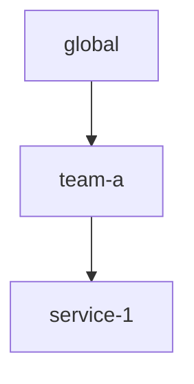

import ApiAuthReq from '/snippets/_partials/api-auth-req.mdx';
import InfoTerraformLockout from '/snippets/_partials/info-terraformlockout.mdx';
import TerraformDel from '/snippets/_partials/terraformdel.mdx';
import TerraformPlan from '/snippets/_partials/terraformplan.mdx';

{/* -- dri: Adam Locke -- */}


After [defining log partitions](/control/consumption/partitions),
[analyzing consumption](/control/consumption/analyze), and making any necessary
adjustments, you can create _budgets_, which are optional shaping policies that you
can attach to a partition.

Budgets provide guardrails to combat runaway usage and overspending, while providing
the flexibility to enforce accountability at the right level of ownership. Budgets
include _thresholds_ that define which actions to take when a threshold is exceeded.

You can also set _priorities_ to control the order in which data is dropped when a
drop action is applied, with lower priority values dropped last. For example, a
priority of `10` is dropped first, and a priority of `1` is dropped last.

Priorities are evaluated in match order, and the first priority to match is applied.
All other priorities are ignored. Use the `default_priority field` to set the
priority on requests that don't match any defined priorities.

## Threshold types

Budgets can include _thresholds_, which help manage both anomalous spikes in data and
slow data growth over time, depending on the type. Although configuring thresholds is
optional, Chronosphere strongly recommends setting thresholds to protect budgets and
avoid overspending. Use different threshold types depending on the use case.

### Anomalous spikes in real time

To detect data spikes in real time and react accordingly, configure either an
instant-rate threshold or a rolling threshold. These thresholds implement shorter
time windows that are more responsive, but can result in more noise.

Instant-rate thresholds limit the rate of incoming data in bytes per second,
specified as fixed values. With an instant rate threshold, the configured action
(such as sending an alert) triggers when consumption exceeds the configured rate
threshold. For example, if a threshold is exceeded, Observability Platform can send
an alert to notify the team who owns the budget for the offending partition.
Alternatively, you can start dropping data when a threshold value is met so that the
budget isn't exceeded, which would otherwise impact your persisted data limit.

Rolling thresholds help to detect and manage anomalous spikes in data over a short
period, such as one to three hours.

### Slow growth over time

To help detect and manage gradual data growth over a longer period (which can be
daily, weekly, or monthly), use fixed volume-based thresholds. These thresholds
implement longer time windows that are less responsive, but are also less noisy than
instant-rate or rolling thresholds.

Fixed volume-based thresholds set a limit over a fixed, non-overlapping period, such
as one day. The configured action (such as dropping data) triggers when consumption
over the specified time period exceeds the configured threshold. For example,
dropping data on a daily basis if a budget for a service exceeds a fixed value
threshold of a configured number of bytes.

### Drop data with thresholds

When certain thresholds with a drop action are exceeded, Observability Platform drops
data according to the length of the time window and the threshold type:

- Fixed volume-based thresholds: Observability Platform drops data until the end of
  the time window. For example, a daily volume-based threshold that's configured to
  drop data at 12:00 AM drops data until 11:59 PM.
- Rolling thresholds: Observability Platform drops data until the data in the
  affected budget naturally ages out of the rolling window, and your tenant
  consumption is under the configured threshold.

Avoid setting multiple volume-based thresholds with a drop action on the same budget.
For example, setting a daily, weekly, and monthly volume-based threshold provides
considerable overlap, and could result in unwanted noise (such as excessive alerts).

## Budgeting order

If you attach multiple budgets to every level of your partition hierarchy, a single
request must pass through multiple thresholds before being accepted. Budgets are
evaluated in order, from the most-specific partition that you created, to the
least-specific partition (the global partition). If a budget drops a request, then
data isn't counted in the received rates of any parent budgets.

For example, consider the following partitions and budgets:

- A partition for `global/team-a` has an `instant_rate` threshold of 2&nbsp;MB per
  second.
- A partition for `global/team-a/service-1` has an instant rate threshold of
  1&nbsp;MB per second.



If the partition `global/team-a/service-1` receives a huge data spike of 1&nbsp;GB
per second, then 999&nbsp;MB of that overage is dropped before it's counted against
the budget for `global/team-a`. Therefore, the `global/team-a` partition receives
only 1&nbsp;MB per second, and won't be impacted by data drops.

This budget hierarchy ensures that drop data from the `global/team-a/service-1`
partition only, and not from `global/team-a`. The budget that's configured on the
individual service ensures that the team budget isn't impacted. This behavior allows
you to penalize bad actors and not impact the upstream partitions.

## View budgets

Select from one of the following methods to view budgets for log partitions.

<Tabs>
<Tab title="Chronoctl" id="view-budgets-chronoctl">

To use [Chronoctl](/tooling/chronoctl) to return all budgets, use the
`chronoctl consumption-budgets list` command:

```shell copy
chronoctl consumption-budgets list
```

To filter for a specific budget, use the `chronoctl consumption-budgets read`
command:

```shell copy /SLUG/
chronoctl consumption-budgets read SLUG
```

Replace _`SLUG`_ with the slug of the budget you want to display.

</Tab>

<Tab title="API" id="view-budgets-api">

To return a list of budgets with the Chronosphere API, use the
[`ListConsumptionBudgets`](/tooling/api-info/definition/operations/ListConsumptionBudgets)
endpoint.

To return a single budget definition, use the
[`ReadConsumptionBudget`](/tooling/api-info/definition/operations/ReadConsumptionBudget) endpoint.

<ApiAuthReq />

</Tab>
</Tabs>

## Create budgets

Log budgets require the following information:

- Include the slug of the partition that the budget applies to.
- Specify an alert notification policy to use for routing alerts.
- Define thresholds and actions to take if a threshold is exceeded.
- Apply priorities for each of the query conditions that match.

Configure alert actions before enforcing drops. Alerts provide visibility without
impacting persisted data.

### Prerequisites

Before creating budgets, [define log partitions](/control/consumption/partitions).
Use the slug or ID of your partition to assign budgets.

Because budgets use Chronosphere alerts to send notifications when thresholds are
exceeded, you need to define [notification policies](/investigate/alerts/notifications/policies)
to reference in your budgets.

### Create partition budgets

Use one of the following methods to create budgets for partitions.

<Tabs>
<Tab title="Chronoctl" id="create-budgets-chronoctl">

To use [Chronoctl](/tooling/chronoctl) to create a budget, use the
`chronoctl consumption-budgets create` command:

```shell copy
chronoctl consumption-budgets create
```

1. Run the following command to generate a sample budget configuration you can use as
   a template:

   ```shell copy
   chronoctl consumption-budgets scaffold
   ```

   In the template, `kind: ConsumptionBudget` defines an individual budget.

   You can redirect the results (using the redirection operator `>`) to a file for
   editing.

1. With a completed definition, submit it with:

   ```shell copy /FILE_NAME/
   chronoctl consumption-budgets create -f FILE_NAME
   ```

   Replace _`FILE_NAME`_ with the name of the YAML definition file you want to use.

See the [Chronoctl example](#chronoctl-budget-example) for a completed budget
resource.

</Tab>

<Tab title="Terraform" id="create-budgets-terraform">

<TerraformPlan />

To create a budget with [Terraform](/tooling/infrastructure/terraform):

1. Create or edit a Terraform file and add the definition by using the
   `chronosphere_consumption_budget` type.
1. Enter a `consumption_config_id` for the budget.
1. Include the `notification_policy_slug` that references the slug of the
   notification policy you want to use for routing alerts.
1. Include the `partition_slug_path` that references the slug of the partition you
   want to assign this budget to.
1. Define a `threshold` condition to send alerts.
1. Define a `threshold` condition to drop data.
1. Run this command to apply the changes:

   ```shell copy
   terraform apply
   ```

See the [Terraform budget example](#terraform-budget-example) for a completed
budget resource.

</Tab>
<Tab title="API" id="create-budgets-api">

To complete this action with the Chronosphere API, use the
[`CreateConsumptionBudget`](/tooling/api-info/definition/operations/CreateConsumptionBudget)
endpoint.

<ApiAuthReq />

</Tab>
</Tabs>

### Next steps

After creating budgets, use the
[Logging License Consumption dashboard](/observe/dashboards/chronosphere-managed-dashboards#licensing-overview)
to monitor and
[analyze consumption](/control/consumption/analyze) for the budget you added to your
partition:

{/* vale off */}
- Review relative consumption trends: Use the **Volume Thresholds** and
  **Instant Rate Thresholds** panel groups to view consumption trends across
  different time periods to understand what's driving data growth.
- Detect budgets approaching thresholds: Use the **Consumed Per Second** panel to
  view data matching the selected partition against either the maximum consumption
  rate set in your contract for the global partition, or a custom threshold for
  custom partitions.
- Observe drops from rate-limiting thresholds per partition: Use the
  **Dropped Per Second** panel to view the rate at which data was
  dropped by a threshold for the selected partition, broken down by priority (if
  configured).
- Debug the source of consumption: In the **Explore** panel group, click the
  **Logs Explorer** link to investigate source of consumption by various fields.
{/* vale on */}

### Chronoctl budget example

The following Terraform example adds a budget for the Ordering Service, which is
included in the
[partition hierarchy](/control/consumption/partitions#partition-hierarchy) diagram.
See the
[Chronoctl example](/control/consumption/partitions#chronoctl-partition-example)
that implements a partition for this service.

This budget is scoped to the parent partition `global/ordering-service`, and defines
the following thresholds:

- An alert warning (`ALERT_WARN`) with a threshold of 4,500 bytes per second.
- A critical warning (`ALERT_CRITICAL`) with a threshold of 5,000 bytes per second.
- A drop action (`DROP`) with a threshold of 5,000 bytes per second.
- A drop action (`DROP`) for daily volume, with a threshold of 90,9997 bytes.

Each `priority` controls which data gets dropped first when the `DROP` action
triggers. Higher priority values are dropped first, and lower priority values are
dropped last:

- The query `"env = 'dev'"` has a priority of `10`, so it's dropped first.
- The query `"env = 'staging'"` has a priority of `5`, so it's dropped next.
- The query `"env = 'prod'"` has a priority of `1`, so it's dropped last.

```yaml copy
api_version: v1/config
kind: ConsumptionBudget
spec:
    slug: "ordering-service-logs"
    name: "Ordering Service Logs"
    partition_slug_path: "global/ordering-service"
    priorities:
         - filters:
              log_filter:
                query: "env = 'dev"
           priority: 10
         - filters:
              log_filter:
                query: "env = 'staging'"
           priority: 5
         - filters:
              log_filter:
                query: "env = 'prod'"
           priority: 1
    thresholds:
        - action: ALERT_WARN
          instant_rate:
            fixed_value_per_sec: 4500
          type: INSTANT_RATE
        - action: ALERT_CRITICAL
          instant_rate:
            fixed_value_per_sec: 5000
          type: INSTANT_RATE
        - action: DROP
          instant_rate:
            fixed_value_per_sec: 5000
          type: INSTANT_RATE
        - action: DROP
          daily_volume:
            fixed_value: 909997
          type: DAILY_VOLUME
    notification_policy_slug: "budget-alerts-slack"
    resource: LOG_PERSISTED_BYTES
```

### Terraform budget example

The following Terraform example adds a budget for the Ordering Service, which is
included in the
[partition hierarchy](/control/consumption/partitions#partition-hierarchy) diagram.
See the
[Terraform example](/control/consumption/partitions#terraform-partition-example)
that implements a partition for this service.

This budget is scoped to the parent partition `global/ordering-service`, and defines
two thresholds:

- An alert warning (`ALERT_WARN`) with a threshold of 4,500 bytes per second.
- A critical warning (`ALERT_CRITICAL`) with a threshold of 5,000 bytes per second.
- A drop action (`DROP`) with a threshold of 5,000 bytes per second.
- A drop action (`DROP`) for daily volume, with a threshold of 90,9997 bytes.

Each `priority` controls which data gets dropped first when the `DROP` action
triggers. Higher priority values are dropped first, and lower priority values are
dropped last:

- The query `"env = 'dev'"` has a priority of `10`, so it's dropped first.
- The query `"env = 'staging'"` has a priority of `5`, so it's dropped next.
- The query `"env = 'prod'"` has a priority of `1`, so it's dropped last.

```ruby copy
resource "chronosphere_consumption_budget" "ordering_service_budget" {
  consumption_config_id = chronosphere_consumption_config.example.id
  name                  = "Ordering Service Logs"
  slug                  = "ordering-service-logs"

  resource = "LOG_PERSISTED_BYTES"

  notification_policy_slug = "budget-alerts-slack"

  partition_slug_path = "global/ordering-service"

  threshold {
    action = "DROP"
    type = "INSTANT_RATE"
    instant_rate_threshold {
      fixed_value_per_sec = 5000
    }
  }

  threshold {
    action = "ALERT_WARN"
    type = "INSTANT_RATE"
    instant_rate_threshold {
      fixed_value_per_sec = 4500
    }
  }

  threshold {
    action = "ALERT_CRITICAL"
    type = "INSTANT_RATE"
    instant_rate_threshold {
      fixed_value_per_sec = 5000
    }
  }

  threshold {
    action = "DROP"
    type = "DAILY_VOLUME"
    volume {
      fixed_value = 909997
    }
  }

  priority {
    priority = 1
    filter {
      condition {
        log_filter {
          query = "env = 'prod'"
        }
      }
    }
  }

  priority {
    priority = 5
    filter {
      condition {
        log_filter {
          query = "env = 'staging'"
        }
      }
    }
  }

  priority {
    priority = 10
    filter {
      condition {
        log_filter {
          query = "env = 'dev'"
        }
      }
    }
  }
}
```

## Update budgets

Select from one of the following methods to update budgets for available log
partitions.

<Tabs>

<Tab title="Chronoctl" id="edit-budgets-chronoctl">

To update budgets with [Chronoctl](/tooling/chronoctl), use the
`consumption-budgets update` command:

```shell copy
consumption-budgets update
```

</Tab>

<Tab title="Terraform" id="edit-budgets-terraform">

To edit a budget using [Terraform](/tooling/infrastructure/terraform):

1. Create or edit a Terraform file that updates the resource's existing properties.
1. Run this command to apply the changes:

   ```shell copy
   terraform apply
   ```

</Tab>
<Tab title="API" id="edit-budgets-api">

To complete this action with the Chronosphere API, use the
[`UpdateConsumptionBudget`](/tooling/api-info/definition/operations/UpdateConsumptionBudget)
endpoint.

<ApiAuthReq />

</Tab>
</Tabs>

## Delete budgets

Select from one of the following methods to delete budgets for log partitions.

<InfoTerraformLockout />

<Tabs>

<Tab title="Chronoctl" id="delete-budgets-chronoctl">

To delete budgets with [Chronoctl](/tooling/chronoctl), use the
`consumption-budgets delete` command:

```shell copy
consumption-budgets delete
```

</Tab>

<Tab title="Terraform" id="delete-budgets-terraform">

<TerraformDel />

</Tab>
<Tab title="API" id="delete-budgets-api">

To complete this action with the Chronosphere API, use the
[`DeleteConsumptionBudget`](/tooling/api-info/definition/operations/DeleteConsumptionBudget)
endpoint.

<ApiAuthReq />

</Tab>
</Tabs>
