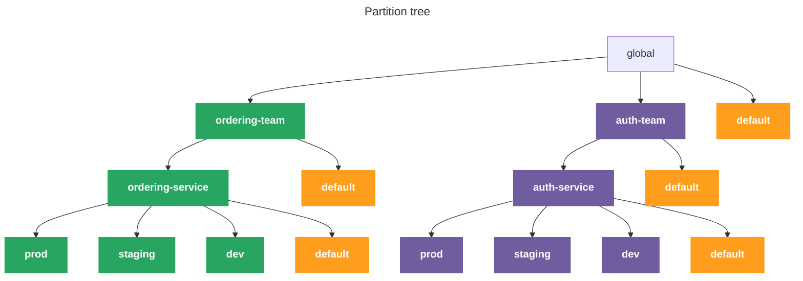

import ApiAuthReq from '/snippets/_partials/api-auth-req.mdx';
import InfoTerraformLockout from '/snippets/_partials/info-terraformlockout.mdx';
import TerraformDel from '/snippets/_partials/terraformdel.mdx';
import TerraformPlan from '/snippets/_partials/terraformplan.mdx';

{/* -- dri: Adam Locke -- */}


To effectively manage your log data, you need to separate, or partition data into
meaningful slices that map to your business. _Partitions_ provide a consistent
structure for attributing usage and costs to the appropriate owners in your
organization so they can isolate and control independent their parts of the business.

## Partition hierarchy

Partitions are hierarchical, which lets you model the ownership structure of your
organization. A global partition is created by default, and captures all
consumption. Individual teams can create distinct partitions, with child partitions
for individual services and environments.

All created partitions are children of the global partition, and each created
partition has a default partition to collect any traffic not explicitly captured by
other partitions. Default partitions are created automatically, and ensure that all
consumption is accounted for at every level and sums correctly into parent
partitions.

The maximum number of partitions you can create is 100, with up to five levels of
child partitions.

The following diagram depicts the hierarchy of partitions stemming from the `global`
partition. Two created partitions are children of the `global` partition: one for the
`ordering_team` and another for the `auth-team`. Each of those partitions have child
partitions for each team's individual service, with additional child partitions for
`prod`, `staging`, and `dev` environments.



## View partitions

Select from the following methods to view and filter available partitions.

<Tabs>
<Tab title="Chronoctl" id="view-partitions-chronoctl">

To use [Chronoctl](/tooling/chronoctl) to return all partitions, use the
`chronoctl consumption-config read` command:

```shell
chronoctl consumption-config read
```

</Tab>

<Tab title="API" id="view-partitions-api">

To complete this action with the Chronosphere API, use the
[`ListConsumptionBudgets`](https://docs.chronosphere.io/tooling/api-info/definition/operations/ListConsumptionBudgets)
endpoint.

<ApiAuthReq />

</Tab>
</Tabs>

## Create partitions

Select from the following methods to create partitions.

<Tabs>
<Tab title="Chronoctl" id="create-partitions-chronoctl">

To use [Chronoctl](/tooling/chronoctl) to create a partitions, use the
`chronoctl consumption-config create` command:

```shell
chronoctl consumption-config create
```

1. Run the following command to generate a sample partition configuration you can use
   as a template:

   ```shell
   chronoctl consumption-config scaffold
   ```

   In the template, `kind: ConsumptionConfig` defines an individual partition.

1. With a completed definition, submit it with:

   ```shell /FILE_NAME/
   chronoctl consumption-config create -f FILE_NAME
   ```

   Replace _`FILE_NAME`_ with the name of the YAML definition file you want to use.

See the [Chronoctl partition example](#chronoctl-partition-example) for a completed
partition definition.

</Tab>

<Tab title="Terraform" id="create-partitions-terraform">

<TerraformPlan />

To create a partition with [Terraform](/tooling/infrastructure/terraform):

1. Create or edit a Terraform file and add the definition by using the
   `chronosphere_consumption_config` type, followed by a name in a resource
   declaration.

1. Run this command to apply the changes:

   ```shell
   terraform apply
   ```

See the [Terraform partition example](#terraform-partition-example) for a completed
partition resource.

</Tab>

<Tab title="API" id="create-partitions-api">

To complete this action with the Chronosphere API, use the
[`CreateConsumptionBudget`](https://docs.chronosphere.io/tooling/api-info/definition/operations/CreateConsumptionBudget)
endpoint.

<ApiAuthReq />

</Tab>
</Tabs>

### Next steps

After creating a partition, use the Logging License Consumption dashboard to
[analyze consumption trends](/control/consumption/analyze) across partitions to
understand what's driving growth and detect unwanted spikes.

### Chronoctl partition example

The following Chronoctl example implements the partition structure outlined in the
diagram that describes [log partitions](#partition-hierarchy) at the start of this
page.

```yaml
api_version: v1/config
kind: ConsumptionConfig
spec:
  partitions:
    - name: "Ordering Service"
      slug: "ordering-service"
      filters:
        operator: "IN"
        conditions:
          log_filter:
            query: "service = 'ordering'"
      partitions:
        - name: "Prod"
          slug: "prod"
          filters:
            operator: "IN"
            conditions:
              log_filter:
                query: "env = 'prod'"
        - name: "Staging"
          slug: "staging"
          filters:
            operator: "IN"
            conditions:
              log_filter:
                query: "env = 'staging'"
        - name: "Dev"
          slug: "dev"
          filters:
            operator: "IN"
            conditions:
              log_filter:
                query: "env = 'dev'"

    - name: "Auth Service"
      slug: "auth-service"
      filters:
        operator: "IN"
        conditions:
          log_filter:
            query: "service = 'auth'"
      partitions:
        - name: "Prod"
          slug: "prod"
          filters:
            operator: "IN"
            conditions:
              log_filter:
                query: "env = 'prod'"
        - name: "Staging"
          slug: "staging"
          filters:
            operator: "IN"
            conditions:
              log_filter:
                query: "env = 'staging'"
        - name: "Dev"
          slug: "dev"
          filters:
            operator: "IN"
            conditions:
              log_filter:
                query: "env = 'dev'"
```

### Terraform partition example

The following Terraform example implements the partition structure outlined in the
diagram that describes [log partitions](#partition-hierarchy) at the start of this
page.

```ruby
resource "chronosphere_consumption_config" "example" {
  partition {
    name = "Ordering Service"
    slug = "ordering-service"
    filter {
      operator = "IN"
      condition {
        log_filter {
          query = "service = 'ordering'"
        }
      }
    }

    partition {
      name = "Prod"
      slug = "prod"
      filter {
        operator = "IN"
        condition {
          log_filter {
            query = "env = 'prod'"
          }
        }
      }
    }

    partition {
      name = "Staging"
      slug = "staging"
      filter {
        operator = "IN"
        condition {
          log_filter {
            query = "env = 'staging'"
          }
        }
      }
    }

    partition {
      name = "Dev"
      slug = "dev"
      filter {
        operator = "IN"
        condition {
          log_filter {
            query = "env = 'dev'"
          }
        }
      }
    }
  }

  partition {
    name = "Auth Service"
    slug = "auth-service"
    filter {
      operator = "IN"
      condition {
        log_filter {
          query = "service = 'auth'"
        }
      }
    }

    partition {
      name = "Prod"
      slug = "prod"
      filter {
        operator = "IN"
        condition {
          log_filter {
            query = "env = 'prod'"
          }
        }
      }
    }

    partition {
      name = "Staging"
      slug = "staging"
      filter {
        operator = "IN"
        condition {
          log_filter {
            query = "env = 'staging'"
          }
        }
      }
    }

    partition {
      name = "Dev"
      slug = "dev"
      filter {
        operator = "IN"
        condition {
          log_filter {
            query = "env = 'dev'"
          }
        }
      }
    }
  }
}
```

## Update partitions

Select from the following methods to update log partitions.

<Tabs>
<Tab title="Chronoctl" id="update-a-partition-chronoctl">

To update partitions with [Chronoctl](/tooling/chronoctl), use the
`consumption-config update` command:

```shell
chronoctl consumption-config update
```

1. Update the partition definition file.
1. Run the following command to submit the changes:

   ```shell /FILE_NAME/
   chronoctl consumption-config update -f FILE_NAME.yaml
   ```

   Replace _`FILE_NAME`_ with the name of the YAML definition file you want to use.

</Tab>

<Tab title="Terraform" id="update-a-partition-Terraform">

To edit partitions using [Terraform](/tooling/infrastructure/terraform):

1. Create or edit a Terraform file that updates the resource's existing properties.
1. Run this command to apply the changes:

   ```shell
   terraform apply
   ```

</Tab>

<Tab title="API" id="update-a-partition-api">

To complete this action with the Chronosphere API, use the
[`UpdateConsumptionBudget`](https://docs.chronosphere.io/tooling/api-info/definition/operations/UpdateConsumptionBudget)
endpoint.

<ApiAuthReq />

</Tab>
</Tabs>

## Delete partitions

Select from the following methods to delete log partitions.

<InfoTerraformLockout />

<Tabs>
<Tab title="Chronoctl" id="deleting-a-partition-chronoctl">

To delete a partition with [Chronoctl](/tooling/chronoctl), use the
`chronoctl consumption-config delete` command:

```shell /SLUG/
chronoctl consumption-config delete SLUG
```

Replace _`SLUG`_ with the slug of the partition you want to delete.

For example, to delete a partition with the slug `ordering-service-production`:

```shell
chronoctl consumption-config delete ordering-service-production
```

</Tab>
<Tab title="Terraform" id="delete-a-partition-terraform">

<TerraformDel />

</Tab>
<Tab title="API" id="delete-a-partition-api">

To complete this action with the Chronosphere API, use the
[`DeleteConsumptionBudget`](https://docs.chronosphere.io/tooling/api-info/definition/operations/DeleteConsumptionBudget)
endpoint.

<ApiAuthReq />

</Tab>
</Tabs>
