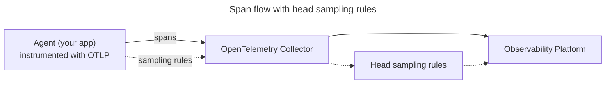

import ApiAuthReq from '/snippets/_partials/api-auth-req.mdx';
import TerraformDel from '/snippets/_partials/terraformdel.mdx';

{/* -- dri: Adam Locke -- */}


You can configure dynamic, remotely configurable
[_head sampling_](https://opentelemetry.io/docs/concepts/sampling/#head-sampling)
to capture only a portion of possible traces from originating services. Use head
sampling rules to limit possible traces to a fraction of all possible traces. You
define sampling strategies to target specific kinds of traces, focus on specific
services, or concentrate on a combination of service and operation.

<Info>
Head sampling applies _only_ to root services, which are services that appear on the
root span of a trace. Identifying root services can help identify where the most
requests to a service originate, and can inform which service to increase sampling
for to generate additional trace data.
</Info>

To instrument head sampling, Chronosphere Observability Platform supports the
[OpenTelemetry JaegerRemoteSampler](https://opentelemetry.io/docs/specs/otel/trace/sdk/#jaegerremotesampler)
head sampling standard. To use head sampling, you must first
[configure the OpenTelemetry Collector](#configure-the-opentelemetry-collector).

## View head sampling rules

You can view head sampling rules in Observability Platform to understand the impact
of each rule on your tracing data, such as the sampling rate, rule criteria, and the
impact the rule is having on your trace data volume.

To return a list of defined head sampling rules without additional information, use
Chronoctl.

<Tabs>
<Tab title="Web" id="view-head-sampling-rules-cloud">

In Observability Platform, each head sampling rule indicates which service or
combination of service and operation it impacts. A single rule can impact multiple
operations at different sampling rates for a specific service.

You need administrative access to complete this task.

To view head sampling rules:

1. In the navigation menu, click **<Icon icon="shield" /> Go to Admin**
   and then select
   **<Icon icon="shapes" /> Control <span aria-label="and then">></span> Trace Control Plane**.
1. Click the **Head sampling** tab.

   - The **Status** column indicates whether each rule is active or inactive. An
     active status means that a client fetched the head sampling rule within the last
     30 minutes.
   - The **Traces Kept** column indicates the percentage at which the current rule is
     sampling your traces for the indicated service. Hold the pointer over the bar in
     this column to view a description for each rule.
1. Expand each of the configured rules to view the rule criteria and impact on your
   tracing data. You can also view which operations the rule impacts for the selected
   service.
1. If a rule impacts multiple operations, use the dropdown menu to select which
   operation to display impact data for.
1. Use the search box to locate rules impacting a specific service.

</Tab>
<Tab title="Chronoctl" id="view-head-sampling-rules-chronoctl">

To display a list of all available head sampling rules
with [Chronoctl](/tooling/chronoctl), use this command:

```shell copy
chronoctl trace-jaeger-remote-sampling-strategies list
```

</Tab>
<Tab title="API" id="view-head-sampling-rules-api">

To complete this action with the Chronosphere API, use the
[`ListTraceJaegerRemoteSamplingStrategies`](/tooling/api-info/definition/operations/ListTraceJaegerRemoteSamplingStrategies)
endpoint.

<ApiAuthReq />

</Tab>
</Tabs>

## Configure head sampling

To instrument head sampling, Observability Platform supports the
[OpenTelemetry JaegerRemoteSampler](https://opentelemetry.io/docs/specs/otel/trace/sdk/#jaegerremotesampler)
head sampling standard. Observability Platform implements the
[JaegerRemoteSampler configuration API](https://www.jaegertracing.io/docs/1.41/apis/#remote-sampling-configuration-stable),
and serves sampling strategies based on the Terraform resources you define.

Observability Platform is compatible with the
[Jaeger Remote Sampling extension](https://github.com/open-telemetry/opentelemetry-collector-contrib/tree/main/extension/jaegerremotesampling)
to enable the OpenTelemetry Collector to act as a proxy between OpenTelemetry agents
and the Observability Platform backend.

To configure head sampling:

1. [Configure the OpenTelemetry Collector](#configure-the-opentelemetry-collector).
1. [Configure your app as an OpenTelemetry agent](#configure-your-app-as-an-opentelemetry-agent).
1. [Create head sampling rules](#create-head-sampling-rules).

### Configure the OpenTelemetry Collector

> Requires OpenTelemetry Collector version 0.83 or later.

Before configuring OpenTelemetry agents, you must configure the OpenTelemetry
Collector to export tracing data to Chronosphere.

1. [Configure the OpenTelemetry Collector](/ingest/metrics-traces/otel/otel-ingest) to export
   tracing data to Observability Platform.
1. In the OpenTelemetry Collector `config.yaml` file, apply the following settings to
   modify the `extensions` YAML collection. Specify an `endpoint` that points to your
   Observability Platform tenant, and include the Chronosphere API token you created
   for the OpenTelemetry Collector.

   Chronosphere recommends specifying a `reload_interval` to control a local cache of
   your sampling strategy for the `remote` source (which is Observability Platform).
   This interval reduces the number of backend API calls the OpenTelemetry Collector
   makes for your instrumented agents, which helps reduce egress costs.

   ```yaml copy /ADDRESS/ /API_TOKEN/
   extensions:
     zpages:
       endpoint: 0.0.0.0:55679
     health_check: {}
     pprof: {}
     jaegerremotesampling:
       source:
         reload_interval: 30s
         remote:
           endpoint: ADDRESS
           compression: gzip
           headers:
             API-Token: ${env:API_TOKEN}
   ```

   - _`ADDRESS`_: Your company name prefixed to your Observability Platform instance
     that ends in `.chronosphere.io:443`. For example,
     _`MY_COMPANY`_`.chronosphere.io:443`.
   - _`API_TOKEN`_: The API token generated from your service account. Chronosphere
     recommends storing your API token in a separate file or Kubernetes Secret and
     calling it using an environment variable, such as `$API_TOKEN`.

### Configure your app as an OpenTelemetry agent

Configure your app as an
[OpenTelemetry agent](https://opentelemetry.io/docs/collector/deployment/agent/)
to act as a proxy for the OpenTelemetry Collector, which sends your tracing data to
Observability Platform.

Instrument your app with the OpenTelemetry SDK using the
[OpenTelemetry protocol (OTLP)](https://opentelemetry.io/docs/specs/otel/protocol/).
Your app sends spans to the OpenTelemetry Collector, which pulls head sampling rules
from Observability Platform. As you update head sampling rules in Observability
Platform, the OpenTelemetry Collector pulls the changes and transmits the updated
rules to your app.



The implementation depends on the programming language of your app. For example,
the following code from the Go implementation of OpenTelemetry,
[OpenTelemetry-Go](https://github.com/open-telemetry/opentelemetry-go-contrib/blob/main/samplers/jaegerremote/README.md),
defines how to implement the JaegerRemoteSampler in Go:

```go copy /SERVICE_NAME/ /HOST_NAME/
jaegerRemoteSampler := jaegerremote.New(
    "SERVICE_NAME",
    jaegerremote.WithSamplingServerURL("http://HOST_NAME:5778/sampling"),
    jaegerremote.WithSamplingRefreshInterval(10*time.Second),
    jaegerremote.WithInitialSampler(trace.TraceIDRatioBased(0.5)),
)

tp := trace.NewTracerProvider(
        trace.WithSampler(jaegerRemoteSampler),
        ...
)
otel.SetTracerProvider(tp)
```

- _`SERVICE_NAME`_: Name of the service you're sampling, which can map to a
  microservice in your architecture.
- _`HOST_NAME`_: Host name where your OpenTelemetry Collector is running.

When configuring the Jaeger remote sampler, you must include all of these properties:

- **Endpoint**: Endpoint where your OpenTelemetry Collector is running, which
  includes the Jaeger Remote Sampling extension that points to Observability Platform.
- **Polling interval**: Interval at which your OpenTelemetry agents sync strategies
  from your OpenTelemetry Collector.
- **Initial sampler**: Policy to implement from your service until the configured
  endpoint pulls a strategy.

## Create head sampling rules

After configuring the OpenTelemetry Collector to export traces, configuring head
sampling, and configuring your OpenTelemetry agents, manage your head sampling
strategy using the [Chronosphere Terraform provider](/tooling/infrastructure/terraform) or
[Chronoctl](/tooling/chronoctl). This ability means you can push strategy changes to all of
your OpenTelemetry agents without modifying the JaegerRemoteSampler strategy
directly.

<Info>
If you don't define a sampling strategy for a service, Observability Platform applies
the default sampling rate of `0.001` (0.1%) to the service.
</Info>

The `applied_strategy` defines your sampling strategy, and can be one of the
following values:

- `probabilistic_strategy`: Defines a probabilistic strategy, which samples traces
  from the identified service based on the `sampling_rate`. This value determines the
  probability of sampling any trace, and must be in the range of `0` to `1`.
- `rate_limiting_strategy`: Defines a rate-limited strategy that sets the maximum
  number of traces to sample per second.
- `per_operation_strategies`: Defines a probabilistic strategy that sets a default
  sampling rate, plus an upper and lower bound.

<Tabs>
<Tab title="Chronoctl" id="head-sampling-chronoctl">

> Requires [Chronoctl](/tooling/chronoctl) version 0.59.0 or later.

When creating your head sampling strategy with Chronoctl, consider the following
behaviors of the `slug` property:

- If you don't provide a `slug`, Chronoctl generates one based on the `name` field.
- After creating your head sampling strategy, you can modify the `name` but can't
  modify the `slug`.
- The `service_name` and `slug` must match.

To define your head sampling strategy with [Chronoctl](/tooling/chronoctl):

1. Create a YAML file and define your head sampling strategy.

   <Info>
Use the `chronoctl trace-jaeger-remote-sampling-strategies scaffold` command to
     generate an example resource for a head sampling rule.
</Info>

   The following head sampling strategy defines a probabilistic strategy that sets a
   default sampling rate for the `inventory-operation`, plus an upper and lower bound:

   ```yaml copy
   api_version: v1/config
   kind: TraceJaegerRemoteSamplingStrategy
   spec:
       slug: ordering-service-sampling
       name: Ordering service head sampling strategy
       service_name: ordering-service-sampling
       applied_strategy:
           per_operation_strategies:
               default_sampling_rate: 0.01
               default_lower_bound_traces_per_second: 1
               default_upper_bound_traces_per_second: 1000
               per_operation_strategies:
                   - operation: inventory-operation
                       probabilistic_sampling_strategy:
                           sampling_rate: 0.1
   ```

1. Apply your head sampling strategy and send it to Observability Platform:

   ```shell copy /FILE_NAME/
   chronoctl apply -f FILE_NAME.yml
   ```

   _`FILE_NAME`_ is the name of your head sampling YAML file.

</Tab>

<Tab title="Terraform" id="head-sampling-terraform">

> Requires [Terraform provider](/tooling/infrastructure/terraform) version 0.38.0 or later.

Create a head sampling rule with Terraform by using the
`chronosphere_trace_jaeger_remote_sampling_strategy` type in a `resource`
declaration.

When managing your head sampling strategy with Terraform, Chronosphere recommends
defining one `resource` per microservice in your Terraform file.

If you use the Chronosphere-managed JaegerRemoteSampler configuration API, you can
create and change the sampling strategies of your services by running `terraform
apply`, without having to redeploy your services or OpenTelemetry Collector.

To define your head sampling strategy:

1. In your Terraform file, create your head sampling strategy. You must include
   a `name`,`service_name`, and `applied_strategy`. For example:

   ```ruby
   resource "chronosphere_trace_jaeger_remote_sampling_strategy" "billing-service" {
     name = "billing-service Jaeger Remote Sampling strategy"
     service_name = "billing-service"

     applied_strategy {
       probabilistic_strategy {
         sampling_rate = 0.01
       }
     }
   }
   ```

   Refer to [this example](#terraform-example) for more information.

1. Apply the changes:

   ```ruby copy
   terraform apply
   ```

</Tab>
<Tab title="API" id="create-head-sampling-rules-api">

To complete this action with the Chronosphere API, use the
[`CreateTraceJaegerRemoteSamplingStrategy`](/tooling/api-info/definition/operations/CreateTraceJaegerRemoteSamplingStrategy)
endpoint.

<ApiAuthReq />

</Tab>
</Tabs>

### Terraform example

The following example provides a `resource` definition for three services and
defines a distinct sampling strategy for each:

- The first resource samples the `billing-service` service at a rate of `0.01`, which
  is 1% of traces.
- The second resource samples at most two traces per second, per instance, from the
  `cart-service` service. For example, if the `cart-service` service consists of 17
  pods, the expected sample of traces per second is somewhere between 0 and 34.
- The third resource samples traces from the `ordering-service` service at a rate of
  `0.01`, or 1% of traces. If volumes are low, Observability Platform samples traces
  at least once per second. If volumes are high, Observability Platform stops
  sampling traces after reaching 1,000 traces per second.

```ruby
resource "chronosphere_trace_jaeger_remote_sampling_strategy" "billing-service" {
  name = "billing-service Jaeger Remote Sampling strategy"
  service_name = "billing-service"

  applied_strategy {
    probabilistic_strategy {
      sampling_rate = 0.01
    }
  }
}

resource "chronosphere_trace_jaeger_remote_sampling_strategy" "cart-service" {
  name = "cart-service Jaeger Remote Sampling strategy"
  service_name = "cart-service"

  applied_strategy {
    rate_limiting_strategy {
      max_traces_per_second = 2
    }
  }
}

resource "chronosphere_trace_jaeger_remote_sampling_strategy" "ordering-service" {
  name = "ordering-service Jaeger Remote Sampling strategy"
  service_name = "ordering-service"

  applied_strategy {
    per_operation_strategies {
      default_sampling_rate = 0.01
      default_lower_bound_traces_per_second = 1
      default_upper_bound_traces_per_second = 1000
      per_operation_strategies {
        operation = "notification-operation"
        probabilistic_strategy {
          sampling_rate = 0.0
        }
      }
      per_operation_strategies {
        operation = "inventory-operation"
        probabilistic_strategy {
          sampling_rate = 0.1
        }
      }
      per_operation_strategies {
        operation = "payment-operation"
        probabilistic_strategy {
          sampling_rate = 1.0
        }
      }
    }
  }
}
```

## Edit head sampling rules

Select from the following methods to edit head sampling rules.

<Tabs>
<Tab title="Chronoctl" id="edit-head-sampling-rules-chronoctl">

To edit head sampling rules with [Chronoctl](/tooling/chronoctl):

1. [View the head sampling rules Chronoctl YAML](#view-head-sampling-rules).
1. Modify its properties and apply the changes with the same process as
   [creating head sampling rules](#create-head-sampling-rules). Chronoctl updates
   head sampling rules if it has the same slug.

You can also use the following process if you already have a definition file:

1. Update the head sampling rules definition file.
1. Run the following command to submit the changes:

   ```shell copy /FILE_NAME/
   chronoctl trace-jaeger-remote-sampling-strategies update -f FILE_NAME.yaml
   ```

   Replace _`FILE_NAME`_ with the name of the YAML definition file you want to use.

</Tab>
<Tab title="Terraform" id="edit-head-sampling-rules-terraform">

To edit head sampling rules using [Terraform](/tooling/infrastructure/terraform):

1. Create or edit a Terraform file that updates the resource's existing properties.
1. Run this command to apply the changes:

   ```shell copy
   terraform apply
   ```

</Tab>
<Tab title="API" id="edit-head-sampling-rules-api">

To complete this action with the Chronosphere API, use the
[`UpdateTraceJaegerRemoteSamplingStrategy`](/tooling/api-info/definition/operations/UpdateTraceJaegerRemoteSamplingStrategy)
endpoint.

<ApiAuthReq />

</Tab>
</Tabs>

## Delete head sampling rules

Select from the following methods to delete head sampling rules.

<Tabs>
<Tab title="Chronoctl" id="delete-head-sampling-rules-chronoctl">

To delete a head sampling rule with [Chronoctl](/tooling/chronoctl), use this
command:

```shell copy /SLUG/
chronoctl trace-jaeger-remote-sampling-strategies delete SLUG
```

Replace _`SLUG`_ with the slug of the head sampling rule you want to delete.

For example, to delete a head sampling rule with the slug `head-sampling-prod`:

```shell copy
chronoctl trace-jaeger-remote-sampling-strategies delete head-sampling-prod
```

</Tab>
<Tab title="Terraform" id="delete-head-sampling-rules-terraform">

<TerraformDel />

</Tab>
<Tab title="API" id="delete-head-sampling-rules-api">

To complete this action with the Chronosphere API, use the
[`DeleteTraceJaegerRemoteSamplingStrategy`](/tooling/api-info/definition/operations/DeleteTraceJaegerRemoteSamplingStrategy)
endpoint.

<ApiAuthReq />

</Tab>
</Tabs>
