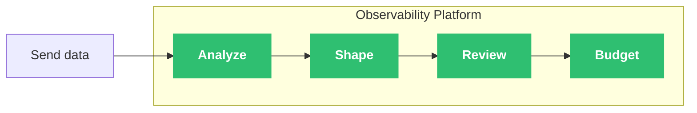

{/* -- dri: Adam Locke -- */}

Managing the cardinality of persisted data can be challenging when determining which
metrics to send to Chronosphere Observability Platform. _Metric cardinality_ is the
number of unique time series produced by a combination of metric names and their
associated labels. Cardinality is the total number of these combinations. The more
combinations there are, the greater a metric's cardinality is, and the more data
Observability Platform persists. This can affect
[your license](/administer/limits-licensing/licensing#persisted-cardinality).

<Info>
Learn about strategies and tools you can use to
[reduce cardinality](/control/shaping/reduce-cardinality).
</Info>

After sending data to Observability Platform, use the
[Live Telemetry Analyzer](/investigate/analyze/telemetry-analyzer) to identify
opportunities to reduce the overall volume of metrics. If you're sending Prometheus
metrics to Observability Platform, you can also use the
[Telemetry Usage Analyzer](/investigate/analyze/usage) to identify obsolete or
unnecessary data, and understand the impact of a proposed shaping rule to users of
that data.

Use the Chronosphere Control Plane to reduce the amount of data retained in your
system over time. Create [shaping rules](/control/shaping/rules) to drop data before
it reaches Observability Platform, aggregate and rewrite data into more manageable
and usable statistics, and alias expressions to improve data queries and references.

After creating shaping rules, use the
[Aggregation Rules UI](/control/shaping/reduce-cardinality/review-aggregation-rules)
to understand your existing shaping rules and how they affect your environment. Use the
[shaping impact preview](/control/shaping/reduce-cardinality/shaping-impact) to
preview the impact of a rule on your overall system, which helps prevent breaking
changes and ensure the rules you create operate as expected.

After configuring shaping rules, define metrics
[quotas and pools](/control/shaping/quotas/manage-pools) to assign specific
percentages of your total persisted writes limit to pools of metrics.

If you identify data you absolutely don't need and want to reduce the data you send
to Observability Platform, adjust what metric data you send from the client-side by
using mechanisms like relabel rules in the
[Chronosphere Collector](/ingest/metrics-traces/collector).
