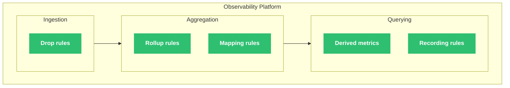
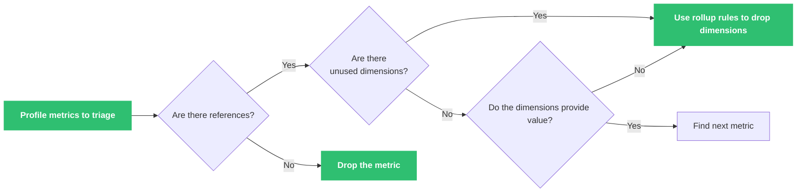

import InfoTerraformLockout from '/snippets/_partials/info-terraformlockout.mdx';

{/* -- dri: Adam Locke -- */}

Observability Platform includes various _shaping rules_ to manipulate the data you
send to Observability Platform. Use metric shaping rules to reduce the metrics you
store in Observability Platform, optimize query performance, and create aliases for
expressions.

Observability Platform applies shaping rules at different phases along the data
journey. Drop rules are applied at ingestion time. After metrics are sent but before
they're stored, rollup rules and mapping rules are applied. Derived metrics and
recording rules are then applied at query time.

## Reduce stored metrics

Chronosphere Observability Platform [ingests](/ingest) metrics from many sources.
These sources can supply multiple [metric types](/control/shaping/types), which are
generally ingested as raw data.

Although raw data might provide detailed information about a specific point in time,
that data grows rapidly and is expensive to store. Use the following shaping rules to
control costs by aggregating, downsampling, or dropping unneeded metric data:

- [Drop rules](/control/shaping/rules/drop-rules) reduce incoming data or cardinality
  to pare down your stored metrics across both time and labels. Use drop rules to omit
  incoming metrics based on labels, and only retain
  the metrics you need. These rules help reduce persisted data, and you can
  implement them quickly.

- [Rollup rules](/control/shaping/rules/rollup) downsample and aggregate metrics
  after they're sent by the client but before they're stored. Use rollup rules to
  reduce cardinality, downsample data, and perform basic aggregations across both
  time and labels. These rules are scalable, can drop raw data, and handle
  late-arriving data.

- [Mapping rules](/control/shaping/rules/mapping) downsample in-memory metric data on
  the streaming ingest path and then store any results in the database, which happens
  before metric aggregation. Use mapping rules to reduce stored metrics across time
  only.

- [Recommendations](/control/shaping/reduce-cardinality/recommendations) identify
  metrics and labels with no usage or utility over the past 30 days. Apply the
  suggested recommendations to reduce the impact on persisted writes and persisted
  cardinality.

Review your metrics to determine if they're useful because they have
[_references_](/investigate/analyze/usage#summary), or because some of their labels
have high utility (_dimensions_).

See [Reducing cardinality](/control/shaping/reduce-cardinality) for more information
about this process.

{/* vale Chronosphere.Simplicity = YES */}

## Optimize query performance

<Info>
Although Observability Platform provides recording rules to optimize query performance,
Chronosphere recommends using [rollup rules](/control/shaping/rules/rollup) in most
cases because they can reduce both cardinality and the volume of the data you persist.
</Info>

[Recording rules](/control/shaping/rules/recording) primarily improve query
performance. You can execute any PromQL query and add labels, which make queries more
efficient. However, recording rules impact your persisted data. If you want to change
how data is presented to make it easier for users to query, consider using [alias
expressions](#alias-expressions), which don't impact persisted data.

If you experience issues with [late-arriving data](/control/storage), consider using
[rollup rules](/control/shaping/rules/rollup) instead, since recording rules might
impact short-term query results.

You can also use rollup rules and drop rules to
[fix slow queries](/investigate/querying/metrics/fixing) by reducing the number of
time series those queries return.

## Alias expressions

[Derived metrics](/investigate/querying/metrics/derived-telemetry/derived-metrics) and
[derived labels](/investigate/querying/metrics/derived-telemetry/derived-labels) provide frequently
used aliases for queries without impacting persisted data limits.

Derived metrics help reduce alert and dashboard complexity, replace
[recording rules](/control/shaping/rules/recording), and provide frequently used
aliases for queries.

Derived labels are non-destructive, and are specifically designed for efficient
operations on time series at scale. Unlike Prometheus relabel rules, which overwrite
existing data, derived labels standardize your label names without overwriting them
permanently.
