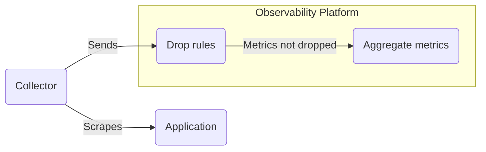

import ApiAuthReq from '/snippets/_partials/api-auth-req.mdx';
import InfoTerraformLockout from '/snippets/_partials/info-terraformlockout.mdx';
import TerraformDel from '/snippets/_partials/terraformdel.mdx';
import TerraformPlan from '/snippets/_partials/terraformplan.mdx';
import TerraformPrereq from '/snippets/_partials/terraformprereq.mdx';

{/* -- dri: Adam Locke -- */}


Based on your amount of available storage and rate limits, you might want to reduce
the amount of metrics that you continue to store so that you're keeping only those
metrics you need. For example, using [Telemetry Usage Analyzer](/investigate/analyze/usage),
you might find a metric has a low utilization score. Metrics with
[high volume and low utilization](/investigate/analyze/usage#high-volume-low-utility-metrics)
are candidates for dropping.

Use drop rules to omit incoming metrics based on labels, and have Chronosphere
Observability Platform persist only those metrics you need. Define filters to specify
the metric or label names you want to drop. You can also drop metrics based on a
data point value.

The Collector scrapes data from an app, and sends the data to Chronosphere where you
can apply drop rules. Any metrics that weren’t impacted by drop rules are then
aggregated in Observability Platform.



Drop rules affect data from the point of rule creation onward. When you query for the
metric:

- Data can display in autocomplete searches for a period of approximately two hours.
- Queries covering the time period before the drop rule took effect display the
  metric until the [retention period](/administer/limits-licensing/licensing#ingestion-limits-and-retention-policies)
  expires.

## View and filter created drop rules

To view the drop rules defined on your instance, you must have administrative
privileges.

Select from the following methods to view your available drop rules.

<Tabs>
<Tab title="Web" id="view-drop-rules-ui">

To view drop rules:

1. In the navigation menu, click **<Icon icon="shield" /> Go to Admin** and
   then select **<Icon icon="shapes" /> Control <span aria-label="and then">></span> Drop Rules**.
1. Use the **Search rules** text box to find a specific rule. This search looks for
   any text in any rule.
1. Select a value from the **Mode** menu to filter for rules matching the selected
   mode.
1. Select a drop rule from the list that you want to view.
1. Optional: To annotate a drop rule with additional context, the **Edit Drop Rule**
   panel click the **Comments** tab to [add a comment](/navigate/comments).

For information about viewing, copying, or downloading rule configurations, see
[Rule configuration](/control/shaping/reduce-cardinality/review-aggregation-rules#rule-configuration).

</Tab>
<Tab title="API" id="view-drop-rule-api">

To complete this action with the Chronosphere API, use the
[`ListDropRules`](/tooling/api-info/definition/operations/ListDropRules) endpoint.

<ApiAuthReq />

</Tab>
</Tabs>

## Create a drop rule

Use drop rules to drop the ingestion of certain metrics that you don't need to
persist. For example, dropping metrics from a specific cluster, or test data.

Drop rules can have multiple filter conditions on different labels, making it
possible to drop a subset of the series matching a particular metric name. Use
multiple filters for cases where only a subset of a metric's data is used. For
example, if a metric is used in an alert but examines only series related to error
statuses, you can drop non-error status series.

You can use [glob syntax](#matching-with-glob-syntax) in your drop rule to match
specific values. Use the `value_based_drop` object to define a
[value-based drop rule](#define-a-value-based-drop-rule) that drops metrics based on
a target data point value.

Drop rules have these definition limitations:

- The rule can't be longer than 8,192 characters.
- A drop rule `slug` must contain only alphanumeric
  characters, dashes, or underscores.
  The allowed regular expression for matching is `[a-zA-Z0-9-_]`. Spaces aren't
  allowed.
- Each rule `name` must be unique.

<Info>
After creating a drop rule, it takes roughly one minute for the rule to take effect.
Wait at least one minute after creating a drop rule before making updates to it.
</Info>

A metric that matches any drop rule is dropped, regardless of overlap with drop rules
created using other methods. For example, if a metric matches a drop rule created
with Terraform that also matches a subset of a drop rule created with the
[`CreateDropRule`](/tooling/api-info/definition/operations/CreateDropRule) endpoint,
the metric is dropped.
{/* vale off */}
A drop rule containing `kubernetes_cluster:dev` matches and drops lower value metrics
containing this key/value pair. To exclude specific values that also match this rule,
use a single `filter` with an `AND` logical operator to specify a "does not equal"
match. The following drop rule matches any metric containing
`kubernetes_cluster:dev`, but not metrics that also contain the specified
`container_name` values:
{/* vale on */}
```sql
"kubernetes_cluster:dev AND container_name:!{log_service|data_service}"
```

Select from the following methods to create a drop rule.

<InfoTerraformLockout />

<Tabs>
<Tab title="Web" id="create-an-always-active-drop-rule-ui">

To create a drop rule, you must have administrative privileges:

1. In the navigation menu, click **<Icon icon="shield" /> Go to Admin**
   and then select
   **<Icon icon="shapes" /> Control <span aria-label="and then">></span> Drop Rules**.

1. Click **Create drop rule**.

1. In the **Create drop rule** drawer, select a **Mode** for the drop rule, which
   can be one of the following values:

   - **Enabled**: Create the rule and make it active immediately.
   - **Preview**: Create the rule and evaluate it, but don't drop data.
   - **Disabled**: Create the rule, but don't evaluate it to drop data.

1. Enter a **Name** for the rule.
1. Enter one or more **Matchers**, which are labels with or without a specific value.
   You can use [glob syntax](/investigate/querying/glob-syntax) in the **Value**
   field.

   To specify multiple values, separate values with a comma and surround them with
   curly braces (`{}`). For example, `key={value1,value2,value3}`.

   To match values containing a comma, specify the values without braces. For
   example, `key=value,continue`.

   When allowing only particular metrics, you might need a double negation, which
   requires specific logical filtering:

   ```text
   keep: a==A && b==B
   drop: !(a==A && b==B)
   ```

   In combination, this logic leads to a drop rule where `!a==A || !b==B --> a!=A || b!=B`.

    <Info>
    Comma-separated lists can't include spaces after commas. Rules with a space after
      a comma don't evaluate.
    </Info>

1. To define a [value-based drop rule](/control/shaping/rules/drop-rules#define-a-value-based-drop-rule),
   choose **0** or **1** in the **Select drop value** menu.
1. Click **Review**.
1. Review the rule to ensure it's correct.
   {/* vale off */}
1. Select the checkbox for **I have reviewed the proposed changes and they look correct**.
   {/* vale on */}
1. Click **Save rule** to save the rule, or click **Back** to change the rule.

</Tab>
<Tab title="Chronoctl" id="create-drop-rule-chronoctl">

To create a drop rule with [Chronoctl](/tooling/chronoctl):

1. Run the following command to generate a sample drop rule configuration you can use
   as a template:

   ```shell
   chronoctl drop-rules scaffold
   ```

   You can redirect this output to a file for editing:

   ```shell /FILE_NAME/
   chronoctl drop-rules scaffold > FILE_NAME.yaml
   ```

   Replace _`FILE_NAME`_ with the name of the YAML definition file you want to use.

1. Configure the rule's properties in the YAML resource definition. See the
   [Chronoctl example](#chronoctl-example) for a completed definition.

1. With a completed definition, submit it with:

   ```shell /FILE_NAME/
   chronoctl apply -f FILE_NAME.yaml
   ```

</Tab>
<Tab title="Terraform" id="create-an-always-active-drop-rule-terraform">

<TerraformPlan />

To create a drop rule with [Terraform](/tooling/infrastructure/terraform):

1. Create or edit a Terraform file and add the definition by using the
   `chronosphere_drop_rule` type, followed by a name in a resource declaration.

1. Run this command to apply the changes:

   ```shell
   terraform apply
   ```

See the [Terraform example](#terraform-example) for a completed drop rule resource.

</Tab>
<Tab title="API" id="create-drop-rule-api">

To complete this action with the Chronosphere API, use the
[`CreateDropRule`](/tooling/api-info/definition/operations/CreateDropRule) endpoint.

<ApiAuthReq />

</Tab>
</Tabs>

### Chronoctl example

The following resource defines a drop rule named `Drop node exporter` in `PREVIEW`
mode, with the slug `drop-node-exporter-metrics`:

```yaml
api_version: v1/config
kind: DropRule
spec:
name: "Drop node exporter"
# Unique identifier for rule
slug: "drop-node-exporter-metrics"
filters:
- name: job
  value_glob: node_exporter
# Boolean to determine if rule is currently active
mode: PREVIEW
value_based_drop:
  enabled: true
  # The target data point value at which to drop metrics.
  target_drop_value: 75
# Boolean to determine whether to drop data points that are NaN.
drop_nan_value: "true"
```

### Terraform example

The following definition creates a drop rule that Terraform refers to as
`drop-node-exporter`, with the name `Drop node exporter`. The rule drops all metrics
from the `node_exporter` job.

```ruby
resource "chronosphere_drop_rule" "drop-node-exporter" {

  # Name for the rule
  name = "Drop node exporter"

  # Unique identifier for rule; generated automatically if left blank
  slug = "drop-node-exporter-metrics"

  # Label matcher to match metrics that should be dropped; all labels must match
  query = [
    "job=node_exporter",
  ]

  # Boolean to determine if rule is currently active
  active = true

  # Boolean to determine whether to drop data points that are NaN.
  drop_nan_value = true
}
```

This rule is an example of a drop rule based on the value of the incoming data point:

```ruby
resource "chronosphere_drop_rule" "value-based-drop-rule" {

  # Name for the rule
  name = "Drop Rule"

  # Label matcher to match metrics that should be dropped; all labels must match
  query = [
    "ab=123",
  ]

  # Boolean to determine if the rule is currently active
  active = true

  # Configuration of which metric values to drop; must be 0 or 1
  value_based_drop {
    target_drop_value = 1
  }

  # Boolean to determine whether to drop data points if the values are NaN
  drop_nan_value = true;
}
```

### Matching with glob syntax

Drop rules support glob syntax, but don't support PromQL operators in the
`value_glob` field to indicate negation. The following glob syntax applies to drop
rules:

- To match on any value, include an asterisk (`*`) in the `value_glob` field. For
  example, the following rule matches values that start with `envoy_cluster_grpc` for
  the `__name__` metric

  ```json
  filters:
    - name: __name__
      value_glob: envoy_cluster_grpc*
  ```

- To not match on a value for a metric label, include an exclamation mark (`!`) in
  the `name` field. For example, the following rules match any metrics that don't
  have a `container` label with a value of `database-backup` or `database-restore`:

  ```json
  filters:
    - name: container!
      value_glob: database-{backup,restore}
  ```

Verify your [glob syntax](/investigate/querying/glob-syntax) with
[Live Telemetry Analyzer](/investigate/analyze/telemetry-analyzer) to ensure your query
matches the correct metrics.

You can also [create drop rules](/control/shaping/rules/drop-rules#create-a-drop-rule)
in preview mode to evaluate a rule without dropping data. This capability lets you
test a rule without impacting your persisted data.

#### Glob syntax examples

The following definition for a drop rule in Chronoctl includes a few different rules
that include matching on any value (`*`) and negation syntax (`!`):

- Drops any metric that doesn't have an `id` field with a forward slash (`/`) as a
  value.
- Drops any metric that includes the `pod` key, with any value.
- Drops any metric that doesn't have the `container` field, with any value.

```json
{
  "drop_rule": {
    "slug": "cAdvisor-pause-containers",
    "name": "cAdvisor pause containers",
    "mode": 1,
    "filters": [
      {
        "name": "job",
        "value_glob": "k8s-cadvisor"
      },
      {
        "name": "id!",
        "value_glob": "/"
      },
      {
        "name": "pod",
        "value_glob": "*"
      },
      {
        "name": "container!",
        "value_glob": "*"
      },
    ]
  }
}
```

The following drop rule for the
[CreateDropRule API](/tooling/api-info/definition/operations/CreateDropRule) drops any
metric containing the `service` label with a value of `api` that also has a `cluster`
label that begins with `dev`.

```json
{
  "drop_rule": {
    "slug": "api-drop-rule",
    "name": "api drop rule",
    "mode": 1,
    "filters": [
      {
        "name": "service",
        "value_glob": "api"
      }
      {
        "name": "cluster",
        "value_glob": "dev*"
      }
    ]
  }
}
```
{/* vale off */}
To keep only metrics with a specific label value, use glob syntax to specify a "does
not equals" match with an exclamation mark `!` in the `name` field to match specified
values.

For example, the following drop rule drops any metric containing the
`service` label with a value of `api`, that doesn't also have an `env` label with a
value of `production`. This drop rule also applies if the `env` label isn't set.
{/* vale on */}

```json
{
  "drop_rule": {
    "slug": "api-drop-rule",
    "name": "api drop rule",
    "mode": 1,
    "filters": [
      {
        "name": "service",
        "value_glob": "api"
      }
      {
        "name": "env!",
        "value_glob": "production"
      }
    ]
  }
}
```

<Info>
A label with an empty value is the same as a label that isn't present.
</Info>

{/* vale off */}
Use an asterisk `*` in the `value_glob` field to match metrics with a particular
label, regardless of the value. Conversely, to drop only metrics that don't have a
particular label, use an exclamation mark `!` in the `name` field to specify a "does
not equal" match, in conjunction with an asterisk `*` to match all values.
{/* vale on */}

For example, the following drop rule drops any metric containing the `service` label
with a value of `api` that doesn't also have an `env` label.

```json
{
  "drop_rule": {
    "slug": "api-drop-rule",
    "name": "api drop rule",
    "mode": 1,
    "filters": [
      {
        "name": "service",
        "value_glob": "api"
      }
      {
        "name": "env!",
        "value_glob": "*"
      }
    ]
  }
}
```

<Info>
Observability Platform glob syntax doesn't support using two asterisks where one of
them is in the middle of a string. For example, `*k8s*staging` isn't valid.
</Info>

### Define a value-based drop rule

Use the `value_based_drop` object to define a value-based drop rule. The
`target_drop_value` parameter specifies the target data point value at which to drop
metrics.

<Warning>
The `value_based_drop` parameter drops time series based on data point values of `0`
or `1`. This type of drop rule can significantly reduce data points per second, but
changes metrics from continuous series to sparse metrics. Adding a rule of this type
can change the behavior of existing monitors or dashboards that use the target
metric.
</Warning>

You can include the `drop_nan_value` parameter to drop data point values that are Not
a Number (NaN). If set to `true`, Chronosphere drops NaN data points, along with any
published
[staleness markers](/ingest/metrics-traces/collector/configure/optimizations#enable-staleness-markers).

If you set the `drop_nan_value` parameter to `true` in conjunction with the
`value_based_drop` parameter, Observability Platform drops data points matching the
value _or_ any NaN values.

If you want to drop _only_ NaN values, set `drop_nan_value` to `true` without a
corresponding `value_based_drop` parameter. When no value is set for
`drop_nan_value`, all values are dropped, including NaN values.

## View drop rule impact

After [creating a drop rule](#create-a-drop-rule), query the
[`chrono_metrics_drop_rule_dpps_matched`](/overview/concepts/dictionary/#impact-statistics)
metric to understand the impact of your drop rule. Use the labels this metric
provides to answer these questions:

- Which data points were dropped by active drop rules?
- Which active rules overlap or duplicate other drop rules?
- What are the total matches across all rules?

To understand the impact of a drop rule:

1. In the navigation menu select
   **<Icon icon="compass" /> Explorers <span aria-label="and then">></span> Metrics Explorer**.
1. In the **Metrics Explorer** page, click **Builder** and then in the **Metric**
   field, enter the following metric name:

   ```sql
   chrono_metrics_drop_rule_dpps_matched
   ```

1. Click **Run** to run the query.

   The results include all drop rules.

1. Click the **Filters** field. In the **Labels** subfield, select `slug` as the
   label to match on, and then click the **Value** subfield to search for the name
   of your drop rule.
1. Click **Run** to run the updated query and narrow the results.
1. In the **Aggregation** field, select **Sum** as the aggregation, and then select
   **applied** and **mode** as the values to aggregate by.
1. Click **Run** to run the updated query.

You can add filters to narrow the results to answer specific questions. The following
examples provide some common questions, and include the query to run in Metrics
Explorer to answer each question:

{/* vale off */}
- **How can I preview how much data a given drop rule will drop?**

  ```sql /SLUG/
  sum(chrono_metrics_drop_rule_dpps_matched{mode="preview", slug="SLUG"})
  ```

  Replace `SLUG` with the slug of your drop rule. This metric creates the drop rule
  in `preview` mode. You can then use the following metric to enable the drop rule
  and apply it.

- **How much data does an existing, enabled rule drop?**

  ```sql /SLUG/
  sum(chrono_metrics_drop_rule_dpps_matched{mode="enabled", applied="true", slug="SLUG"})
  ```

  Replace `SLUG` with the slug of your drop rule.

- **How much data am I actually dropping across my existing drop rules?**

  ```sql /SLUG/
  sum by (slug) (chrono_metrics_drop_rule_dpps_matched{mode="enabled", applied="true"})
  ```

- **What's the overall combined number of data points dropped as a result of my enabled and preview rules?**

  ```sql /SLUG
  sum(chrono_metrics_drop_rule_dpps_matched{applied="true"})
  ```

- **Which rules aren't effective because they're duplicates of existing rules that are dropping data?**

  ```sql /SLUG/
  sum by (slug) (chrono_metrics_drop_rule_dpps_matched{mode="enabled", applied="false"})
  ```
{/* vale on */}

## Disable a drop rule

Select from the following methods to disable a drop rule.

<InfoTerraformLockout />

<Tabs>
<Tab title="Web" id="disable-a-drop-rule-ui">

To disable an existing drop rule in Observability Platform, you must have
administrative privileges:

1. In the navigation menu, click **<Icon icon="shield" /> Go to Admin**
   and then select
   **<Icon icon="shapes" /> Control <span aria-label="and then">></span> Drop Rules**.
1. Select the rule you want to disable from the list.
1. Toggle the rule to the **Disabled** state.
1. Click **Save**.

To re-enable the rule, use the previous steps and instead toggle **Always Active**.

</Tab>
<Tab title="Chronoctl" id="disable-a-drop-rule-chronoctl">

To disable a drop rule with [Chronoctl](/tooling/chronoctl):

1. In the drop rule specification, set `mode` to `DISABLED`.

   ```yaml
   api_version: v1/config
   kind: DropRule
   spec:
     name: "Drop node exporter"
     # Unique identifier for the rule
     slug: "drop-node-exporter-metrics"
     filters:
     - name: job
       value_glob: node_exporter
     # Boolean to determine if rule is currently active
     mode: DISABLED
     value_based_drop: 75
   ```

1. Submit the disabled drop rule definition to Observability Platform:

   ```shell
   chronoctl apply -f FILE.yaml
   ```

</Tab>
<Tab title="Terraform" id="disable-a-drop-rule-terraform">

To disable a drop rule with [Terraform](/tooling/infrastructure/terraform):

1. Edit the drop rule's definition in a Terraform file to set `active` to `false`.
1. Run the following command:

   ```shell
   terraform apply
   ```

For example, the following definition disables an always active drop rule that
Terraform refers to as `drop-node-exporter`, with a human-readable name
of `Drop node exporter`.

```ruby
source "chronosphere_drop_rule" "drop-node-exporter" {

  # Name for the rule
  name = "Drop node exporter"

  # Unique identifier for the rule
  slug = "drop-node-exporter"

  # Label matcher to match metrics that should be dropped; all labels must match
  query = [
    "job=node_exporter"
  ]

  # Boolean to determine if rule is currently active
  active = false
}
```

</Tab>
<Tab title="API" id="disable-a-drop-rule-api">

To complete this action with the Chronosphere API, use the
[`UpdateDropRule`](/tooling/api-info/definition/operations/UpdateDropRule) endpoint and update
the `mode` key to `DISABLED`.

<ApiAuthReq />

</Tab>
</Tabs>

## Delete a drop rule

Select from the following methods to delete a drop rule.

<Tabs>
<Tab title="Web" id="cloud-delete-drop-rule">

1. In the navigation menu select **Shaping <span aria-label="and then">></span> Drop Rules**.
1. Select the rule you want to delete from the list.
1. Click the <Icon icon="trash" /> delete icon to delete the rule.

</Tab>
<Tab title="Chronoctl" id="chronoctl-delete-drop-rule">

To delete a drop rule using [Chronoctl](/tooling/chronoctl), pass the rule's
slug to the `drop-rules delete` command:

```shell
chronoctl drop-rules delete SLUG
```

Replace _`SLUG`_ with the slug of the rule you want to delete.

</Tab>
<Tab title="Terraform" id="terraform-delete-drop-rule">

<TerraformDel />

</Tab>
<Tab title="API" id="api-delete-drop-rule">

To complete this action with the Chronosphere API, use the
[`DeleteDropRule`](/tooling/api-info/definition/operations/DeleteDropRule) endpoint.

<ApiAuthReq />

</Tab>
</Tabs>
