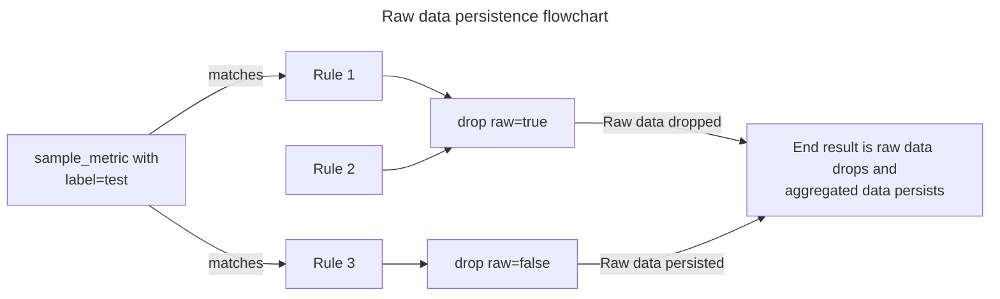

import ApiAuthReq from '/snippets/_partials/api-auth-req.mdx';
import TerraformCreate from '/snippets/_partials/terraformcreate.mdx';
import TerraformDel from '/snippets/_partials/terraformdel.mdx';
import TerraformPlan from '/snippets/_partials/terraformplan.mdx';

{/* -- dri: Adam Locke -- */}


To downsample and aggregate metrics after they're sent by the client but before
they're stored, create _rollup rules_.

Rollup rules are a type of [aggregation rule](/control/shaping/rules)
that help you reduce the cardinality footprint of your metrics by dropping raw
data to eliminate unneeded labels. High cardinality footprints can cause slow
dashboards and queries.

If you're working with [late-arriving data](/administer/limits-licensing/limits/metric-limits#late-arriving-metrics),
rollup rules are well suited for ensuring all of your data aggregates the way you
need it.

As an example, `instance` or `pod` labels don't often add value on their own,
but removing these labels from the client side isn't always possible. You can
use rollup rules to avoid storing these labels.

Rollup rules support both Prometheus and Graphite metrics.

## View rollup rules

Select from the following methods to view rollup rules.

<Tabs>
<Tab title="Web" id="view-a-rollup-rule-cloud">

In Observability Platform, view rollup rules in the
[Aggregation rules UI](/control/shaping/reduce-cardinality/review-aggregation-rules).

</Tab>
<Tab title="Chronoctl">

To list only rollup rules on the command line with [Chronoctl](/tooling/chronoctl),
use this command:

```shell
chronoctl rollup-rules list
```

</Tab>
<Tab title="API" id="view-a-rollup-rule-api">

To complete this action with the Chronosphere API, use the
[`ListRollupRules`](https://docs.chronosphere.io/tooling/api-info/definition/operations/ListRollupRules) endpoint.

<ApiAuthReq />

</Tab>
</Tabs>

For information about viewing, copying, or downloading rule configurations, see
[Rule configuration](/control/shaping/reduce-cardinality/review-aggregation-rules#rule-configuration).

## Create a rollup rule

Select from the following methods to apply rollup rules. Observability Platform
doesn't limit the number of rollup rules a system can have.

<Info>
If you define a rollup rule using the Observability Platform app, you must download
the rule configuration and apply it with one of the supported methods.
</Info>

<Tabs>
<Tab title="Web" id="create-a-rollup-rule-cloud">

Create rollup rule configurations in Observability Platform from the
[Aggregation rules UI](/control/shaping/reduce-cardinality/review-aggregation-rules).

When creating a rule configuration, the **Visual Editor** displays by default.
When creating a rule in Metrics Analyzer, the dialog pre-populates fields based
on the user's selected data.

To create a rule configuration:

1. Enter or edit data for the following fields:
   - **Rule Name**: Add or edit the name of the rule.
   - **Rule Details**: Either **Rule Preview** or **Rule Enabled**.
   - **Matching Time Series:** Time series the rule applies to. You must include a
     **Label**, operator (`=` or `!=`), and a **Value**. The value you enter maps to
     the `filters` section of the
     [CreateRollupRule](https://docs.chronosphere.io/tooling/api-info/definition/operations/CreateRollupRule#filters)
     endpoint.

     For example, if you want the rollup rule to match on
     [Prometheus gauge metrics](/control/shaping/types#prometheus), enter
     `__m3_prom_type__` as the label to match on, and `gauge` as the value. The
     resulting filter looks like:

     ```text
     __m3_prom_type__ = gauge
     ```

     Separate multiple values with a comma. You can use
     [glob syntax](/investigate/querying/glob-syntax), including matching multiple
     patterns with an `OR`, such as `service:{svc1,svc2}`. Click <Icon icon="plus" /> **Add**
     to add another time series.
   - **Labels to Roll Up**: **Discard Labels** or **Keep Labels**. Add labels to the
     **Input Labels** text box.
   - **Output Metric**: The new metric's name and aggregation configuration.
       - **Output Metric Name:** Edit the output metric name. Clear the checkbox for
         **Include metric name** to remove the original name.
       - **Input Metric Type:** Select a
         [metric type](/control/shaping/types#observability-platform-types), which
         determines how the rollup rule interprets all matching data points. For
         example, if you select **Gauge**, the rollup rule interprets all matching
         data points as that data type, even if the original source isn't a gauge
         metric. This behavior means that the metric type you choose doesn't have to
         match the data type of the incoming data.

         If you want to match the incoming metric to a specific type, enter two
         matching time series in the rollup rule: one to match the metric, and
         another to match the metric type. Use `__metric_type__` to define the type
         of metric you want to match on. For example, if you want to match a time
         series named `agg_write_latency` that's a cumulative exponential histogram,
         define two series that look like:

         ```text
         __name__ = agg_write_latency AND __metric_type__ = cumulative_exponential_histogram
         ```

       - **Aggregation:** Select an [aggregation operation](#aggregation-operations).
       - **Sample Interval:** The length of time between samples.
   - **Raw Data**: Select the toggle to drop the raw input data after aggregation.
1. When finished, click **Code Config**.
1. Choose your rule creation method from these options:
   - **Chronoctl**
   - **Terraform**
   - **API**
1.  Apply the changes based on your selected method.

</Tab>
<Tab title="Chronoctl" id="create-a-rollup-rule-chronoctl">

To create a rollup rule with [Chronoctl](/tooling/chronoctl), define the rule in a
YAML file and apply it.

If you don't already have a YAML configuration file, use the `scaffold` Chronoctl
parameter to generate a template for a specific resource type:

```shell
chronoctl rollup-rules scaffold
```

You can redirect the results (using the redirection operator `>`) to a file for
editing.

1. Create or edit a YAML configuration file to configure the rollup rule.

1. Apply the rollup rule:

   ```shell /FILE_NAME/
   chronoctl apply -f FILE_NAME.yaml
   ```

Replace _`FILE_NAME`_ with the name of the YAML configuration file.

See the [Chronoctl rollup rule example](#chronoctl-rollup-rule-example) for more
information.

</Tab>
<Tab title="Terraform" id="create-a-rollup-rule-terraform">

<TerraformPlan />

Create a rollup rule with Terraform by using the `chronosphere_rollup_rule`
type, followed by a name in a resource declaration. See the
[Terraform rollup rule example](#terraform-rollup-rule-example) for more information.

<TerraformCreate />

</Tab>

<Tab title="API" id="create-a-rollup-rule-api">

To complete this action with the Chronosphere API, use the
[`CreateRollupRule`](https://docs.chronosphere.io/tooling/api-info/definition/operations/CreateRollupRule) endpoint.

<ApiAuthReq />

</Tab>
</Tabs>

Rollup rules take effect immediately, but can require a full recording interval
to show a change.

### Best practices for rule creation

Following these guidelines helps ensure your rollup rules work as intended:

- Use [Live Telemetry Analyzer](/investigate/analyze/telemetry-analyzer) to verify your
  [glob syntax](/investigate/querying/glob-syntax) to ensure your query matches
  the correct metrics.
- Before using a rollup rule to group labels, be sure those labels aren't used
  in other places, such as dashboards, monitors, or the queries you use to
  debug issues.
- Filters using curly braces (`{}`) shouldn't use a dash (-) in the filter for
  label names. The single filter identifies this as a range. For example,
  `service_cluster: !{my-label}` fails. Rewrite the filter to
  `service_cluster:!human-label` instead.
- Metrics can match more than one rule. Matching multiple rules can affect data
  retention. If a rule matches any `drop_raw=true`, raw metrics are dropped.
- If a single output series receives more than 10 million unique input series,
  Observability Platform might stop accepting new input series specified in the
  rollup rule, which could result in partially aggregated metrics. To avoid this
  behavior, choose a [label policy](#label-policies) that writes more output series
  by removing fewer labels.



### Chronoctl rollup rule example

Here's an example of a rollup rule that matches time series with the value
`permits_blocked`, while discarding any labels matching `instance` and `job`. It uses
a counter type metric, and aggregates as a sum using a 30-second interval.

```yaml
api_version: v1/config
kind: RollupRule
spec:
  slug: permits_blocked_without_instance
  name: permits blocked without instance
  filters:
    - name: __name__
    value_glob: permits_blocked
  metric_name: '{{ .MetricName }}:without_instance'
  metric_type: COUNTER
  aggregation: SUM
  interval: 30s
  label_policy:
    discard:
    - instance
    - job
  mode: ENABLED
```

### Terraform rollup rule example

Here's an example of a rollup rule that matches time series with the value
`permits_blocked`, while discarding any labels matching `instance` and `job`.
It uses a counter type metric, and aggregates as a sum using a 30-second interval.

```ruby
resource "chronosphere_rollup_rule" "permits_blocked_without_instance" {
  name      = "permits blocked without instance"
  slug      = "permits_blocked_without_instance"
  filter    = "__name__:permits_blocked"
  permissive = false
  metric_type = "COUNTER"
  aggregation = "SUM"
  interval = "30s"
  exclude_by  = ["instance", "job"]
  mode      = "ENABLED"
  new_metric  = "{{ .MetricName }}:without_instance"
}
```

## Delete a rollup rule

<Tabs>
<Tab title="Chronoctl" id="delete-a-rollup-rule-chronoctl">

To delete rollup rules with [Chronoctl](/tooling/chronoctl), use this command:

```shell /SLUG/
chronoctl rollup-rules delete SLUG
```

Replace _`SLUG`_ with the rule's slug.

For example, to delete the `http_request_duration_by_service_and_status` rule,
use this command:

```shell
chronoctl rollup-rules delete http_request_duration_by_service_and_status
```

If your slug starts with a dash (`-`), use double quotes (`"`) around the slug
name.

```shell
chronoctl rollup-rules delete "/-my-rollup-rule"
```

</Tab>

<Tab title="Terraform" id="delete-a-rollup-rule-terraform">

<TerraformDel />

</Tab>

<Tab title="API" id="delete-a-rollup-rule-chronoctl">

To complete this action with the Chronosphere API, use the
[`DeleteRollupRule`](https://docs.chronosphere.io/tooling/api-info/definition/operations/DeleteRollupRule) endpoint.

<ApiAuthReq />

</Tab>
</Tabs>


## Rollup rule attributes

To accurately aggregate your data, rollup rules require you to both
configure multiple fields and to have an understanding of
[aggregation operations](#aggregation-operations).

See the [CreateRollupRule API](https://docs.chronosphere.io/tooling/api-info/definition/operations/CreateRollupRule)
documentation for the complete list of fields that are part of the `rollup_rule`
object that you define when [creating a rollup rule](#create-a-rollup-rule) with any
of the supported methods.

### Label policies

Use label policies to define which labels to preserve in the resulting metric. In the
rollup rule definition, add the appropriate field to specify which labels to retain
or discard.

<Info>
You can set only one of `group_by` or `exclude_by` per rollup rule. Graphite metrics
support only the `exclude_by` rule type.
</Info>

#### Keep specified labels

To aggregate only metrics that contain _all_ of the specified labels and discard all
other labels, use `group_by` (Terraform) or `keep`. When using these rollup rules,
you must specify the labels to aggregate the metrics by. If a metric doesn't include
all of the specified labels, the metric isn't included in the rule.

If a rollup rule uses `group_by` or `keep`, the rule will match only metrics with
labels that contain these fields, even if the label `filters` would have matched
these metrics.

#### Remove specified labels

To target a group of metrics for a particular service, team, or other higher-level
set of metrics, use `exclude_by` (Terraform) or `discard`. When using these rollup
rules, you specify which labels to remove from the aggregated metric, while keeping
all other labels.

#### Set a Graphite label policy

For Graphite metrics, you can use the `graphite_label_policy` parameter to also
set a Graphite-specific label policy. This lets you define replacements for label
values without changing their positions, which can reduce cardinality without breaking
Graphite metrics' preferred positional indexing.

For example, assume you have raw metric names that follow this pattern:

```text
cluster.production.instance.instance1.requests_count
cluster.production.instance.instance2.requests_count
...
```

You can create a Graphite label policy that defines a replacement rule that replaces
the third positional label name (`__g3__`) with a new string value (`INSTANCE`).

This replacement aggregates these metrics as
`cluster.production.instance.INSTANCE.requests_count`, without changing their positional
indexing.

<Tabs>

<Tab title="Chronoctl">

The output of the `chronoctl rollup-rules scaffold` command includes the `graphite_label_policy`
parameter:

```yaml
api_version: v1/config
kind: RollupRule
spec:
  ...
    graphite_label_policy:
      # Required list of labels to replace. Useful for discarding
      # high-cardinality values while still preserving the original positions of
      # the Graphite metric.
      replace:
        - # Required name of the label whose value should be replaced. Only
          # '__gX__' labels are allowed (aka positional Graphite labels).
          name: <string>
          # Required new value of the replaced label.
          new_value: <string>
  ...
```

To implement the rule from the example scenario as a Chronoctl YAML resource, define
the `name` and `new_value` in the list of `replace` values:

```yaml
api_version: v1/config
kind: RollupRule
spec:
  ...
    graphite_label_policy:
      replace:
        - name: "__g3__"
          new_value: "INSTANCE"
  ...
```

Define multiple replacements in a single rollup rule by adding more pairs of `name`
and `new_value` to the `replace` list.

</Tab>

<Tab title="Terraform">

The `graphite_label_policy` parameter in the `chronosphere_rollup_rule` resource
accepts a `replace` map of `name` and `new_value` pairs.

For example, to implement the rule from the example scenario as a Terraform resource:

```yaml
resource "chronosphere_rollup_rule" "rollup_rule" {
  ...
  graphite_label_policy = {
    name = "__g3__"
    new_value = "INSTANCE"
  }
  ...
}
```

</Tab>
</Tabs>

### Aggregation operations

Some operations can change the type of the metric during aggregation. The
resulting metric type of an aggregation is called the _output_ metric type.

Even if you are ingesting data with the wrong metric type, configure your rollup rule
with the metric type that the ingested data should be. For example, if Chronosphere
Observability Platform ingests metrics with type `GAUGE`, but the values actually
represent `DELTA_COUNTER`, use a `metric_type=DELTA_COUNTER` rollup rule to aggregate
them.

Rollup rules support the following aggregation operations:

#### `CUMULATIVE_COUNTER`

Cumulative counters support these aggregations:

- `SUM`: Takes the increase of each individual input series within the
  configured interval, then sums the increases together according to the configured label
  policy. The output is the cumulative summed increase across all input series.

- `COUNT`: Counts the number of unique input series matched by the configured label
  policy (for example, cardinality).

The output type of all cumulative counter aggregations is a [`CUMULATIVE_COUNTER`](/control/shaping/types#cumulative-counter).

#### `GAUGE`

Gauges support the following aggregation methods:

- `SUM`: Takes the max value of each individual input series within the
  configured interval, then sums all final values together by the configured
  label policy.

- `COUNT`: Counts the number of unique input series matched by the configured label
  policy (for example, cardinality).

- `MIN`: Takes the minimum value of all data points within the configured
  interval across all series matched by the configured label policy.

- `MAX`: Takes the maximum value of all data points within the configured
  interval across all series matched by the configured label policy.

- `PXX`, `MEAN`, `MEDIAN`, `STDEV`, `SUMSQ`: Takes the maximum value of each
  individual input series within the configured interval, and then computes the
  value distribution.

The output type of all gauge aggregations is a [`GAUGE`](/control/shaping/types#gauge).

When querying a gauge metric with a range vector included in the query
downsampling might impact the accuracy of the query result. Most use cases that
fit this criteria can be converted to use counters instead, which avoids the issue.

#### `DELTA_COUNTER`

Supported aggregations:

- `SUM`: Sums all values of all series matched by the configured label policy. All
  values must be nonnegative.

- `COUNT_SAMPLES`: Counts the number of input samples matched by the configured label
  policy.

The output type of all delta counter aggregations is a [`DELTA_COUNTER`](/control/shaping/types#delta-counter).

##### Exceptions for `DELTA_COUNTER` metrics

`DELTA_COUNTER` metrics don't require the following fields for rollup rules:

- `name`
- `aggregation`
- `keep`
- `discard`

#### `MEASUREMENT`

A key feature of `MEASUREMENT` aggregations lies in how they treat individual
samples. Unlike other types such as [`GAUGE`](/control/shaping/rules/rollup#gauge)
and [`CUMULATIVE_COUNTER`](/control/shaping/rules/rollup#cumulative_counter),
`MEASUREMENT` metrics aggregate all at once, across all samples of your matching
time series within the aggregated time interval. This enables calculation of
accurate statistics server-side, within Observability Platform.

A typical use case for `MEASUREMENT` aggregations is calculating statistics across
raw request latencies across all instances. This can be correctly performed through
`metric_type=MEASUREMENT` and `aggregation=P95`. Using `metric_type=GAUGE` in this
scenario produces results you don't want, discarding all samples except the
per-instance max value, then computing the ninety-fifth percentile across these
per-instance max values.

Measurements support all aggregation methods:

- `SUM`: Sums all values of all series matched by the configured label policy. All
  values must be nonnegative. The output metric type is a
  [`DELTA_COUNTER`](/control/shaping/types#delta-counter).

- `COUNT_SAMPLES`: Counts the number of input samples matched by the configured label
  policy. The output metric type is a
  [`DELTA_COUNTER`](/control/shaping/types#delta-counter).

- `LAST`: Takes the last value of all samples matched by the configured label policy.
  The output metric type is a [`GAUGE`](/control/shaping/types#gauge).

- `MIN`: Takes the minimum value of all samples matched by the configured label
  policy. The output metric type is a [`GAUGE`](/control/shaping/types#gauge).

- `MAX`: Takes the maximum value of all samples matched by the configured label
  policy. The output metric type is a [`GAUGE`](/control/shaping/types#gauge).

- `PXX`, `MEAN`, `MEDIAN`, `STDEV`, `SUMSQ`: Computes the value distribution across
  all samples matched by the configured label policy. The output metric type is a
  [`GAUGE`](/control/shaping/types#gauge).

- `HISTOGRAM`: Summarizes the distribution of values as an exponential histogram
  with a scale of 3. The output type is a
  [`DELTA_EXPONENTIAL_HISTOGRAM`](/control/shaping/types#delta-exponential-histograms).

### Histograms aggregation operations

<Info>
If either the input histogram or resulting aggregation exceeds the 160-bucket limit,
Observability Platform decreases the exponential histogram scale until the bucket
count is within the limit. Downscaling reduces the exponential histogram's resolution.
</Info>

#### `CUMULATIVE_EXPONENTIAL_HISTOGRAM`

Cumulative exponential histogram aggregations operate on OpenTelemetry exponential
histograms with cumulative temporality, and on Prometheus native histograms with
an exponential bucket layout.

Cumulative exponential histograms support this aggregation method:

- `SUM`: Merges input cumulative exponential histograms by the configured label
  policy. The output metric type is a
  [`CUMULATIVE_EXPONENTIAL_HISTOGRAM`](/control/shaping/types#histogram).

#### `DELTA_EXPONENTIAL_HISTOGRAM`

Delta exponential histogram aggregations operate on OpenTelemetry exponential histograms
with delta temporality.

Delta exponential histograms support this aggregation method:

- `SUM`: Merges input delta exponential histograms by the configured label policy.
  The output metric type is a
  [`DELTA_EXPONENTIAL_HISTOGRAM`](/control/shaping/types#delta-exponential-histograms).
