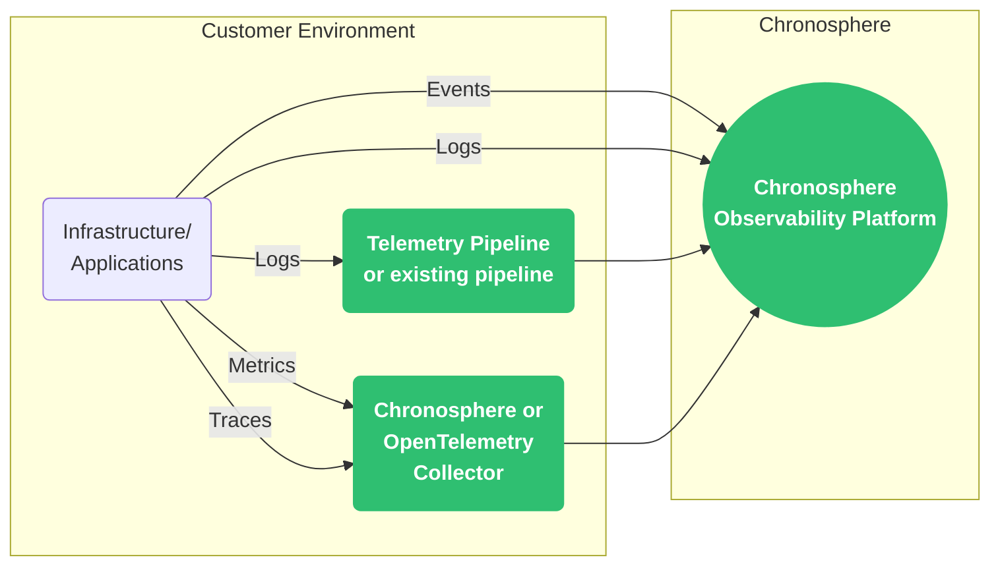

import NoIcon from '/snippets/_partials/no-icon.mdx';
import YesIcon from '/snippets/_partials/yes-icon.mdx';

{/* -- dri: Garrett Guillotte -- */}

Before you can use Chronosphere Observability Platform to view and manage your
telemetry data (of whatever type), you need to get that data into Observability
Platform.

Observability Platform supports multiple methods to ingest telemetry data, which
depend on which type of data you want to ingest:

| Ingestion method        | Change events | Logs | Metrics | Traces |
| ----------------------- | :-----------: | :--: | :-----: | :----: |
| [Chronosphere Collector](/ingest/metrics-traces/collector) | <NoIcon /> | <NoIcon /> | <YesIcon /> | <YesIcon /> |
| [OpenTelemetry Collector](/ingest/metrics-traces/otel)     | <NoIcon /> | <YesIcon /> | <YesIcon /> | <YesIcon /> |
| [Telemetry Pipeline](/pipelines) or Core Agent             | <NoIcon /> | <YesIcon /> | <NoIcon /> | <NoIcon /> |
| [Existing pipeline](/ingest/logs)                          | <NoIcon /> | <YesIcon /> | <NoIcon /> | <NoIcon /> |
| [Direct to Observability Platform](/ingest/third-party)    | <YesIcon /> | <YesIcon /> | <NoIcon /> | <NoIcon /> |

After ingesting telemetry data, you can use the control mechanisms that Observability
Platform provides to [control costs](/control) and ensure you're ingesting only the
data you care about.

## Ingestion models

Chronosphere utilizes _push_ and _pull_ models of ingestion, depending on the data
collected and the method of ingestion.

| Telemetry type | Push | Pull |
| -------------- | :--: | :--: |
| Metrics        | <YesIcon /> | <YesIcon /> |
| Traces         | <YesIcon />| <NoIcon /> |
| Logs           | <YesIcon /> | <YesIcon /> |

_Pull_ models, like the Chronosphere Collector, scrape telemetry data from external
sources and pull it in. These metrics have consistent reporting intervals.

_Push_ models, like tracing, send telemetry data to Chronosphere, which is then
processed. These metrics can have a broad spectrum of reporting frequency, from large
bursts of data to long periods with no data reporting.

The ingestion model depends on the telemetry data source. Metrics pushed to
Observability Platform can have [latency delays](/ingest/metrics-traces/gcp#metrics-availability)
or [sparse time series](/investigate/querying/metrics/troubleshooting#sparse-time-series) which can
result in unexpected query results.
