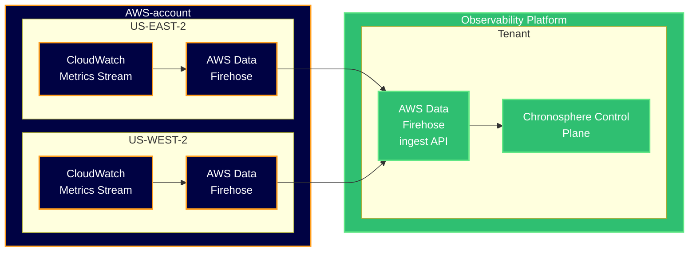

{/* -- dri: Garrett Guillotte -- */}


Chronosphere Observability Platform supports receiving AWS CloudWatch metrics through
[CloudWatch Metrics Streams](https://docs.aws.amazon.com/AmazonCloudWatch/latest/monitoring/CloudWatch-Metric-Streams.html).
You can configure Amazon Web Services (AWS) to continually stream metrics to
Observability Platform by configuring CloudWatch Metric Streams, either manually in
the AWS Management Console or by using Terraform.

## Metric naming conventions

Metric names of ingested CloudWatch metrics in Observability Platform follow the
prefix naming pattern:

```text
<namespace>_<MetricName>_<statistic>
```

- `<namespace>`: The namespace is lowercased, and Observability Platform replaces
  all forward slash (`/`) and period (`.`) characters in the CloudWatch namespace
  with underscores (`_`).

  All AWS service namespaces follow the naming convention `AWS/<ServiceName>`, where
  `<ServiceName>` is replaced with the service name. In Observability Platform,
  the ingested metrics therefore begin with `aws_<servicename>`. For a list of AWS
  services and their respective namespaces, see
  [AWS services that publish CloudWatch metrics](https://docs.aws.amazon.com/AmazonCloudWatch/latest/monitoring/aws-services-cloudwatch-metrics.html).

  If you create custom metrics, the namespace you set for the metric correspondingly
  becomes the metric name prefix in Observability Platform.
- `<MetricName>`: Observability Platform preserves the CloudWatch metric name's case.
- `<statistic>`: Observability Platform appends the CloudWatch statistic's name
  (`count`, `sum`, `maximum`, `minimum`, `average`). If you define additional statistics
  for a metric, Observability Platform appends the corresponding CloudWatch metric
  statistic name (`pXX`).

For examples, see [Example metric names](#example-metric-names).

## Metric labeling conventions

Observability Platform adds CloudWatch metric dimensions as labels to the time series
following the pattern `dimension_<DimensionName>`. For examples, see
[Example metric names](#example-metric-names).

## Metric limitations

Most AWS services publish metrics to CloudWatch in or near real-time. However, a
subset of AWS services, such as Amazon S3 daily storage metrics for buckets in
CloudWatch, produce metrics based on a daily schedule with a data point timestamp older than the two-hour
late-arriving data point limit.

Observability Platform generally expects data points to be timestamped at the time
they are sent, and enforces a two-hour age limit on ingested data points. Check
the send interval for a specific AWS service metric to ensure it publishes metrics
more frequently than the two-hour ingestion age limit.

## Stream resource attributes

CloudWatch Metric Streams include OpenTelemetry Protocol (OTLP) resource attributes,
which Observability Platform merges into the time series. Observability Platform
replaces periods (`.`) with underscores (`_`) in attribute key names.

Amazon Data Firehose includes the following resource attributes in every post:

- `aws_exporter_arn`: The Amazon Resource Name (ARN) of the CloudWatch Metric Stream,
  which serves as the unique metric writer instance identifier.
- `cloud_account_id`: The account ID of the Amazon Data Firehose sending the stream,
  such as `123456789`.
- `cloud_provider`: The value is always `aws`.
- `cloud_region`: The AWS region of the Amazon Data Firehose sending the stream,
  such as `us-east-2`.

For examples, see [Example metric names](#example-metric-names).

### Add custom resource attributes using stream parameters

You can define custom key:value pairs as parameters for Amazon Data Firehose to
include in each HTTP call. Observability Platform treats all additional parameters
as resource attributes and merges them into the time series.

<Info>
Your custom parameters take precedence over the default CloudWatch metrics resource
attributes. To avoid accidentally overwriting CloudWatch-provided values, do not
add custom parameters with key names that conflict with default CloudWatch key names.
</Info>

You can configure additional parameters using either the AWS Management Console
or Terraform.

<Tabs>

<Tab title="Terraform">

To configure parameters using Terraform:

1. Edit the Terraform module.
1. In the `aws_kinesis_firehose_delivery_stream` resource definition, modify the
   `request_configuration` block to define additional `common_attributes`. The
   AWS Management Console names this setting **Parameters**, while the API name is
   `common_attributes`.

   For example, this configures the `content_encoding` parameter to `GZIP` and defines
   two `common_attributes`, `testname` and `testname2`:

   ```ruby
   request_configuration {
     content_encoding = "GZIP"

     common_attributes {
       name  = "testname"
       value = "testvalue"
     }

     common_attributes {
       name  = "testname2"
       value = "testvalue2"
     }
   }
   ```

</Tab>

<Tab title="AWS Management Console">

To configure parameters using the AWS Management Console:

1. Navigate to the Amazon Data Firehose service.
1. Click the stream sending CloudWatch metrics (​​`PUT-CW-STREAM-CHRONOSPHERE`).
1. Click the **Configuration** tab in the Firehose stream details view.
1. In the Destination settings panel, click **Add parameters**.
1. In the Edit destination settings view, click **Add parameter**.
1. Enter the key and value. To add more parameters, click **Add parameter**.
1. Click **Save changes**.

</Tab>

</Tabs>

### Example metric names

Given a CloudWatch metric with the following attributes:

- The namespace `AWS/EBS` (AWS Service)
- The metric name `VolumeReadBytes`
- The dimension `VolumeId`
- The custom Firehose destination parameter `environment`
- The CloudWatch metric resource attributes `aws_exporter_arn`, `cloud_account_id`,
  `cloud_provider`, and `cloud_region`

Observability Platform creates metrics with these names and labels:

```text
aws_ebs_VolumeReadBytes_count{dimension_VolumeId="xyz", aws_exporter_arn="abc123", cloud_account_id="123", cloud_provider="aws", cloud_region="us-east-2", environment="staging"}
aws_ebs_VolumeReadBytes_sum{dimension_VolumeId="xyz", aws_exporter_arn="abc123", cloud_account_id="123", cloud_provider="aws", cloud_region="us-east-2", environment="staging"}
aws_ebs_VolumeReadBytes_maximum{dimension_VolumeId="xyz", aws_exporter_arn="abc123", cloud_account_id="123", cloud_provider="aws", cloud_region="us-east-2", environment="staging"}
aws_ebs_VolumeReadBytes_minimum{dimension_VolumeId="xyz", aws_exporter_arn="abc123", cloud_account_id="123", cloud_provider="aws", cloud_region="us-east-2", environment="staging"}
aws_ebs_VolumeReadBytes_average{dimension_VolumeId="xyz", aws_exporter_arn="abc123", cloud_account_id="123", cloud_provider="aws", cloud_region="us-east-2", environment="staging"}
```

Given a CloudWatch metric with the following attributes:

- The namespace `Buildkite` (custom metrics)
- The metric name `RunningJobsCount`
- The custom Firehose destination parameter `environment`
- No dimension
- CloudWatch resource metric attributes `aws_exporter_arn`, `cloud_account_id`,
  `cloud_provider`, and `cloud_region`

Observability Platform creates metrics with these names and labels:

```text
buildkite_RunningJobsCount_count{aws_exporter_arn="abc123", cloud_account_id="123", cloud_provider="aws", cloud_region="us-east-2", environment="staging"}
buildkite_RunningJobsCount_sum{aws_exporter_arn="abc123", cloud_account_id="123", cloud_provider="aws", cloud_region="us-east-2", environment="staging"}
buildkite_RunningJobsCount_maximum{aws_exporter_arn="abc123", cloud_account_id="123", cloud_provider="aws", cloud_region="us-east-2", environment="staging"}
buildkite_RunningJobsCount_minimum{aws_exporter_arn="abc123", cloud_account_id="123", cloud_provider="aws", cloud_region="us-east-2", environment="staging"}
buildkite_RunningJobsCount_average{aws_exporter_arn="abc123", cloud_account_id="123", cloud_provider="aws", cloud_region="us-east-2", environment="staging"}
```

## Drop CloudWatch Metric Stream metrics

When you ingest CloudWatch Metric Streams, you generate metrics that consume
some of your Standard Metrics License capacity. To determine how this might affect
license consumption, configure a [drop rule](/control/shaping/rules/drop-rules)
before configuring CloudWatch Metric Stream ingestion.

### Create rules to drop CloudWatch Metrics

This example [Chronoctl](/tooling/chronoctl) YAML resource definition creates a drop rule
that drops all metrics from CloudWatch Metric Streams _except_ for metrics about
the Metric Stream itself.

```yaml
api_version: v1/config
kind: DropRule
spec:
  slug: drop-cloudwatch-metric-stream-metrics
  name: Drop CloudWatch Metric Stream metrics
  mode: ENABLED
  filters:
    - name: aws_exporter_arn
      value_glob: arn:aws:cloudwatch:*
    - name: Namespace!
      value_glob: '{AWS/CloudWatch/MetricStreams}'
```

You can modify the rule to allow additional metrics from additional AWS namespaces.
This example allows all metrics from the CloudWatch Metric Streams and AWS ECS
namespaces.

```yaml
api_version: v1/config
kind: DropRule
spec:
  slug: drop-cloudwatch-metric-stream-metrics
  name: Drop CloudWatch Metric Stream metrics
  mode: ENABLED
  filters:
    - name: aws_exporter_arn
      value_glob: arn:aws:cloudwatch:*
    - name: Namespace!
      value_glob: '{AWS/CloudWatch/MetricStreams,AWS/ECS}'
```

You can also configure CloudWatch Metric Streams to include or exclude specific
namespaces to reduce AWS costs associated with the streaming of unwanted metrics.

1. In the AWS Management Console, go to **Streams**.
1. Edit the Metric Stream.
1. Under **Metrics to be streamed**, include or exclude namespaces.

### View drop rule metrics

To view how many data points per second that Observability Platform is dropping
with the example CloudWatch Metric Streams drop rule, use the following PromQL query:

```text
sum by (policy_name) (rate(chrono_policies_count{dropped="yes", policy_name="Drop CloudWatch Metric Stream metrics"}[5m]))
```

## Configure CloudWatch Metric Streams

The following diagram shows the architecture and data flow from your AWS account to
Chronosphere. In each of your AWS regions where you want to stream data from, a
CloudWatch Metric Streams instance sends data to an AWS Data Firehose, which forwards
that data to the AWS Data Firehose ingest endpoint running in your Observability
Platform tenant.

Observability Platform processes the CloudWatch metrics and makes them available for
use in queries, monitors, and dashboards.



### CloudWatch roles and permissions

To use CloudWatch Metric Streams in Observability Platform, you must configure a
CloudWatch Metric Stream in each AWS account and region. The account you use to set
up the CloudWatch Metric Stream must either have the `CloudWatchFullAccess` policy
and `iam:PassRole` permission, or it must have the following list of permissions:

- `iam:PassRole`
- `cloudwatch:PutMetricStream`
- `cloudwatch:DeleteMetricStream`
- `cloudwatch:GetMetricStream`
- `cloudwatch:ListMetricStreams`
- `cloudwatch:StartMetricStreams`
- `cloudwatch:StopMetricStreams`
- `iam:CreateRole`
- `iam:PutRolePolicy`

### Observability Platform authentication

You must also create or use the API token of an Observability Platform restricted
service account with write-only permission. For more information, see
[Create a restricted service account](/administer/accounts-teams/service-accounts#create-a-restricted-service-account).

You must also provide your Observability Platform organization name, which is the
name of the subdomain that you use to access Observability Platform. For example, if
your team uses `example.chronosphere.io`, your team's organization name is `example`.

### AWS resources and IAM roles

The AWS setup process automatically creates the following resources and IAM roles as
part of creating a metrics stream:

#### AWS resources

- **S3 Bucket:** A bucket will be created to store data processed by the Kinesis
  Firehose delivery stream.
- **CloudWatch Log Group:** A log group will be created to capture logs related
  to the Kinesis Firehose delivery stream.
- **Kinesis Firehose Delivery Stream:** A Kinesis Firehose delivery stream will be
  created with configurations to send data to Observability Platform through an HTTP
  endpoint, and store backup data in the S3 bucket.
- **IAM Role for S3:** An IAM role will be created with the following permissions
  for the Kinesis Firehose to access the S3 bucket and CloudWatch Logs:
    - `s3:AbortMultipartUpload`
    - `s3:GetBucketLocation`
    - `s3:GetObject`
    - `s3:ListBucket`
    - `s3:ListBucketMultipartUploads`
    - `s3:PutObject`
    - `logs:PutLogEvents`

#### IAM roles

An IAM role to allow CloudWatch Metric Streams to publish data to the Kinesis Firehose
delivery stream will be created with the following permissions:

- `firehose:PutRecord`
- `firehose:PutRecordBatch`

### Apply the configuration

You can configure CloudWatch Metric Streams either manually in the AWS Management
Console or by using Terraform.

<Info>
Before configuring metric ingestion, you can set up a drop rule to drop all metrics
sent by CloudWatch Metric Streams. Doing this avoids unexpected license
consumption changes. For examples, see
[Drop CloudWatch Metric Stream metrics](#drop-cloudwatch-metric-stream-metrics).
</Info>

<Tabs>

<Tab title="Terraform">

1. Set values for the following environment variables, and modify the following
   Terraform data, and resources to apply the required settings.

   ```ruby
   # Variables

   variable "chronosphere_org_name" {
     type        = string
     description = "The name of your Observability Platform organization, which is the subdomain name before .chronosphere.io."
   }

   variable "chronosphere_api_token" {
     type        = string
     sensitive   = true
     description = "The API token for an Observability Platform Restricted Service Account with write-only permission."
   }

   variable "failed_data_bucket_name" {
     type        = string
     description = "The name of the S3 bucket to create to store data that couldn't be delivered to Observability Platform. If not specified, a random name will be generated."
     default     = ""
   }

   variable "common_resource_attributes" {
     type        = map(string)
     description = "Key-value pairs to apply as OpenTelemetry Resource Attributes on all metrics in this stream."
     default     = {}
   }

   # IAM Policy Documents

   data "aws_iam_policy_document" "kinesis-firehose-stream-role-trust-policy" {
     statement {
       sid     = "AllowRoleAssumptionByKinesisFirehose"
       effect  = "Allow"
       actions = ["sts:AssumeRole"]

       principals {
         type        = "Service"
         identifiers = ["firehose.amazonaws.com"]
       }
     }
   }

   data "aws_iam_policy_document" "kinesis-firehose-stream-role-s3-policy" {
     statement {
       sid     = "AllowFirehoseS3Access"
       effect  = "Allow"
       actions = [
         "s3:AbortMultipartUpload",
         "s3:GetBucketLocation",
         "s3:GetObject",
         "s3:ListBucket",
         "s3:ListBucketMultipartUpload",
         "s3:PutObject"
       ]

       resources = [
         aws_s3_bucket.kinesis-firehose-stream-failed-data.arn,
         "${aws_s3_bucket.kinesis-firehose-stream-failed-data.arn}/*"
       ]
     }
   }

   data "aws_iam_policy_document" "cloudwatch-metric-stream-role-trust-policy" {
     statement {
       sid     = "AllowRoleAssumptionByloudWatchMetricStream"
       effect  = "Allow"
       actions = ["sts:AssumeRole"]

       principals {
         type        = "Service"
         identifiers = ["streams.metrics.cloudwatch.amazonaws.com"]
       }
     }
   }

   data "aws_iam_policy_document" "cloudwatch-metric-stream-role-firehose-policy" {
     statement {
       sid    = "AllowCloudWatchFirehoseAccess"
       effect = "Allow"
       actions = [
         "firehose:PutRecord",
         "firehose:PutRecordBatch"
       ]

       resources = [
         aws_kinesis_firehose_delivery_stream.kinesis-firehose-stream.arn
       ]
     }
   }

   # S3

   resource "random_id" "default_bucket_name_suffix" {
     byte_length = 8
   }

   resource "aws_s3_bucket" "kinesis-firehose-stream-failed-data" {
     bucket = var.failed_data_bucket_name != "" ? var.failed_data_bucket_name : "chronosphere-cw-stream-failed-data-${random_id.default_bucket_name_suffix.hex}"
   }

   resource "aws_s3_bucket_public_access_block" "kinesis-firehose-stream-failed-data" {
     bucket                  = aws_s3_bucket.kinesis-firehose-stream-failed-data.id
     block_public_acls       = true
     block_public_policy     = true
     ignore_public_acls      = true
     restrict_public_buckets = true
   }

   resource "aws_s3_bucket_server_side_encryption_configuration" "kinesis-firehose-stream-failed-data" {
     bucket = aws_s3_bucket.kinesis-firehose-stream-failed-data.id

     rule {
       apply_server_side_encryption_by_default {
         sse_algorithm = "AES256"
       }

       bucket_key_enabled = false
     }
   }

   resource "aws_s3_bucket_lifecycle_configuration" "kinesis-firehose-stream-failed-data" {
     bucket = aws_s3_bucket.kinesis-firehose-stream-failed-data.id

     rule {
       id = "Cleanup"

       expiration {
         days = 90
       }

       status = "Enabled"
     }
   }

   # Kinesis Firehose Delivery Stream

   resource "aws_iam_role" "kinesis-firehose-stream-role" {
     name               = "cloudwatch-firehose-stream-role"
     assume_role_policy = data.aws_iam_policy_document.kinesis-firehose-stream-role-trust-policy.json

     tags = {
       Name = "cloudwatch-firehose-stream-role"
     }
   }

   resource "aws_iam_role_policy" "kinesis-firehose-stream-role-s3-policy" {
     name   = "KinesisFirehose-S3Access"
     role   = aws_iam_role.kinesis-firehose-stream-role.id
     policy = data.aws_iam_policy_document.kinesis-firehose-stream-role-s3-policy.json
   }

   resource "aws_kinesis_firehose_delivery_stream" "kinesis-firehose-stream" {
     name        = "chronosphere-cloudwatch-metric-stream"
     destination = "http_endpoint"

     http_endpoint_configuration {
       name               = "chronosphere-http-endpoint"
       url                = "https://${var.chronosphere_org_name}.chronosphere.io/data/metrics/api/v1/cloudwatch/firehose"
       access_key         = var.chronosphere_api_token
       buffering_size     = 1  # MiB
       buffering_interval = 60 # seconds
       role_arn           = aws_iam_role.kinesis-firehose-stream-role.arn
       s3_backup_mode     = "FailedDataOnly"
       retry_duration     = 300 # seconds

       s3_configuration {
         role_arn           = aws_iam_role.kinesis-firehose-stream-role.arn
         bucket_arn         = aws_s3_bucket.kinesis-firehose-stream-failed-data.arn
         buffering_size     = 10  # MiB
         buffering_interval = 300 # seconds
         compression_format = "GZIP"
       }

       request_configuration {
         content_encoding = "GZIP"

         dynamic "common_attributes" {
           for_each = var.common_resource_attributes
           iterator = attribute
           content {
             name  = attribute.key
             value = attribute.value
           }
         }
       }
     }

     server_side_encryption {
       enabled = true
     }
   }

   # CloudWatch Metric Stream

   resource "aws_iam_role" "cloudwatch-metric-stream-role" {
     name               = "cloudwatch-metric-stream-role"
     assume_role_policy = data.aws_iam_policy_document.cloudwatch-metric-stream-role-trust-policy.json

     tags = {
       Name = "cloudwatch-metric-stream-role"
     }
   }

   resource "aws_iam_role_policy" "cloudwatch-metric-stream-role-firehose-policy" {
     name   = "MetricStreams-FirehosePutRecords"
     role   = aws_iam_role.cloudwatch-metric-stream-role.id
     policy = data.aws_iam_policy_document.cloudwatch-metric-stream-role-firehose-policy.json
   }

   resource "aws_cloudwatch_metric_stream" "cloudwatch-metric-stream" {
     name          = "chronosphere-metric-stream"
     role_arn      = aws_iam_role.cloudwatch-metric-stream-role.arn
     firehose_arn  = aws_kinesis_firehose_delivery_stream.kinesis-firehose-stream.arn
     output_format = "opentelemetry1.0"
   }
   ```

</Tab>

<Tab title="AWS Management Console">

To configure CloudWatch Metric Streams using the AWS Management Console:

1. Open the [CloudWatch console](https://console.aws.amazon.com/cloudwatch/).
1. In the navigation pane, go to **Metrics <span aria-label="and then">></span> Streams**.
1. Click **Create metric stream**.
1. Click **Custom setup with Firehose**.
1. To create a new Amazon Data Firehose stream, click **Set up an Amazon Data Firehose stream**
   under **Select your Amazon Data Firehose stream**.
1. In **Create Firehose Stream**, set the following options:
   - **Set source:** `Amazon Kinesis Data Streams` or `Direct PUT`
   - **Destination:** `HTTP Endpoint`
   - **Firehose stream name:** `chronosphere-cloudwatch-metric-stream`
   - **Destination settings:**
     - **HTTP endpoint name:** `Chronosphere CloudWatch Endpoint`
     - **HTTP endpoint URL:** `https://<ORG_NAME>.chronosphere.io/data/metrics/api/v1/cloudwatch/firehose`.
       Replace `<ORG_NAME>` with your Observability Platform organization name.
     - **Authentication:** `Use access key`
     - **Access key:** Enter your Observability Platform Restricted Service Account's
       API token.
     - **Content encoding:** `GZIP`
     - **Retry duration:** `300 seconds`
     - Expand **Buffering Hints**.
       - **Buffer size:** `1 MiB`
       - **Buffer interval:** `60 seconds`
   - **Backup settings:**
     - **Source record backup in Amazon S3:** `Failed data only`
     - **S3 backup bucket:** Select a bucket, or create a new bucket. If you create
       a new bucket, provide a unique name and leave all default settings.
     - Expand **Buffer hints, compression and encryption**.
       - **Buffer size:** `10 MiB`
       - **Buffer interval:** `300 seconds`
       - **Compression for data records:** `GZIP`
1. Click **Create Firehose stream**.
1. Return to **Create a metric stream**.
1. In **Select your Amazon Data Firehose stream**, select `PUT-CW-STREAM-CHRONOSPHERE`.
   This is the Amazon Data Firehose stream you created previously.
1. Expand **Change output format** and verify that the output format is
   `OpenTelemetry 1.0`.
1. Under **Metrics to be streamed**, select **All metrics** to stream all CloudWatch
   metrics, or **Select metrics** to define which metrics to include or exclude in
   the metrics stream.
1. Set the **Custom metric stream name** to `chronosphere-cloudwatch-metric-stream`.
1. Click **Create metric stream**.

</Tab>

</Tabs>

## Verify CloudWatch Metric Stream ingestion

After setup, data can take from 5 to 10 minutes to arrive to Observability Platform.
To verify functionality, check the operational dashboards in the AWS Management
Console for the Metric Stream and Amazon Data Firehose.

{/* vale off */}
{/* Vale doesn't like ampersands, but there's one in the name of the dashboard. */}

### Check the CloudWatch Metrics Ingestion & Health dashboard

The CloudWatch Metrics Ingestion & Health dashboard displays operational information
about the health of your CloudWatch Metrics Streams integration with Observability
Platform.

The **CloudWatch Metric Streams** and **Data Firehose** panel groups rely on
CloudWatch metrics sent from those services to Observability Platform. To populate
these charts, include metrics from the `AWS/Firehose` and
`AWS/CloudWatch/MetricStreams` namespaces in your CloudWatch Metrics Streams
configuration.

1. In Observability Platform, go to **Dashboards**.
1. In the search bar, enter **CloudWatch**, and then click on the
   **CloudWatch Metrics Ingestion & Health** dashboard.

   The **Observability Platform metrics ingestion** panel group displays information
   about the CloudWatch metrics Observability Platform received.

1. Check the **Data Firehose records received by Amazon Resource Name** chart to
   confirm that the ingestion API received Data Firehose records.

1. Check the **CloudWatch metric updates received** chart to confirm the number of
   CloudWatch metric updates Observability Platform extracts from the Data Firehose
   records.

1. Confirm that the **Transformed metrics** chart shows no **Rejected Data Points**

1. Check the **Unique time series by AWS metric namespace** chart to confirm that
   metrics from the AWS namespaces you want are in the stream that Observability
   Platform received.

{/* vale on */}

### Check the Metric Stream Dashboard

In the AWS Management Console, check the **Metric Updates** chart for specific
metrics to validate that metrics are streaming.

1. In the AWS Management Console, go to
   **CloudWatch <span aria-label="and then">></span> Metric Streams**.
1. Click `chronosphere-cloudwatch-metric-stream` to view the status and operational
   statistics.
1. Verify that the **Status** is `Running`.
1. Verify how many updates have been sent in the **Metric Updates** chart. If the
   stream is working, the chart should report a non-zero number of updates.
1. Verify whether any errors were reported in the **Errors** chart. The value should
   be 0.

### Check the Amazon Data Firehose status

In the AWS Management Console, check the status of several charts to ensure that
metrics are streaming.

1. In the AWS Management Console, go to
   **Amazon Data Firehose <span aria-label="and then">></span> Firehose Streams**.
1. Select `PUT-CW-STREAM-CHRONOSPHERE` to view status and operational statistics
   for the Amazon Data Firehose.
1. The **Incoming bytes**, **Incoming put requests**, and **Incoming records charts**
   should all report non-zero values.
1. The **HTTP endpoint delivery success** chart should report a 100% successful
   metric count.
1. The **Records delivered to HTTP endpoint** chart should report a non-zero value.

### Query metrics about AWS CloudWatch Metric Streams

You can also query for metrics about AWS CloudWatch Metric Streams in Observability
Platform. These metrics won't appear in the Observability Platform Metrics Explorer
if you've defined a drop rule to drop all AWS metrics. Modify the rule to allow some
metrics, such as all metrics from the `AWS/CloudWatch/MetricStreams` namespace. For
examples, see [Drop CloudWatch Metric Stream metrics](#drop-cloudwatch-metric-stream-metrics).

1. In Observability Platform, go to
   **Explore <span aria-label="and then">></span> Metrics Explorer**.
1. In the query box, enter `aws_cloudwatch_metricstreams` `to view a list of AWS
   metrics received from the CloudWatch Metric Stream.
1. Select the metric you want to query to add it to the query prompt.

You can then write a query around the selected metric. For example, run this query to
report the rate of CloudWatch metric updates:

```sql
rate(aws_cloudwatch_metricstreams_MetricUpdate_sum[5m])
```
