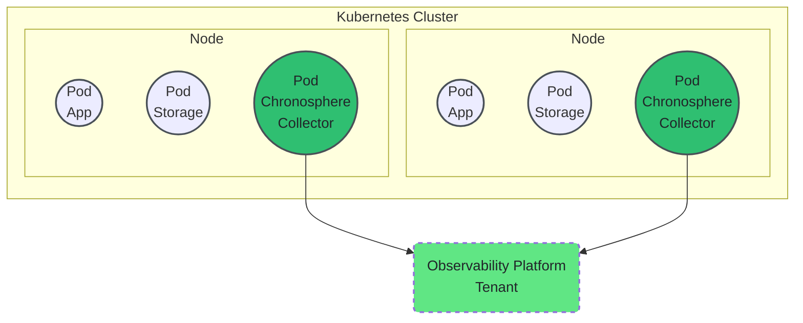
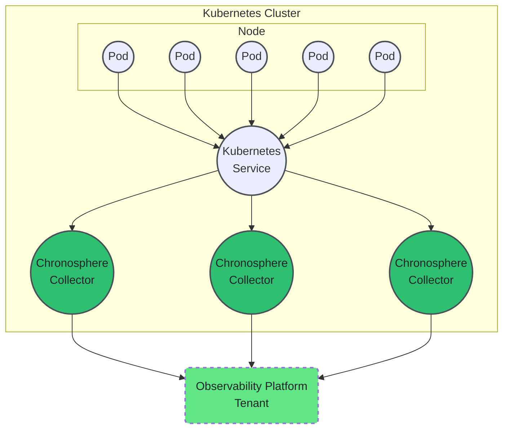
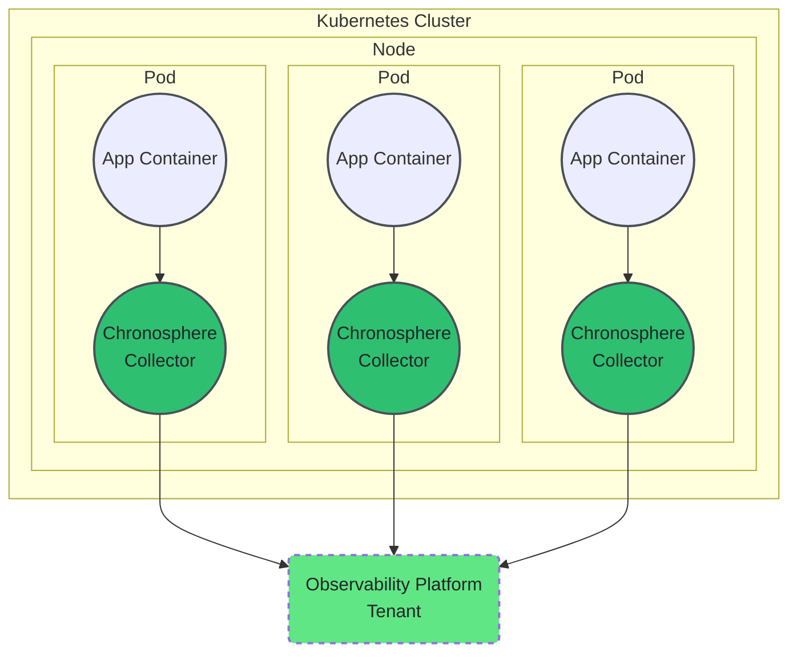

import CollectorVersions from '/snippets/_partials/collector-versions.mdx';

{/* -- dri: Garrett Guillotte -- */}

The Chronosphere Collector is a standalone app whose main function is to discover and
scrape a Prometheus server that's exposed by your app. The Collector then sends any
discovered data to the Chronosphere Observability Platform service through a
connection secured by a revocable API token. If the Collector can't scrape certain
jobs or components, you can manually push metrics to it. For more information, refer
to [Service discovery](/ingest/metrics-traces/collector/discover).

In addition to ingesting metrics, the Collector can:

- Filter, rename, and drop Prometheus metrics that pass through it by using
  [Prometheus's relabeling rules](https://prometheus.io/docs/prometheus/latest/configuration/configuration/#relabel_config),
  based on specific label/value pairs.
- Add [global labels](/ingest/metrics-traces/collector/configure#global-labels) to
  all Prometheus metrics the Collector ingests. For example, you can append all
  Prometheus metrics passing through a particular Collector with the label
  `service="col1"`.
- [Receive traces](/overview/types/traces) from your services, such as
  OpenTelemetry spans and other popular open source formats like Jaeger and
  Zipkin.

<Note>
<CollectorVersions />
</Note>

## Get started

The Collector supports IPv4, IPv6, or fully qualified domain names for a single endpoint.

To get started with the Collector:

1. [Review the architecture](#architecture) to determine how you want to install the
   Collector.
1. [Install the Collector](/ingest/metrics-traces/collector/install),
   either to retrieve metric data or receive trace data.
1. [Verify and monitor the Collector](/ingest/metrics-traces/collector/monitor) to
   ensure your data is streaming in to Observability Platform.
1. [Configure service discovery](/ingest/metrics-traces/collector/discover) to
   discover other apps to scrape metrics from.
1. [Enable recommended optimizations](/ingest/metrics-traces/collector/configure#recommended-optimizations)
   and modify default settings.
1. Optional: [Ingest additional metrics](/ingest/metrics-traces/collector/addl-metrics)
   such as DogStatsD, Graphite, Prometheus, or Pushgateway.

If you're using Kubernetes, you can also
[modify the scrape configuration](/ingest/metrics-traces/collector/discover/scrape-configuration)
to override scrape defaults, change the annotation prefix, and define the `jobs`
configuration.

## Architecture

You can install the Collector with Kubernetes as a DaemonSet, Deployment, or as a
sidecar. Each of these models have advantages and disadvantages, with different
architectures.

### DaemonSet

Installing the Collector as a Kubernetes DaemonSet is a pull-based model, where the
Collector scrapes endpoints using either annotations or `ServiceMonitors`. With this
method, you deploy a Collector on every node in your cluster. This method is the
recommended way to install the Collector to receive metrics.

#### Advantages 

Because the Collector resides on the same Kubernetes node as your app, latency is low. As your
cluster grows, deploy a Collector on each new node to scale your cluster
horizontally. Installing one Collector per node also means that you're less likely to
overload any single Collector.

This method allows for phased rollouts of new Collector versions and configuration
changes to help avoid losing scrape coverage. Also, if you lose a node, you're only
losing metrics for that node and not your entire cluster.

#### Disadvantages

Some environments, such as AWS Fargate, restrict you from deploying an app as a
DaemonSet. Kubernetes applies resource requirements globally across your cluster,
which means that DaemonSets can evict other applications from the node depending on
prioritization. Also, DaemonSets don't deal well with noisy scrape endpoints, such as
`kube-state-metrics`.

### Deployment

Installing the Collector as a Kubernetes Deployment works best for push-based models,
where your app pushes data to a Kubernetes Service, which the Collector receives data
from. This method is the recommended way to install the Collector to receive
distributed trace data.

To install the Collector in a Deployment where it pulls metrics data from scrape
targets, Chronosphere recommends using Prometheus Service Discovery. If you don't
need Pod metadata, you can install the Collector in a Deployment using
ServiceMonitors.

#### Advantages

Deployments work well for monitoring high cardinality endpoints. You can choose to
either configure multiple Collectors in your cluster or deploy a singular Collector.
You can also select the number of Collectors to run in your cluster. As your cluster
grows, add more Pods to scale your Deployment horizontally.

#### Disadvantages

If you deploy a singular Collector that's undersized for your workload, the Collector
might experience delays in scrape latency or encounter out of memory situations. A
Deployment can also be problematic when using staleness markers, and you can't
customize the push configuration of the Collector per app.

### Sidecar

A sidecar is a dedicated resource for your app that's ideal for handling high volume
data, such an app that generates copious time series data. To run the Collector as a
sidecar, you can install an individual Collector in each Pod of your cluster. Because
the Collector Container and app Container run on the same Pod, you can optimize
resources for the Pod.

#### Advantages

If a Collector goes offline, you lose only the metrics for a single Pod. You have
more control over resource usage for high cardinality apps and can customize the
Collector per app.

#### Disadvantages

Each Pod requires a sidecar Container, which requires additional Kubernetes resources
for your cluster. Sidecars require you to maintain the app manifest to include the
Collector as a sidecar, which increases overhead. Because the Collector exists on
the same Pod as your app Container, the Collector can impact the entire Pod if it
experiences problems.
