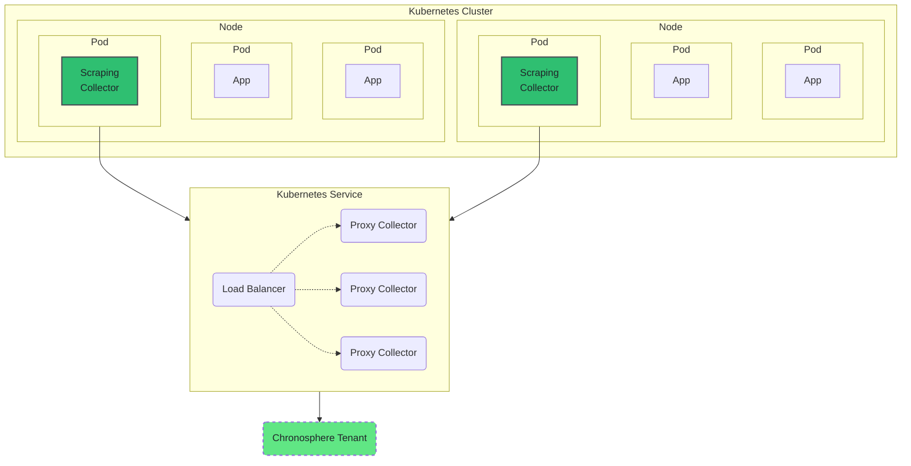

{/* -- dri: Garrett Guillotte -- */}


When you're ready to upgrade the Chronosphere Collector to a new version, determine
your current version before upgrading. You can then upgrade the Collector based on
your installation method.

<Info>
Chronosphere supports Collector versions for one year from their release dates. Use
only a supported version, unless explicitly instructed otherwise by Chronosphere
Support. If you experience issues, upgrade to the latest supported version.
</Info>

## Determine your current version

To determine the current version of your Collector, you can:

- [Check your manifest](/ingest/metrics-traces/collector/install/upgrade#check-your-manifest)
- [Use the debug endpoint](/ingest/metrics-traces/collector/install/upgrade#use-the-debug-endpoint)
- [Use Metrics Explorer](/ingest/metrics-traces/collector/install/upgrade#use-metrics-explorer)

### Check your manifest

Open your Collector manifest and locate the `spec.template.spec.containers.env.image`
YAML collection. The string includes `vVERSION`, where `VERSION` is the Collector
version number:

```yaml
spec:
...
  template:
    spec:
      containers:
      - env:
        image: gcr.io/chronosphereio/chronocollector:vVERSION
```

_`VERSION`_ is the current version number of the Collector.

### Use the debug endpoint

The Collector exposes a [debug endpoint](/ingest/metrics-traces/collector/debugging)
that you can query to return the Collector version. To query this endpoint, run the
following request:

```shell copy
curl -X GET http://LISTEN_ADDRESS/debug/version
```

Replace _`LISTEN_ADDRESS`_ with the
[`listenAddress`](/ingest/metrics-traces/collector/configure/optimizations#define-the-listenaddress),
which is the address that the Collector serves requests on. Default: `0.0.0.0:3030`.

The response is a JSON representation of the Collector version information, which is
the same information the Collector prints when starting. For example:

```json
{
    "go_version": "go1.19.2",
    "version": "v0.99.0",
    "branch": "HEAD",
    "revision": "f2665b5e3",
    "build_date": "2023-01-19-22:35:10",
    "build_time": "1674167710"
}
```

### Use Metrics Explorer

1. In the navigation menu select
   **<Icon icon="compass" /> Explorers <span aria-label="and then">></span> Metrics Explorer**
   to access the Metrics Explorer.

1. Enter the following query in the query field.

   ```text copy
   count(chronocollector_build_information) by (build_version, instance)
   ```

1. Click **<Icon icon="arrows-rotate" />Run**.

   The version of each Collector instance displays in the `build_version` column of
   the query results table. For example:

   | Time                | build\_version | instance                             |
   | ------------------- | -------------- | ------------------------------------ |
   | 2023-02-15 11:07:15 | v0\_99\_0      | test-env/chronocollector-test3-2z8dx |
   | 2023-02-15 11:07:15 | v0\_90\_0      | test-env/chronocollector-test3-4vcd9 |

## Upgrade to a new version

After determining your current version, you're ready to upgrade your Collector. Your
installation method determines how you upgrade the Collector.

### Upgrade a Kubernetes deployment

If you deployed your Collector as a Kubernetes DaemonSet or Deployment, complete the
following steps to upgrade your Collector.

1. Open your Collector manifest and locate the
   `spec.template.spec.containers.env.image` YAML collection.

1. In the `image` string, modify the version number to the version that you want to
   upgrade to. For example, the following `image` indicates version `0.99.0` of the
   Collector:

   ```yaml
   spec:
   ...
     template:
       spec:
         containers:
         - env:
           image: gcr.io/chronosphereio/chronocollector:v0.99.0
   ```

1. Complete a rolling restart of your pods:

   ```shell copy
   kubectl rollout restart daemonset chronocollector -n NAMESPACE
   ```

   Replace _`NAMESPACE`_ with your Kubernetes namespace.

1. Re-enable port forwarding for your Collector. The following command enables port
   forwarding on port `3030`:

   ```shell copy
   kubectl port-forward chronocollector-POD_NAME 3030
   ```

### Upgrade a standalone deployment

If you deployed your Collector as a standalone binary, download the latest version
and redeploy the Collector.

Refer to the [Standalone Collector installation](/ingest/metrics-traces/collector/install/standalone)
page for steps on how to download the latest binary and redeploy it.

### Upgrade Collectors to v0.104.0 or later

By default, older versions of Collector used Kubernetes' older Endpoints API for
endpoint discovery. In Collector v0.85.0, Chronosphere introduced support for the newer EndpointSlices
API of Kubernetes v1.21 and later, the configuration of which included setting the
Collector flag `useEndpointSlices` to `true` and configuring your `ClusterRole`
resources to use EndpointSlices, such as in the steps to
[Enable ServiceMonitor discovery](/ingest/metrics-traces/collector/discover).

Collector v0.104.0 and later exclusively use the
[EndpointSlices API](https://kubernetes.io/docs/concepts/services-networking/endpoint-slices)
and ignore the `useEndpointSlices` setting. If you've enabled endpoint discovery
but haven't enabled and configured EndpointSlices, this is a **breaking change**
from older versions of Collector.

### Upgrade proxy Collectors to v0.101.0 or later

The v0.101.0 release introduces a new Protocol Buffer (Protobuf) format for
Collector-to-Collector communication. This Protobuf format aligns with the Prometheus
format.

<Warning>
This format change is a **breaking change** for environments with a
[proxy deployment architecture](#collector-proxy-deployment) where a Collector
communicates directly with another Collector. If you don't use proxy Collectors, this
change doesn't impact your installation.

Collector v0.104.0 and later use the new format by default. When using proxy Collectors
and upgrading from v0.100.2 and earlier to v0.104.0 or later, you **must** upgrade
using these steps.
</Warning>

To upgrade when using proxy Collectors:

1. Upgrade all proxy Collectors to v0.101.0 or later.

   After upgrading to v0.101.0 or later, the proxy Collectors can safely support the
   old and new Protobuf formats. Upgrading the proxy tier doesn't affect scraping
   Collectors.

1. Upgrade all downstream scraping Collectors that communicate with the proxy tier.

   The upgraded scraping Collectors can now use the new Protobuf format to
   communicate with the proxy Collectors.

<Info>
Collectors running v0.101.0 to v0.103.0 are backward compatible with both the old
and new Protobuf formats. It's safe to run earlier versions of scraping Collectors
alongside proxy Collectors running v0.101.0 to v0.103.0.
</Info>

#### Collector proxy deployment

The following diagram illustrates an architecture where scraping Collectors
communicate with proxy Collectors:


