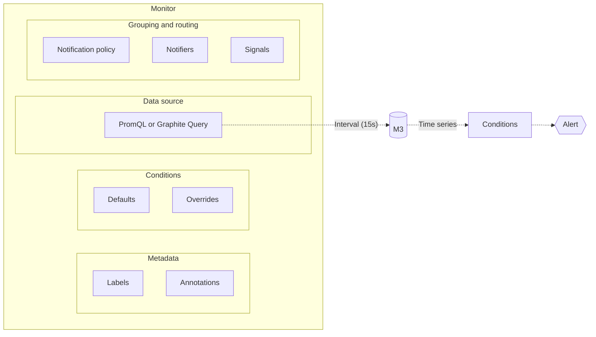

{/* -- dri: Garrett Guillotte -- */}

One reason to ingest and store time series data is to know when data does or doesn't
meet certain criteria. To generate alerts and notifications from data, regardless of
whether the data's for your services or your use of Chronosphere Observability Platform
itself, use _alerting_.

You create [monitors](#monitors) to query time series, and optionally group results
into [signals](#signals). Whenever a time series meets a [condition](#conditions), an
[alert](#alerts) triggers that sends a [notification](#notifications). You can mute
notifications with [muting rules](#muting-rules).

## Monitors

Observability Platform alerting revolves around [monitors](/investigate/alerts/monitors). You can
watch time series data that's specified in a monitor query. The results of a monitor
query can be time series data or the outcome of a function applied to time series
data. Because Observability Platform is a single data store, you can merge alerts,
which lets an alert query all metrics and not only metrics local to a Prometheus
instance.

### Conditions

[Conditions](/investigate/alerts/monitors/data-model#conditions) are evaluations run against
every time series from the resulting monitor query, along with a related severity,
such as critical or warning. For example, conditions can help you determine if a time
series value remains greater than `1` for more than 30 seconds. If this happens,
Observability Platform can display a warning alert.

You can also specify [condition overrides](/investigate/alerts/monitors/data-model#condition-overrides)
to [override the default conditions](/investigate/alerts/monitors#override-a-monitor-alert)
that define when an alert triggers for a monitor.

### Signals

[Signals](/investigate/alerts/notifications/signals) are optional groupings by label of the
results returned from a monitor query. For example, you can use signals to group time
series from multiple environments, such as development or production, to generate
separate alerts for each environment.

In Observability Platform, on the **Monitors** page, monitors with defined signals
display the <Icon icon="folder-tree" /> file tree icon. To view the signals
from a displayed monitor, click the name of the monitor from the list.

Observability Platform supports converting from Prometheus alerts to signals, and
strongly recommends using signals instead of configuring complex routing trees to
route notifications:

- You can configure signals for individual monitors, which isolates changes to only
  that monitor. Prometheus requires a single global configuration, and any change
  impacts users across your entire organization.
- Signals let you group notifications within the monitor itself, rather than grouping
  notifications within the notification routing tree. This model makes signals easier
  to manage as part of a monitor configuration.

## Alerts

[Alerts](/investigate/alerts/monitors) occur when one or more monitor query results
trigger a condition. By configuring the monitor signal to group query results, you
can generate an alert for each signal that triggers a condition.

### Notifications

When an alert triggers, and optionally when an alert resolves, Observability Platform
sends a [notification](/investigate/alerts/notifications) to specified endpoints called
[notifiers](/investigate/alerts/notifications/notifiers), including PagerDuty, email, and Slack.
You configure your notifications with
[notification policies](/investigate/alerts/notifications/policies).

### Muting rules

Using Observability Platform, you can temporarily mute a triggered alert, including
its notifications. These [muting rules](/investigate/alerts/muting-rules) can apply to:

- A specific alert.
- The monitor or signal that generated the alert.
- Any stored time series.

### Analyze alerts

[Analyze patterns](/investigate/alerts/monitors/analyze-alerts) across alerts for
individual monitors, and alerts that span across multiple monitors, to better
understand where issues are occurring in your system.
