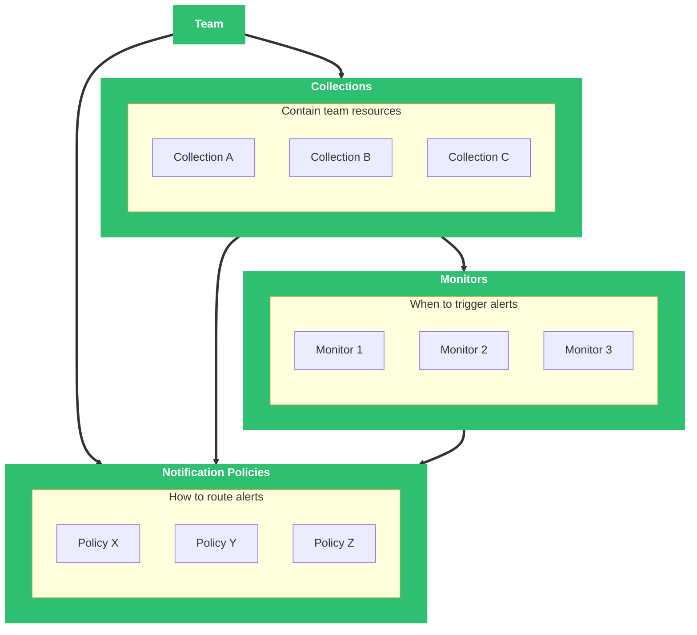

{/* -- dri: Garrett Guillotte -- */}


Monitors use a custom definition in YAML format. When
[adding or editing](/investigate/alerts/monitors) a monitor in Observability Platform,
click the [Code Config tool](/investigate/alerts/monitors#use-the-code-config-tool)
to view code representations of a monitor for Terraform, Chronoctl, and the
Chronosphere API.

Whichever method you use to create a monitor, the monitor structure uses the
following data model. A full list of values is available
[in the API](/tooling/api-info/definition/operations/CreateMonitor).



## Collection

A [collection](/administer/collections) is
an organization of resources associated with a [team](/administer/accounts-teams/teams).
All monitors must belong to exactly one collection.

Each team can own many [collections](/administer/collections), which
are a group of resources like monitors and dashboards. The identified team owns the
systems that the associated dashboards and monitors track. Each collection can have
either a default [notification policy](/investigate/alerts/notifications/policies)
for all monitors, or you can set notification policies explicitly for each monitor.
These policies apply a function to time series data that determines whether an alert
triggers.

## Name

A unique descriptive name for the monitor. You can change a monitor's name after it's
created. Monitor names are static strings, so they can't include label variables such
as `$labels.LABEL_NAME`.

## Slug

A unique identifier that you can't change after creating the monitor.
When you create a monitor with Observability Platform, it generates a
slug for you. Slugs have a maximum length of 254 alphanumeric characters.

## Notification policy

This policy determines which [notification policy](/investigate/alerts/notifications/policies)
to use at a particular alert severity.

You define the policies in a collection. When you create a collection with Chronoctl
or Terraform, you can reference a notification policy in any collection.

## Labels

Labels are user-defined key-value pairs associated with a monitor. Used for
identification, categorization, and routing of an alerting time series to specific
notifiers by using notification policies. Labels don't affect monitor performance.

## Notifiers

[Notifiers](/investigate/alerts/notifications/notifiers) can reference monitor labels
by using the `{{ .CommonLabels.LABEL }}` variable, replacing _`LABEL`_ with the
monitor label name.

Notifiers can reference monitor annotations by using the
`{{.CommonAnnotations.<ANNOTATION> }}` variable, replacing `<ANNOTATION>` with the
monitor annotation name. Building on the previous example, you can create a Slack
notifier that references the `summary` annotation:

```yaml
api_version: v1/config
kind: Notifier
spec:
  name: slack-summary-notifier
  slug: slack-notifier
  slack:
    …
    text: "Summary: {{ .CommonAnnotations.summary }}"
    …
```

## Query

A Prometheus or Graphite query, and a check interval of 15, 30, or 60
seconds that defines how often to check the latest data against configured
conditions.

When querying monitors, recent data is typically the most relevant. For this reason,
Chronosphere recommends the `topk` function instead of the `head_max` function.
The `topk` function takes the top `K` data points at query runtime and returns a
filtered list of data points. The `head_max` function takes the maximum values for
each time series across the entire query time range, selects the top `K` time series
based on the maximum value, and then returns the filtered list of time series.

## Signals

[Signals](/investigate/alerts/notifications/signals) are an optional group of
notifications that use a unique combination of labels. When you create a monitor and
enable the signals option for notifications, you can add the labels from the
monitor's time series to the group.

The following query parameters are available for signals:

| Parameter         | Configurable? | Default    |
| ----------------- | ------------- | ---------- |
| `group_wait`      | No            | 10 seconds |
| `group_interval`  | No            | 5 minutes  |
| [`repeat_interval`](/investigate/alerts/notifications/policies#repeat-intervals) | Yes           | `3600` (seconds) |

## Conditions

Checks run against every time series resulting from the query. You
define a condition and sustain period (duration of time) and can assign the
resulting alert a severity (warning or critical). If a time series triggers that
condition for the sustain period, Observability Platform generates an alert.

Evaluating a sustain period of greater than 0 seconds requires at least two checks,
defined in the query check interval, before triggering an alert. For example,
if the sustain is five seconds, but the check interval is 30 seconds, the alert isn't
triggered for at least 30 seconds, the time it takes for two checks to occur.
A sustain period of zero seconds causes the alert to trigger after only one check,
but might lead to noisy alerts.

### Condition overrides

Defines [overrides](/investigate/alerts/monitors#override-a-monitor-alert) for specific
conditions regarding the selected monitor. Use the `EXACT_MATCHER_TYPE` matcher to
override exact key/value pairs, or the `REGEXP_MATCHER_TYPE` matcher to match with
regular expressions. These are the only supported matcher types for condition
overrides.

### Resolve window

When you have an alert that's repeatedly resolving and continuing to trigger, define
a resolve window. Within the resolve window, Observability Platform suppresses
additional triggers for the same alert until the alert hasn't fired for the defined
duration.

- Alerts configured with the `sustain` field trigger if the PromQL expression for the
  alert returns a populated value for the defined duration.
- A triggered alert with a defined resolve window resolves after the PromQL
  expression returns an empty value for the defined duration.

Use resolve windows with conditions or condition overrides. The resolve window
defaults to `0s`. How you define the resolve window differs depending on how you
[create the monitor](/investigate/alerts/monitors#create-a-monitor):

- Terraform: Define the resolve window with the `resolve_sustain` field in the
  `series_conditions` object.
- Chronoctl or the
  [CreateMonitor API endpoint](/tooling/api-info/definition/operations/CreateMonitor):
  Define the resolve window with the `resolve_sustain_secs` field in the
  `series_conditions` object.
- Observability Platform: In the **Conditions** pane, define the resolve window with
  the **Resolve when clear for** field.

The duration defined in the resolve window definition behaves like the Prometheus
[`keep_firing_for`](https://prometheus.io/docs/prometheus/latest/configuration/recording_rules/#rule)
field.

<Info>
Changing a monitor's configuration might result in resolve windows not being
respected. This behavior can cause an alert to be triggered again, which would enter
a new resolve window.
</Info>

### Schedule

By default, Observability Platform monitors are constantly active. You can optionally
limit a monitor's activity to specific time ranges within a weekly schedule.

A schedule defines weekly time ranges when Observability Platform runs the monitor's
queries and evaluates its conditions, and the monitor runs only during the specified
time ranges.

You can define monitor schedules only with [Chronoctl](/investigate/alerts/monitors#create-a-monitor-chronoctl)
or [Terraform](/investigate/alerts/monitors#create-a-monitor-terraform).

<Warning>
Avoid ending a schedule's time range at 23:59. Using this value can inadvertently
  stop a monitor from executing during the last minute of the day. To run the monitor
  through the end of the day, use `24:00`. To span days, end the first day at `24:00`
  and begin the next day at `00:00`.
</Warning>

A monitor that's actively sending alerts will resolve after entering an inactive
period in a defined schedule. When a monitor re-enters an active state, the
monitor must meet defined conditions to trigger a new alert.

## Annotations

Annotations are notes you can
[add to a monitor](/investigate/alerts/monitors#use-annotations-with-monitors), such as runbooks,
links to related dashboards, data links to related traces, and documentation links.
Annotations can assist on-call engineers in troubleshooting by providing links to
related resources, or to display a summary that encapsulates the meaning of the
overall query without having to scan the entire Series Legend.

Annotations text is validated against the same regular expression as
[Prometheus metric names and labels](https://prometheus.io/docs/concepts/data_model/#metric-names-and-labels).

For example, you can create a summary for a monitor that uses labels from the
monitor query. Consider the following monitor query that matches on labels for
`kube_pod_status`:

```text copy
kube_pod_status{cluster="staging",namespace="test",pod=~"staging-[0-9a-z]+-[0-9a-z]+"}
```

You can create an annotation that uses variables to substitute values from this
monitor query. For example:

```text copy
Cluster: {{$labels.cluster}} | Namespace: {{$labels.namespace}} | Pod: {{$labels.pod}} is stale after 10m
```

When you save your monitor, the annotation replaces variables with values from the
monitor query and renders as:

```text copy
  Cluster: staging | Namespace: test | Pod: staging-37s799fcsj-ekg12 is stale after 10m
```

You can also create annotations for monitors that link to trace metrics, which lets
you provide direct links for your on-call engineers to help diagnose issues. For more
information, refer to
[linking to tracing data](/investigate/querying/create-links/).
