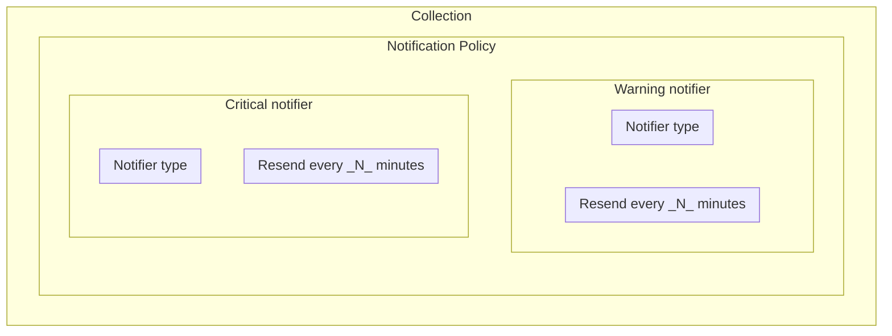
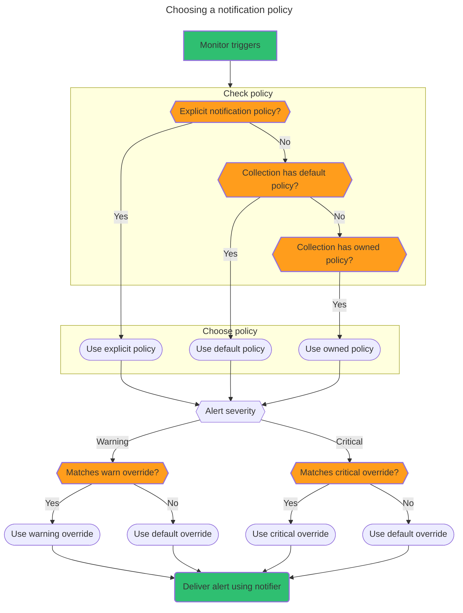

import ApiAuthReq from '/snippets/_partials/api-auth-req.mdx';
import LimitedAvail from '/snippets/_partials/limited-avail.mdx';
import TerraformCreate from '/snippets/_partials/terraformcreate.mdx';
import TerraformDel from '/snippets/_partials/terraformdel.mdx';
import TerraformPlan from '/snippets/_partials/terraformplan.mdx';

{/* -- dri: Garrett Guillotte -- */}


A notification policy connects a monitor with notifiers at warning and critical
levels. The notification policy applies rules that define how to route an alert when
it triggers, such as who to notify and through which notifier type. Chronosphere
Observability Platform runs several checks to determine
[which notification policy](#choose-a-notification-policy) to apply. You can
define custom overrides for notification policies based on a signal's labels.



## View notification policies

Select from the following methods to view your available notification policies.

<Tabs>
<Tab title="Web" id="view-a-notification-policy-cloud">

To view all notification policies:

1. In the navigation menu select
   **<Icon icon="bell" /> Alerts <span aria-label="and then">></span> Notification Policies**.
1. Use the search box to locate specific notification policies, or choose a
   notification policy from the **Select a Team** dropdown.
1. Click a notification policy to view its definition.

The list includes notification policies created in Terraform, but you can't modify
them.

</Tab>
<Tab title="Chronoctl" id="view-a-notification-policy-chronoctl">

> Requires [Chronoctl](/tooling/chronoctl) version 0.46.0 or later.

To view available notification policies in Chronoctl, use the
`notification-policies list` command:

```shell copy
chronoctl notification-policies list
```

This command returns a list of YAML documents, each representing a notification
policy. For example, a Chronoctl listing of a notification policy in the
`example-team-name` team might look like this:

```yaml copy
api_version: v1/config
kind: NotificationPolicy
spec:
  slug: example-policy
  name: Example Policy
  created_at: "2022-02-16T05:55:30.000Z"
  updated_at: "2022-06-14T13:01:07.000Z"
  routes:
    defaults:
      warn: {}
      critical: {}
    overrides:
      - alert_label_matchers:
          - type: EXACT
            name: notify
            value: pinnacle-db-slack
          - type: REGEX
            name: notify
            value: ^(?:example.*|test.*|sample.*)$
        notifiers:
          warn:
            notifier_slugs:
              - example-1
          critical:
            notifier_slugs:
              - example-1
```

</Tab>
<Tab title="API" id="view-a-notification-policy-api">

To complete this action with the Chronosphere API, use the
[`ListNotificationPolicies`](/tooling/api-info/definition/operations/ListNotificationPolicies)
endpoint.

<ApiAuthReq />

</Tab>
</Tabs>

## Create a notification policy

You can set a notification policy in these ways:

- **Per collection**: If you configure a notification policy as the default policy on
  a collection, every monitor in that collection inherits the notification policy.
- **Per monitor**: You can set a notification policy explicitly on each monitor
  rather than setting a default policy for a collection.

### Repeat intervals

Notification policies use the `repeat_interval` parameter, which is the frequency (in seconds) to
resend alerts. Repeat interval is a
[required field](/investigate/alerts/monitors/data-model#signals), and must be set separately
for each monitor.

If the repeat interval isn't set, or is set to `0`, the value defaults to `3600`.

The repeat interval can not be lower than `300` seconds (five minutes), and should be
a multiple of `300`. Repeat intervals are rounded up to the next five minute
increment.

To reduce repeat notifications for the same alert, set your repeat interval to a high
value. The maximum repeat interval is `3456000` seconds (40 days).

### `group_by`

Chronosphere recommends using
[`signal_grouping`](/investigate/alerts/monitors#terraform-examples) in most
circumstances.

<LimitedAvail />

You can configure a `group_by` field in notification policies both on the default and
override levels. The value of `group_by` accepts a set of unique labels. For example,
you can group by `env` for environments or by `endpoint`.

<Info>
Grouping notifications with the `group_by` field for a notification policy is applied
only if the associated monitor doesn't have any custom
[signals](/investigate/alerts/notifications/signals) configured.
</Info>

<Tabs>
<Tab title="Web" id="create-a-notification-policy-cloud">

To create a notification policy:

1. In the navigation menu select
   **<Icon icon="bell" /> Alerts <span aria-label="and then">></span> Notification Policies**.
1. On the **Notification Policies** page, click **Create notification policy**.
1. Enter a name for the notification policy. Optionally, select a team to own
   the policy.
1. For both **Critical Alert Notifiers** and **Warning Alert Notifiers**:
   - Select the time period for resending notifications, which defaults to one hour.
   - Choose a notifier to define who to notify and through which endpoint.
1. Click **Save**.

</Tab>
<Tab title="Chronoctl" id="create-a-notification-policy-chronoctl">

Using YAML definitions for creating a notification policy allows for more flexibility
and [override options](#override-notification-policy-defaults).

For example, the following YAML definition creates a notification policy associated
with the `api-error` team. It defines notifiers for critical and warning alerts,
with the notification frequency for critical customized to 60 minutes, represented as
3600 seconds.

```yaml copy
api_version: v1/config
kind: NotificationPolicy
spec:
  slug: api-error
  name: Default API error policy
  routes:
    defaults:
      warn:
        notifier_slugs:
          - db-team-urgent
      critical:
        notifier_slugs:
          - db-team
        repeat_interval_secs: 3600
```

This example uses a default notifier with the slug `slack`
for critical notifications, and includes a `group_by` field to group notifications by
the `service` label. If the `env` label matches the `production` value
(`env=production`), then override notifiers apply and notifications are grouped by
the `env` and `severity` labels.

``` yaml copy
kind: NotificationPolicy
slug: default
routes:
  defaults:
    critical:
      notifiers:
        - slug: slack
      group_by:
        labelnames:
          - service
  overrides:
    - alertlabelmatchers:
        - type: EXACT
          name: env
          value: production
      notifiers:
        critical:
          notifiers:
            - slug: pagerduty
          group_by:
            labelnames:
              - env
              - severity
```

Apply your changes:

```shell copy
chronoctl apply -f FILE_NAME.yaml
```

Replace _`FILE_NAME`_ with the name of your notifier YAML file.

</Tab>
<Tab title="Terraform" id="create-a-notification-policy-terraform">

<TerraformPlan />

Create a notification policy with Terraform by using the
`chronosphere_notification_policy` type followed by a `name`. You can optionally
specify a `slug`.

To associate a notification policy:

- With a collection: define a `chronosphere_collection` resource and specify a
  `notification_policy_id`.
- With a monitor: define a `chronosphere_monitor` resource and specify a
  `notification_policy_id`.

For example, the following code creates a notification policy that Terraform refers
to as `infra`, which defines notification routes for Slack and PagerDuty:

```ruby copy
resource "chronosphere_notification_policy" "infra" {
  name    = "Infra Development Policy"
  slug    = "infra-development-policy"

  # Route that sends warning alert notifications to Slack
  route {
    # Valid values: warn, critical
    severity = "warn"

    # Set of notifiers for alerts triggered at the this severity level
    notifiers = [chronosphere_slack_alert_notifier.default.id]
  }

  # You can specify multiple routes in a notification policy
  route {
    # Valid values: warn, critical
    severity = "critical"

    # Set of notifiers for alerts triggered at the severity level
    notifiers = [chronosphere_pagerduty_alert_notifier.default.id]

    # The notification frequency to resend alerts, which defaults to 60m (one hour).
    repeat_interval = "60m"
  }
    notification_policy_id = chronosphere_notification_policy.infra_override.id
}
# Associates a notification policy with a collection
resource "chronosphere_collection" "infra" {
  name        = "Infrastructure collection"
  team_id     = infra.team_id
  description = "Collection of resources related to infrastructure services."

  notification_policy_id = chronosphere_notification_policy.infra.id
}

# Associates a notification policy with a monitor
resource "chronosphere_monitor" "infra" {
  name              = "Infrastructure monitor"
  collection_id     = chronosphere_collection.infra.id
  ...
}

# Optional override if you want to override the inherited collection policy to a value specific to this monitor
resource "chronosphere_monitor" "infra_with_policy_override" {
  name          = "Infrastructure monitor with policy override"
  collection_id = chronosphere_collection.infra.id

  # Override the notification policy assigned to the collection.
  notification_policy_id = chronosphere_notification_policy.other.id
  ...
}

```

<TerraformCreate />

</Tab>
<Tab title="API" id="create-a-notification-policy-api">

To complete this action with the Chronosphere API, use the
[`CreateNotificationPolicy`](/tooling/api-info/definition/operations/CreateNotificationPolicy)
endpoint.

<ApiAuthReq />

</Tab>
</Tabs>

## Edit a notification policy

Select from the following methods to edit notification policies.

<Tabs>
<Tab title="Web" id="edit-a-notification-policy-cloud">

<Info>
You can use Observability Platform to edit only notification policies created in
Observability Platform.
</Info>

To edit a notification policy:

1. In the navigation menu select
   **<Icon icon="bell" /> Alerts <span aria-label="and then">></span> Notification Policies**.
1. Click the notification policy you want to edit.
1. In the notification policy definition page, click **Edit Policy**.
1. Make changes to your notification policy.
1. Click **Save**.

</Tab>
<Tab title="Chronoctl" id="edit-a-notification-policy-chronoctl">

To edit a notification policy using [Chronoctl](/tooling/chronoctl):

1. Return a list of all available notification policies:

   ```shell copy
   chronoctl notification-policies list
   ```

1. Modify the YAML file for the notification policy you want to update.
1. Apply your changes:

   ```shell copy
   chronoctl apply -f FILE_NAME.yaml
   ```

   Replace _`FILE_NAME`_ with the name of your notification policy YAML file.

Chronoctl updates the notification policy's properties if it has the same slug.

</Tab>
<Tab title="Terraform" id="edit-a-notification-policy-terraform">

To edit a notification policy using [Terraform](/tooling/infrastructure/terraform):

1. Modify the resource's existing properties.
1. Run `terraform apply` to apply the changes.

   ```shell copy
   terraform apply
   ```

</Tab>
<Tab title="API" id="edit-a-notification-policy-api">

To complete this action with the Chronosphere API, use the
[`UpdateNotificationPolicy`](/tooling/api-info/definition/operations/UpdateNotificationPolicy)
endpoint.

<ApiAuthReq />

</Tab>
</Tabs>

## Delete a notification policy

Select from the following methods to delete notification policies.

<Tabs>
<Tab title="Web" id="delete-a-notification-policy-cloud">

<Info>
You can use Observability Platform to delete only notification policies created in
Observability Platform.
</Info>

To delete a notification policy:

1. In the navigation menu select
   **<Icon icon="bell" /> Alerts <span aria-label="and then">></span> Notification Policies**.
1. Click the notification policy you want to delete. The notification policy
   definition page displays:
   1. Click **Edit Policy**.
   1. Click **Delete notification policy**.
1. Click **Delete** to confirm that you want to delete the notification policy.

</Tab>
<Tab title="Chronoctl" id="delete-a-notification-policy-chronoctl">

To delete a notification policy using [Chronoctl](/tooling/chronoctl):

1. Return a list of all available notification policies:

   ```shell copy
   chronoctl notification-policies list
   ```

1. Run the following command to delete the notification policy:

   ```shell copy
   chronoctl notification-policies delete SLUG
   ```

   Replace _`SLUG`_ with the slug of the notification policy you want to delete.

Chronoctl deletes the notification policy with the specified slug.

</Tab>
<Tab title="Terraform" id="delete-a-notification-policy-terraform">

<TerraformDel />

</Tab>
<Tab title="API" id="delete-a-notification-policy-api">

To complete this action with the Chronosphere API, use the
[`DeleteNotificationPolicy`](/tooling/api-info/definition/operations/DeleteNotificationPolicy)
endpoint.

<ApiAuthReq />

</Tab>
</Tabs>

## Override notification policy defaults

You can override notification policy defaults based on alert labels by adding an
`overrides` collection to its definition. Use the `alert_label_matchers` collection
to define the conditions for the override.

You can specify either a monitor label name or a signal label name as the `value` of
the `alert_label_matchers` collection. If you specify any other label type, the
override isn't processed for the specified monitor, even if the alerting series
includes the specified label.

When an override matches the defined conditions, the notification defined in the
specified `notifiers` collection triggers. If an override matches multiple
conditions, only the first match triggers a notification. Any additional matches
don't trigger a notification. Similarly, if an override matches multiple notifiers,
only the first matching notifier triggers a notification.

For matcher labels within an override notifier, all matcher label conditions must be
met for an override notifier to be selected.

When a monitor has `signal_per_series` set to `true` (multiple alerts) as the signal
grouping, you can use any label as a notification policy override.

<Tabs>
<Tab title="Web" id="override-notification-policy-defaults-cloud">

To override a notification policy:

1. In the navigation menu select
   **<Icon icon="bell" /> Alerts <span aria-label="and then">></span> Notification Policies**.
1. On the **Notification Policies** page, click **Create notification policy**.
1. Enter a name for the notification policy. Optionally, select a team to own
   the policy.
1. For both **Critical Alert Notifiers** and **Warning Alert Notifiers**:
   - Select the time period for resending notifications.
   - Choose a notifier to define who to notify and through which endpoint.
1. Click **+ Add Override Notifier** to define a notification override:
   - Enter a label name and value to match on. To add another label and value to
     match on, click **Add Matcher Label**.
   - Define the conditions for both the **Critical Alert Notifiers** and
     **Warning Alert Notifiers** sections.
1. Click **Save**.

</Tab>
<Tab title="Chronoctl" id="override-notification-policy-defaults-chronoctl">

For example, the following YAML definition adds an override notifier when the
`component` label has the value of `mysql`, and another if the `importance` label has
the value `low`:

<Info>
This example uses the `type` value `EXACT` for exact label matching. To use regular
expression matching, provide the `type` value `REGEX`. These are the resource's only
`type` values.
</Info>

```yaml copy
routes:
  defaults: …
  overrides:
    # If an alert has the component=mysql label, route to the db team.
    - alert_label_matchers:
        - type: EXACT,
          name: component
          value: mysql
      notifiers:
        critical:
          notifier_slugs:
            - db-team-urgent
        warn:
          notifier_slugs:
            - db-team
    - alert_label_matchers:
        - type: EXACT
          name: importance
          value: low
      notifiers:
        critical:
          notifier_slugs:
            - accounts-email
```

</Tab>
<Tab title="Terraform" id="override-notification-policy-defaults-terraform">

To override a notification policy override in Terraform, use the `override` parameter.

This Terraform definition adds an override notifier when the `component` label has
the value of `mysql`, and another if the `importance` label has the value `low`:

```ruby copy
resource "chronosphere_notification_policy" "infra" {
  …

  # You can optionally define multiple overrides, which route alerts with
  # matching labels to alternative sets of notifiers.
  override {
    # One or more matchers for labels on an alert, where labels are
    # from a monitor's hardcoded labels or signal labels
    alert_label_matcher {
      # Name of the label
      name = "component"
      # How the label is matched: "EXACT_MATCHER_TYPE" or "REGEXP_MATCHER_TYPE"
      type = "EXACT_MATCHER_TYPE"
      # Value of the label
      value = "mysql"
    }

    # The set of zero or more routes used for alerts with matching labels
    route {
      # Valid values: warn, critical
      severity = "critical"

      # Set of notifiers for alerts triggered at the this severity level
      notifiers = [chronosphere_slack_alert_notifier.default.id]
    }
  }
  override {
    alert_label_matcher {
      name = "importance"
      type = "EXACT_MATCHER_TYPE"
      value = "low"
    }

    route {
      severity = "warn"
      notifiers = [chronosphere_email_alert_notifier.default.id]
    }
  }
}
```

<TerraformCreate />

</Tab>
<Tab title="API" id="override-notification-policy-defaults-api">

To complete this action with the Chronosphere API, use the
[`UpdateNotificationPolicy`](/tooling/api-info/definition/operations/UpdateNotificationPolicy)
endpoint and update the `overrides` key.

<ApiAuthReq />

</Tab>
</Tabs>

## Choose a notification policy

When a monitor triggers, Observability Platform runs checks to determine which
notification policy to apply. First, Observability Platform checks the notification
policy type to determine:

- If the monitor has an explicit notification policy, use that policy.
- If the associated collection has a default policy, use that policy. The
  `notification_policy_slug` or `notification_policy_id` attribute for a collection
  entity declares a default policy.
- If the collection doesn't have a default policy but has an owned policy, use that
  policy. The `bucket_slug` attribute for a notification policy entity declares an
  owned policy.

  <Info>
  Owned policies are deprecated. Refer to
    [migrate buckets to collections](/administer/collections/migration)
    to migrate from buckets to collections.
  </Info>

From there, Observability Platform evaluates the alert severity:

- If the alert severity is warning and matches a warning override, use the override
  notifier. Otherwise, use the default warning notifier.
- If the alert severity is critical and matches a critical override, use the override
  notifier. Otherwise, use the default critical.

Observability Platform then delivers the alert using the selected
[notifier type](/investigate/alerts/notifications/notifiers).


