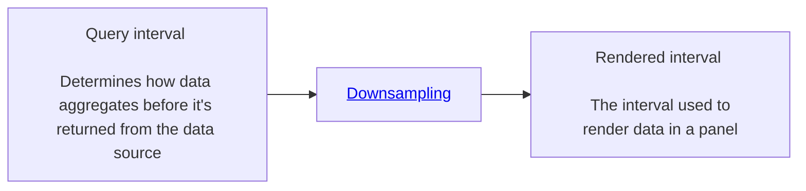

{/* -- dri: Lynette Miles -- */}


Users can specify an interval in a dashboard query that specifies how to aggregate and
render the data on the dashboard panel. The rendered interval in your dashboards is
calculated based on the relationship between your selected time range and the maximum
number of data points that can be displayed. This calculation ensures optimal
performance and visualization clarity.

Interval calculations flow like this:



The following concepts directly relate to your dashboard's display:

- [Time Range](/observe/dashboards/customization/time-ranges): The total time window
  you're viewing. For example, the last 24 hours or the last 7 days.
- Max Data Points: The maximum number of data points to return for each time
  series for any given chart. This setting is a global default that helps prevent
  performance issues, and ensures consistent visualization across your dashboards.
- Resolution: Affects the maximum data points displayed. Resolution and the rendered
  interval are inversely proportional to each other. A higher resolution indicates
  using a smaller interval. Resolution settings are:

  - Low: Reduces max data points for better performance
  - Medium (Default): Balanced between performance and detail
  - High: Increases max data points for maximum detail

  Users can [change the resolution settings](/observe/dashboards/panels#change-a-panels-query)
  for any dashboard query.

The interval is calculated as:

```text
time range / max data points = interval
```

## Best practices

Consider the following ideas when creating intervals:

- Create your `$interval` variable with meaningful options. Consider natural
  resolution of your data when setting interval options.
- Include the `$interval` variable in the custom resolution option.
- Including the variable in the **Min step** alone won't enforce the selected interval.

### Things to avoid

Most users should avoid changing the interval resolution. If you need to
create intervals, follow these guidelines:

- Don't create interval options smaller than your data resolution. If your intervals are
  smaller than your data resolution, your graphs can look like data is missing.
- Account for
  [rate calculations](/investigate/querying/promql/apply-functions) in
  counter metrics.

## Use intervals

You can use intervals as variables.

### Query intervals

Users can specify this variable as their query interval.

```text
metric_name[$interval]
```

When implemented in the query:

- Directly controls how data is aggregated and grouped
- Ensures consistent data resolution
- Respects user-selected intervals when configured

### Render Intervals

You can specify the custom render interval for a panel by specifying it at the panel
level as a [custom resolution](/observe/dashboards/panels#change-a-panels-query).

You can also set a **Min step**. The minimum step serves as a floor for data
resolution by:

- Setting the minimum interval that the data source uses.
- Acting as a guideline rather than a strict rule.
- In instances where the custom resolution is lower than the **Min step**,
  the **Min step** is respected.
- Final data points still respect the max data points setting.

## Custom render intervals for an entire dashboard

In general, Chronosphere doesn't recommend modifying the render interval for all
panels in a dashboard as a common mechanism. If you need to modify an entire dashboard,
you must use `$interval` as a custom resolution for all the panels on that dashboard.
