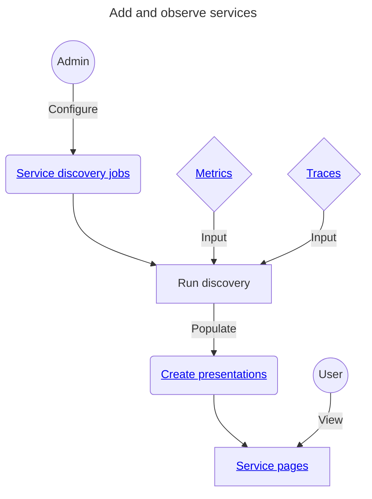

import { ServiceNavIcon } from '/snippets/Icons.jsx';
import LimitedAvail from '/snippets/_partials/limited-avail.mdx';

{/* -- dri: Lynette Miles -- */}

{/* -- Feature flag: serviceUiAccessControlEmails -- */}

<LimitedAvail />

Chronosphere Lens includes **Services**, which are a type of
[collection](/administer/collections) that provide efficient views into your
organization's services to help discover ways of exploring your telemetry
data. Chronosphere Observability Platform can discover and curate services,
or you can create your own
[service discovery jobs and presentation](/administer/service-discovery).

Observability Platform provides a [_service page_](/observe/services/service-pages)
for each service. A service page generates queries and data visualizations related to
that service, lists related monitors and alert statuses, and links to other
Observability Platform features in a combined view. This helps you monitor services
without the need to learn another query language or dashboard tool.

Service pages take advantage of other Observability Platform features, including
[tagged metrics](/overview/types/metrics),
[queries](/investigate/querying),
[data visualization panels](/observe/dashboards/panels),
[teams](/administer/accounts-teams/teams), and
[collections](/administer/collections). To set up related
monitors and alerts, see [Monitors](/investigate/alerts/monitors).

<Info>
The contents of service pages depend on configuration and metrics tagging methods
that might require information provided in your Observability Platform tenant. This
information might be tailored to your organization or a specific service.

The number of listed services might not match services found in
[Trace Explorer](/investigate/querying/traces) due to
[discovery job and merge rule configuration](/administer/service-discovery).
</Info>

## Understand services

[Discover services](/administer/service-discovery) and customize their display with
user-created presentations. You can't edit or customize anything in a
Chronosphere-provided service page.

You can have both a [service](/observe/services) and a
[collection](/administer/collections) with the same slug.
You can create a collection with the same name or slug as an existing service, and a
discovered service can have the same slug as an existing collection.

## View services

In the navigation menu select
**<ServiceNavIcon /> System Overview > Services**
to view a tabular list of services.

To view a [service's page](/observe/services/service-pages), click its name in the
table. Each service page displays interactive visualization panels, lists monitors
and dashboards, and links to [related traces](/observe/services/service-exploration)
and events if available.

Services are split into groups:

- **My services:** Services owned by teams the user is assigned to.
- **All services:** Services belonging to teams the user isn't assigned to.

Services discovered in the previous 7 days display in an alert at the top of the
list. Click the alert box to review the full list of newly discovered services.
Closing the alert acknowledges and removes the alert until additional services are
discovered.

## Understand the services table

The services table displays summarized status information about your services.

Toggle the **Include inactive services** switch to display or hide inactive services.

### Service status

The **Status** column displays the status for each service next to its title:

| Icon | Description |
| ---- | ------------|
| <Icon icon="hexagon-exclamation" style={{ color: 'rgb(238, 108, 108)' }}/> | Has a currently alerting monitor that exceeds the defined critical conditions. |
| <Icon icon="circle-exclamation" style={{ color: 'rgb(255, 178, 73)' }}/> | Has a currently alerting monitor that exceeds the defined warning conditions. |
| <Icon icon="circle-check" style={{ color: 'rgb(89, 204, 141)' }}/> | No monitors are currently alerting. |
| <Icon icon="circle-xmark" style={{ color: 'rgb(42, 46, 66)' }}/> | No defined monitors. |

### Alerts

The **Alerts** column displays a bar which updates based on the current number and
level of alerts for each service. Services with more critical alerts display more red
in the bar. Next to the bar is a summary of how many monitors are in an alert state,
and of which type. For example, `4 critical, 2 warning alerts`. Services without
configured alerts display a gray bar.

### Templates

Displays the configuration templates used by the service.

To find Services using the
[dependency map](/observe/services/service-pages#dependency-map), look for services
using the `traces-chronosphere` template.

### Team

The [team](/administer/accounts-teams/teams) that owns the service.

### Filter the table

You can filter and reorganize the information in the table.

To filter the table's contents by service name, click the **Search services** field
and enter some or all of the service's name.

To filter the table by [team](/administer/accounts-teams/teams), click
the **Select a Team** dropdown and choose the team whose services you want to view.
You can select multiple teams to list all services owned by any of the selected
teams.

[Pinned scopes](/navigate/pinned-scopes) are available for the services list.
