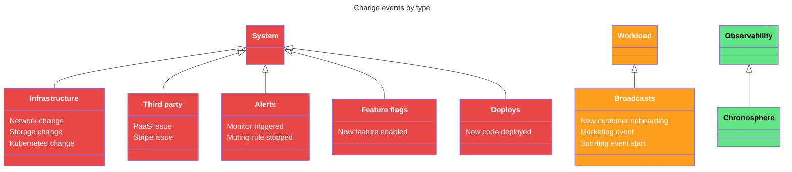

{/* -- dri: Adam Locke -- */}

When on-call engineers respond to an issue, they need to understand what changed,
where the change occurred, and when the change happened. These insights are critical
to investigating and remediating issues when they arise.

Changes Explorer displays _change events_ to create a comprehensive view of all
changes in your environment. Each change event describes a change within your
environment or Chronosphere Observability Platform tenant at a specific time so you
can answer questions like _When did a particular service deploy last?_ or
_Which alerts triggered in the last week?_

Change events provide an additional layer of meaning. A specific set of changes
might occur at the system level, but can be further differentiated by
[category, type, and source](/observe/enable-events/use-events#categorize-change-events-intentionally).
For example, a system-level change can be categorized as a deploy, alert, or
infrastructure event. Within a specific category, you can differentiate events. For
example, within the infrastructure category, you can add a type such as network
change, storage modification, or security update to distinguish these events.

Learn about interacting with [change events](/overview/types/change-events) in
Observability Platform.

