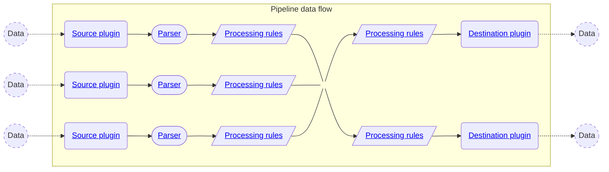

{/* -- dri: Alexa Kreizinger -- */}

You can use Chronosphere Telemetry Pipeline to collect, transform, and route
telemetry data.

{/* markdownlint-disable MD013 */}

{/* markdownlint-enable MD013 */}

When you [create a pipeline](/pipeline-data/create-modify), you must include at
least one [source plugin](/pipeline-data/plugins/source-plugins) and at least
one [destination plugin](/pipeline-data/plugins/destination-plugins). You also
have the option to add [parsers](/pipeline-data/parsers) and [processing rules](/pipeline-data/processing-rules)
that transform the data passing through your pipeline.

## Get started

{/* markdownlint-disable MD013 */}
{/* vale Chronosphere.SentenceLengthLong = NO */}

<Columns cols={1}>
  <Card icon="dharmachakra" title="Automated Kubernetes logging" href="/pipeline-data/automated-logging" />
  <Card icon="pipe" title="Create, modify, or delete pipelines" href="/pipeline-data/create-modify" />
  <Card icon="file-code" title="Parsers" href="/pipeline-data/parsers" />
  <Card icon="route" title="Plugins" href="/pipeline-data/plugins" />
  <Card icon="filters" title="Processing rules" href="pipeline-data/processing-rules" />
  <Card icon="bandage" title="Troubleshoot a pipeline" href="/pipeline-data/troubleshoot" />
</Columns>

{/* vale Chronosphere.SentenceLengthLong = YES */}
{/* markdownlint-enable MD013 */}
