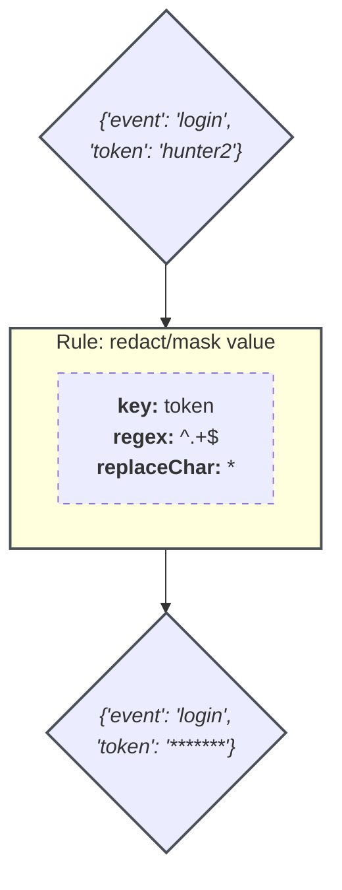

import PipelineFlow from '/snippets/_partials/pipeline-flow-processing-rules.mdx';

{/* -- dri: Alexa Kreizinger -- */}


<PipelineFlow/>

Processing rules transform the data that passes through your telemetry pipeline.
You can use a variety of rules to perform different operations on data in transit
between its source and its destination.

Some example use cases for processing rules include:

- Adding a new field to each log for easier debugging and troubleshooting.
- Redacting sensitive values to preserve user privacy.
- Removing unnecessary fields to improve the signal-to-noise ratio of your data.
- Converting data from one format to another.
- Turning unstructured data into structured data.
- Aggregating logs into metrics to reduce data volume while retaining key
  insights.

## Overview

{/* markdownlint-disable MD013 */}



{/* markdownlint-enable MD013 */}

Each built-in processing rule transforms data in a specific way. You can combine
multiple processing rules to create complex transformation logic suited for
your telemetry data and storage format.

Processing rules are applied at the [plugin](/pipeline-data/plugins/) level,
and each plugin can have multiple associated processing rules. Any rules associated
with a [source plugin](/pipeline-data/plugins/source-plugins) are applied after the
data from that plugin has been parsed by a [file-based parser](/pipeline-data/parsers),
if applicable. Any rules associated with a
[destination plugin](/pipeline-data/plugins/destination-plugins) are applied before
the data leaves your pipeline.

## Format

Processing rules are run one at a time, from top to bottom. If you add multiple
processing rules to the same pipeline for the same [telemetry type](#telemetry-types),
the output from your first rule becomes the input for your second rule, the
output from your second rule becomes the input for your third rule, and so on.

Most processing rules are compatible with most data formats. Processing rules
are also designed to skip any incompatible records or records that can't be
processed, which means you can create rules even if they only apply to a subset
of your data. For example, you can apply a broad rule to remove a certain field from your
logs even if some logs that travel through your pipeline don't contain that field.

### Telemetry types

> Requires Core Operator version 3.1.0 or later and pipeline agent version 24.7.3 or later.

Processing rules support logs, metrics, and traces. You can create processing rules
for multiple telemetry types within the same pipeline, but each processing rule
is applied only to its specified telemetry type. For example, if you create a
[search/replace value](/pipeline-data/processing-rules/search-replace-value)
processing rule for metrics, this rule won't affect any logs or traces that
pass through your pipeline, even if those logs or traces contain a matching key.

<Info>
When raw log data passes through at least one processing rule, the data
receives a new `log` field for each event. This `log` field lets you treat each event
as a single unit of data.

Structured log data such as JSON doesn't receive a `log` field
because you can already break structured data into discrete events.
</Info>

### Regex engines

> Requires Telemetry Pipeline version 2.9.0 or later.

Some processing rules, like [block records](/pipeline-data/processing-rules/block-records)
and [rename keys](/pipeline-data/processing-rules/rename-keys),
accept regular expressions. For most of these rules, you can specify one of the
following engines to parse your rule:

- [PCRE2](https://www.pcre.org/current/doc/html/) (default)
- [Oniguruma](https://github.com/kkos/oniguruma)
- [POSIX](https://pubs.opengroup.org/onlinepubs/9699919799/basedefs/regex.h.html)
- [GNU](https://www.gnu.org/software/gnulib/manual/html_node/Regular-expressions.html)
- [TRE](https://laurikari.net/tre/)

### Record accessor syntax

If your raw data is in JSON format, you can use record accessor syntax to
extract nested fields within a larger JSON object.

To extract a nested field inside a standard object, use the following syntax:

```text
$objectName.fieldName
```

To extract a nested field inside an array, use the following syntax:

```text
$objectName.arrayName[X]
```

For example, given the following JSON object:

```json
    "log": "1234",
    "kubernetes": {
        "pod_name": "mypod-0",
        "labels": [
            {
                "app": "myapp",
                "env": "prod"
            }
        ],
    }
}
```

The expression `$kubernetes.pod_name` resolves to `mypod-0`, and the expression
`$kubernetes.labels[0]` resolves to `"app": "myapp"`.

<Info>
If the name of a field or parent object contains periods, wrap the name in
quotes. For example, to access the field `k8s.pod.uid` inside the object
`attributes`, use the expression `$attributes."k8s.pod.uid"`.
</Info>

## Add processing rules to your pipeline

1. Sign in to the [Telemetry Pipeline web interface](https://core.calyptia.com/).

1. Open the project that contains the pipeline to which you want to add processing
   rules.

1. Navigate to **Core Instances**, then select the pipeline to which you want to
   add processing rules.

1. Click **Edit**.

1. Click the <Icon icon="arrows-rotate-reverse" alt="Edit processing rules"/> node in
   the middle of the configuration diagram.

1. In the dialog that appears, select an option from the **Telemetry type** tab.

1. Click <Icon icon="plus" />&nbsp;**Add New Rule** to open the processing rules menu.

1. Select a processing rule from the available list.

1. Configure the available settings for that processing rule, and then click
   **Apply**.

1. Optional: Repeat steps 5 through 8 to add additional processing rules. If you
   add multiple rules, you can drag them to change the order in which they run.

1. Optional: Add test input and then click
   <Icon icon="play" />&nbsp;**Preview Output** to preview the output
   of your processing rules.

1. Click **Apply Processing Rules**&nbsp;<Icon icon="chevron-right" /> to
   finalize your processing rules, and then click
   **Save and Deploy**&nbsp;<Icon icon="chevron-right" /> to save
   your pipeline settings.

<Info>
Use the toggle next to a processing rule to enable or disable that rule.
</Info>

## Use pipeline logs as preview input data

You can use the **Input** and **Output** panes in the processing rules builder to
preview the effects of your processing rules. When you edit processing rules for
most pipelines, or when you use the processing rules playground, the **Input**
pane displays sample logs by default.

However, when you edit certain eligible pipelines, the **Input** pane
automatically fetches the latest logs from that pipeline. You can also manually
fetch logs from eligible pipelines to use as preview input data in the processing
rules playground or when editing any other pipelines.

<Info>
To be an eligible preview input source, a pipeline must be active and must include
the [Standard output](/pipeline-data/plugins/destination-plugins/standard-output)
destination plugin. This plugin is necessary because Chronosphere can't access
the telemetry data that passes through your pipelines without it.
</Info>

To use a pipeline's logs as preview input data, choose an eligible pipeline from the
**Select pipeline** drop-down menu, then click **Get Latest Logs**. This takes a
snapshot of the logs currently passing through your pipeline and displays that
snapshot in the **Input** pane.

If you click <Icon icon="play" />&nbsp;**Preview Output**,
the **Output** pane will show how the logs in that snapshot would change based on the
processing rules that you've configured. However, processing rules won't actually
modify the previewed logs unless you save and apply changes to the pipeline from which
those logs originate.

To use sample logs as preview input, open the **Select pipeline** drop-down
menu and click **Sample logs**. You can also overwrite the logs in the **Input**
pane with any text of your choosing.

## Save and load templates

To create a template from your current processing rule settings, click
<Icon icon="inbox-out" />&nbsp;**Export** to save a JSON template file
to your device. You can also click <Icon icon="hexagon-check" />&nbsp;**Save**
to save your template within the Telemetry Pipeline web interface, which makes
that template available to any other users in your current project.

To load an existing template, click <Icon icon="inbox-in" />&nbsp;**Import**
and select a JSON template file stored on your device, or use the **Select Template**
drop-down menu to choose one of the templates available in your current project.

Chronosphere also offers several processing rule templates in the
[`processing-templates` GitHub repository](https://github.com/chronosphereio/processing-templates).

## Available processing rules

Telemetry Pipeline offers the following processing rules:

| Processing rule | Description |
| --------------- | ----------- |
| [**Add/set key/value**](/pipeline-data/processing-rules/add-set-key-value) | Adds the same key/value pair to every record. |
| [**Aggregate records**](/pipeline-data/processing-rules/aggregate-records) | Transforms incoming logs into computed metrics at periodic intervals. |
| [**Allow keys**](/pipeline-data/processing-rules/allow-keys) | Preserves any keys that match a specified regular expression, and removes all other keys. |
| [**Allow records**](/pipeline-data/processing-rules/allow-records) | Preserves any records that contain a key whose value matches a specified regular expression, and removes all other records. |
| [**Block keys**](/pipeline-data/processing-rules/block-keys) | Removes keys that match a regular expression. |
| [**Block records**](/pipeline-data/processing-rules/block-records) | Removes records that contain a key whose value matches a specified regular expression. |
| [**Copy keys**](/pipeline-data/processing-rules/copy-keys) | Copies the value of a specified source key to the value of a specified destination key. |
| [**Custom Lua**](/pipeline-data/processing-rules/custom-lua) | Write custom Lua scripts to transform your telemetry data. |
| [**Decode CSV**](/pipeline-data/processing-rules/decode-csv) | Transforms log data from CSV format to JSON. |
| [**Decode JSON**](/pipeline-data/processing-rules/decode-json) | Transforms an escaped JSON string into a structured JSON object. |
| [**Deduplicate records**](/pipeline-data/processing-rules/deduplicate-records) | Searches for any records that contain identical key/value data within a specified time frame, then removes all but the earliest of those records. |
| [**Delete key**](/pipeline-data/processing-rules/delete-key) | Deletes a specified key and its associated value from all records. |
| [**Encode CSV**](/pipeline-data/processing-rules/encode-csv) | Transforms log data from JSON to CSV format. |
| [**Encode JSON**](/pipeline-data/processing-rules/encode-json) | Transforms a JSON object into an escaped string. |
| [**Extract keys/values**](/pipeline-data/processing-rules/extract-keys-values) | Uses a regular expression to search for key/value pairs inside a string, then creates a structured object to store those key/value pairs. |
| [**Flatten subrecord**](/pipeline-data/processing-rules/flatten-subrecord) | Uses regular expression to search for key/value pairs inside a JSON object, then either moves or copies any applicable key/value pairs to the top level of the record. |
| [**Hash key**](/pipeline-data/processing-rules/hash-key) | Copies the value of a specified source key, hashes that value, then stores the hashed copy in a specified destination key. |
| [**Join records**](/pipeline-data/processing-rules/join-records) | Combined values from multiple records into an array of values within a single record. |
| [**Lift submap**](/pipeline-data/processing-rules/lift-submap) | Uses regular expressions to search for key/value pairs inside a JSON object, then either moves or copies any applicable key/value pairs out of the JSON object and into a higher level of the record. |
| [**Multiline join**](/pipeline-data/processing-rules/multiline-join) | Combines multiple logs into a single log by looking for repeating patterns in log data. |
| [**Nest keys**](/pipeline-data/processing-rules/nest-keys) | Moves the value of a specified source key into an object nested under a specified destination key. |
| [**Parse**](/pipeline-data/processing-rules/parse) | Uses a regular expression to search for values inside a string and assign a key to each value, then stores those key/value pairs in a structured object. |
| [**Parse number**](/pipeline-data/processing-rules/parse-number) | Uses a regular expression to transform a key's value from a string to a number. |
| [**Random sampling**](/pipeline-data/processing-rules/random-sampling) | Preserves a percentage of records that pass through your pipeline and discards the rest. |
| [**Redact/mask value**](/pipeline-data/processing-rules/redact-mask-value) | Obscures all or part of a specified key's value by replacing the original string with a series of repeated characters. |
| [**Rename keys**](/pipeline-data/processing-rules/rename-keys) | Changes the name of a specified key. |
| [**Search/replace value**](/pipeline-data/processing-rules/search-replace-value) | Uses regular expressions to search for a value inside a string, then replaces that value with a different specified value. |
| [**Split record**](/pipeline-data/processing-rules/split-record) | Splits an array of JSON objects into a series of standalone records. |
