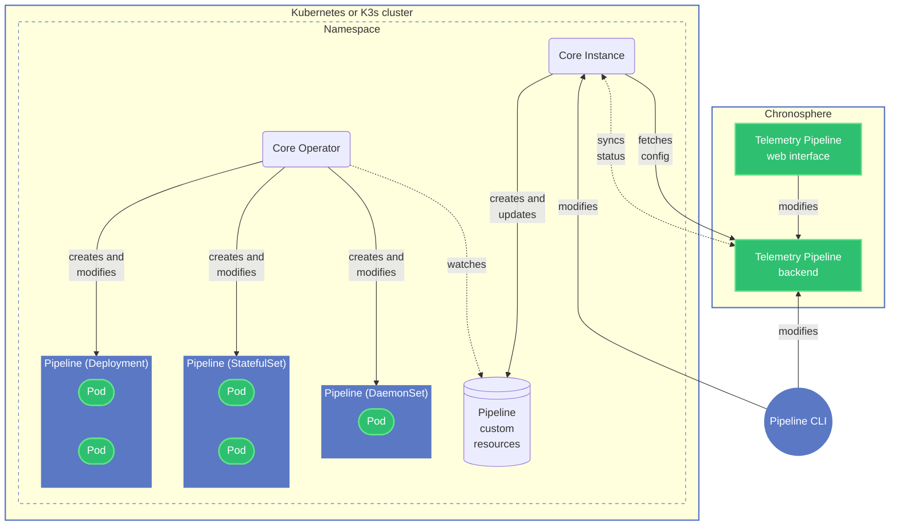

{/* -- dri: Alexa Kreizinger -- */}

Chronosphere Telemetry Pipeline uses different components to create, modify, and
run pipelines.

Telemetry Pipeline is built on Kubernetes. You can either
[install Telemetry Pipeline](/pipeline-install) in an existing Kubernetes cluster
or in a Linux environment. If you install Telemetry Pipeline in a Linux environment,
the installer automatically deploys a K3s cluster, then installs Telemetry Pipeline
components in that cluster.

Each Telemetry Pipeline installation includes a Core Operator, which is a
[Kubernetes operator](https://kubernetes.io/docs/concepts/extend-kubernetes/operator/)
that creates and modifies pipelines. A different component called a Core Instance
creates and updates the custom resources that the Core Operator uses when it creates
or modifies pipelines. The Core Instance also syncs the status of your cluster
with the Telemetry Pipeline backend.

Each pipeline is a workload that runs within your cluster and contains one or more Pods.
By default, pipelines run as
[Deployments](https://kubernetes.io/docs/concepts/workloads/controllers/deployment/),
but other [workload types](/pipeline-configure/kubernetes/workloads) are supported as well.

You can use [Pipeline CLI](/pipeline-cli) and the
[Telemetry Pipeline web interface](https://core.calyptia.com/) to configure your
Telemetry Pipeline installation and to create and modify pipelines.
