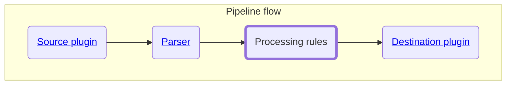

```mermaid
flowchart LR
    accTitle: Pipeline flow
    accDescr: A simplified representation of a telemetry pipeline, which includes a source plugin, parser, processing rules, and destination plugin.
    subgraph Pipeline flow
        direction LR
        A(<a href="/pipeline-data/plugins/source-plugins">Source plugin</a>)
        B(<a href="/pipeline-data/parsers">Parser</a>)
        C(Processing rules)
        D(<a href="/pipeline-data/plugins/destination-plugins">Destination plugin</a>)
        A --> B --> C --> D
        style C stroke-width:4px
    end
```
